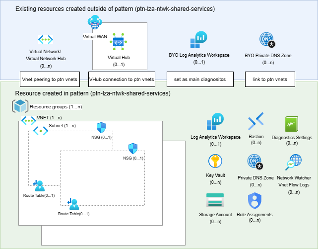

<!-- BEGIN_TF_DOCS -->
<!-- Code generated by terraform-docs. DO NOT EDIT. -->
# ALZ Spoke Networking & Shared Services Pattern

This Terraform root module provisions Azure Application Landing Zone (ALZ) spoke networking and shared services infrastructure using [Azure Verified Modules (AVM)](https://azure.github.io/Azure-Verified-Modules/) exclusively.

## Features

- Spoke virtual networks with subnets, NSGs, route tables, and hub VNet peering
- Private DNS Zone VNet links for private endpoint resolution
- Key Vaults with managed identities and RBAC role assignments
- Virtual WAN hub connections (alternative to hub VNet peering)
- Azure Bastion for secure remote access (optional)
- Network Watcher VNet flow logs (optional)
- Log Analytics workspace (pattern-managed or externally provided)
- Resource locks, diagnostic settings, and common tagging on all resources
- Storage accounts with sub-resource diagnostic settings (blob, file, queue, table)

## Diagram



## Usage

All configuration is driven through `terraform.tfvars`. See the `examples/` directory for common deployment scenarios:

| Example | Description |
|---------|-------------|
| [examples/minimal](examples/minimal/) | Minimal spoke VNet with NSGs, Key Vault, and Bastion |
| [examples/vnet\_hub](examples/vnet\_hub/) | Hub VNet peering connectivity |
| [examples/vwan\_hub](examples/vwan\_hub/) | vWAN hub connectivity |
| [examples/full](examples/full/) | All features enabled |

## Quick Start

```bash
# 1. Copy an example tfvars as a starting point
cp examples/minimal/terraform.tfvars terraform.tfvars

# 2. Edit terraform.tfvars with your values
# 3. Initialize and deploy
terraform init
terraform plan
terraform apply
```

## Documentation

Input and output documentation is auto-generated by [terraform-docs](https://terraform-docs.io/).

<!-- markdownlint-disable MD033 -->
## Requirements

| Name | Version |
|------|---------|
| <a name="requirement_terraform"></a> [terraform](#requirement\_terraform) | >= 1.13, < 2.0 |
| <a name="requirement_azapi"></a> [azapi](#requirement\_azapi) | ~> 2.0 |
| <a name="requirement_azurerm"></a> [azurerm](#requirement\_azurerm) | ~> 4.0 |
| <a name="requirement_random"></a> [random](#requirement\_random) | ~> 3.0 |

## Resources

| Name | Type |
|------|------|
| [random_string.key_vault_suffix](https://registry.terraform.io/providers/hashicorp/random/latest/docs/resources/string) | resource |
| [random_string.storage_account_suffix](https://registry.terraform.io/providers/hashicorp/random/latest/docs/resources/string) | resource |
| [terraform_data.validation](https://registry.terraform.io/providers/hashicorp/terraform/latest/docs/resources/data) | resource |
| [azurerm_client_config.current](https://registry.terraform.io/providers/hashicorp/azurerm/latest/docs/data-sources/client_config) | data source |
| [azurerm_log_analytics_workspace.external](https://registry.terraform.io/providers/hashicorp/azurerm/latest/docs/data-sources/log_analytics_workspace) | data source |

<!-- markdownlint-disable MD013 -->
## Inputs

| Name | Description | Type | Default | Required |
|------|-------------|------|---------|:--------:|
| <a name="input_location"></a> [location](#input\_location) | The Azure region where all resources will be deployed. Changing this forces recreation of all resources.<br/><br/>Each resource defaults to this location unless overridden by a per-resource `location` attribute. | `string` | n/a | yes |
| <a name="input_resource_groups"></a> [resource\_groups](#input\_resource\_groups) | A map of resource groups to create. The map key is deliberately arbitrary to avoid issues where map keys maybe unknown at plan time.<br/><br/>- `name` - (Required) The name of the resource group.<br/>- `location` - (Optional) The Azure region for the resource group. Defaults to `null`.<br/>- `tags` - (Optional) Tags to apply to this resource group. Defaults to `{}`.<br/>- `lock` - (Optional) Controls the Resource Lock configuration for this resource. The following properties can be specified:<br/>  - `kind` - (Required) The type of lock. Possible values are `\"CanNotDelete\"` and `\"ReadOnly\"`.<br/>  - `name` - (Optional) The name of the lock. If not specified, a name will be generated based on the `kind` value. Changing this forces the creation of a new resource.<br/>- `role_assignments` - (Optional) A map of role assignments to create on this resource. The map key is deliberately arbitrary to avoid issues where map keys maybe unknown at plan time.<br/>  - `role_definition_id_or_name` - (Required) The ID or name of the role definition to assign to the principal.<br/>  - `principal_id` - (Optional) The ID of the principal to assign the role to. Mutually exclusive with `assign_to_caller`.<br/>  - `assign_to_caller` - (Optional) When `true`, automatically uses the object ID of the identity running Terraform as the principal. Mutually exclusive with `principal_id`. Defaults to `false`.<br/>  - `description` - (Optional) The description of the role assignment.<br/>  - `skip_service_principal_aad_check` - (Optional) If set to true, skips the Azure Active Directory check for the service principal in the tenant. Defaults to `false`.<br/>  - `condition` - (Optional) The condition which will be used to scope the role assignment.<br/>  - `condition_version` - (Optional) The version of the condition syntax. Leave as `null` if you are not using a condition, if you are then valid values are '2.0'.<br/>  - `delegated_managed_identity_resource_id` - (Optional) The delegated Azure Resource Id which contains a Managed Identity. Changing this forces a new resource to be created. This field is only used in cross-tenant scenario.<br/>  - `principal_type` - (Optional) The type of the `principal_id`. Possible values are `User`, `Group` and `ServicePrincipal`. It is necessary to explicitly set this attribute when creating role assignments if the principal creating the assignment is constrained by ABAC rules that filters on the PrincipalType attribute.<br/><br/>  > Note: only set `skip_service_principal_aad_check` to true if you are assigning a role to a service principal.<br/><br/>> **Pattern note:** If `location` is not specified, defaults to `var.location`. Tags in `tags` are merged with `var.tags`. `managed_identity_key` is not supported in `resource_groups` role assignments because managed identities are created inside resource groups, which would cause a circular dependency. | <pre>map(object({<br/>    name     = string<br/>    location = optional(string)<br/>    tags     = optional(map(string), {})<br/>    lock = optional(object({<br/>      kind = string<br/>      name = optional(string, null)<br/>    }))<br/>    role_assignments = optional(map(object({<br/>      role_definition_id_or_name             = string<br/>      principal_id                           = optional(string)<br/>      assign_to_caller                       = optional(bool, false)<br/>      description                            = optional(string, null)<br/>      skip_service_principal_aad_check       = optional(bool, false)<br/>      condition                              = optional(string, null)<br/>      condition_version                      = optional(string, null)<br/>      delegated_managed_identity_resource_id = optional(string, null)<br/>      principal_type                         = optional(string, null)<br/>    })), {})<br/>  }))</pre> | n/a | yes |
| <a name="input_backup_vaults"></a> [backup\_vaults](#input\_backup\_vaults) | A map of Azure Data Protection Backup Vaults to create. The map key is deliberately arbitrary to avoid issues where map keys maybe unknown at plan time.<br/><br/>- `name` - (Required) The name of the Backup Vault. Must be between 5 and 50 characters long.<br/>- `resource_group_key` - (Required) The key of the resource group in the `resource_groups` variable where this Backup Vault will be deployed.<br/>- `location` - (Optional) The Azure region for the Backup Vault. Defaults to `var.location`.<br/>- `datastore_type` - (Required) Specifies the type of the datastore. Valid options: `"ArchiveStore"`, `"OperationalStore"`, `"SnapshotStore"`, `"VaultStore"`.<br/>- `redundancy` - (Required) Specifies the backup storage redundancy. Valid options: `"GeoRedundant"`, `"LocallyRedundant"`, `"ZoneRedundant"`.<br/>- `immutability` - (Optional) Immutability state of the vault. Possible values: `"Disabled"`, `"Locked"`, `"Unlocked"`. Defaults to `"Disabled"`.<br/>- `soft_delete` - (Optional) Soft delete state. Defaults to `"AlwaysOn"`.<br/>- `retention_duration_in_days` - (Optional) Soft delete retention duration. Valid values are between 14 and 180. Defaults to `14`.<br/>- `cross_region_restore_enabled` - (Optional) Whether to enable cross-region restore. Can only be enabled with `"GeoRedundant"` redundancy. Defaults to `false`.<br/>- `cross_subscription_restore_state` - (Optional) Cross-subscription restore state. Possible values: `"Enabled"`, `"Disabled"`, `"PermanentlyDisabled"`. Defaults to `null`.<br/>- `alerts_for_all_job_failures` - (Optional) Azure Monitor alert setting for all job failures. Possible values: `"Enabled"`, `"Disabled"`. Defaults to `null`.<br/>- `resource_guard_enabled` - (Optional) Whether to deploy a Resource Guard to protect the vault. Defaults to `false`.<br/>- `resource_guard_name` - (Optional) The name of the Resource Guard. If not specified, uses vault name with `"-guard"` suffix. Defaults to `null`.<br/>- `vault_critical_operation_exclusion_list` - (Optional) Critical operations not protected by Resource Guard. Possible values: `"Delete"`, `"Update"`, `"DisableSoftDelete"`, `"ChangeBackupProperties"`. Defaults to `[]`.<br/>- `replicated_regions` - (Optional) List of replicated regions. Only applicable for `"GeoRedundant"` vaults. Defaults to `[]`.<br/>- `permanent_delete_on_destroy` - (Optional) Whether backup instances should be permanently deleted on destroy. Defaults to `true`.<br/>- `customer_managed_key` - (Optional) Customer managed key configuration for encrypting the Backup Vault.<br/>  - `key_vault_resource_id` - (Optional) The resource ID of the Key Vault containing the key. Mutually exclusive with `key_vault_key`.<br/>  - `key_vault_key` - (Optional) The key of a Key Vault in the `key_vaults` variable, resolving to its resource ID. Mutually exclusive with `key_vault_resource_id`.<br/>  - `key_name` - (Optional) The name of the Key Vault key. Mutually exclusive with `key_key`.<br/>  - `key_key` - (Optional) The key of a key entry within the Key Vault's `keys` map (identified by `key_vault_key`), resolving to its name. Requires `key_vault_key` to be set. Mutually exclusive with `key_name`.<br/>  - `key_version` - (Optional) Specific key version. If omitted, the service uses the latest.<br/>  - `user_assigned_identity` - (Optional) The user-assigned identity to use for accessing the Key Vault.<br/>    - `resource_id` - (Optional) The resource ID of the user-assigned managed identity. Mutually exclusive with `key`.<br/>    - `key` - (Optional) The key of a managed identity in the `managed_identities` variable, resolving to its resource ID. Mutually exclusive with `resource_id`.<br/>- `backup_policies` - (Optional) A map of backup policies to create. Defaults to `{}`.<br/>  - `type` - (Required) Policy type: `"disk"`, `"blob"`, `"adls"`, `"kubernetes"`, `"postgresql"`, `"postgresql_flexible"`.<br/>  - `name` - (Required) The name of the backup policy.<br/>  - `backup_repeating_time_intervals` - (Optional) List of ISO8601 backup schedule intervals. Defaults to `[]`.<br/>  - `default_retention_duration` - (Optional) Default retention period in ISO8601 format. Defaults to `"P30D"`.<br/>  - `time_zone` - (Optional) Time zone for backup schedules. Defaults to `"UTC"`.<br/>  - `operational_default_retention_duration` - (Optional) For blob/ADLS policies.<br/>  - `vault_default_retention_duration` - (Optional) For blob/ADLS policies.<br/>  - `default_retention_life_cycle` - (Optional) For AKS policies.<br/>  - `retention_rules` - (Optional) List of retention rules with criteria and lifecycle. Defaults to `[]`.<br/>- `backup_instances` - (Optional) A map of backup instances to create. Each instance references a backup policy via `backup_policy_key`. Defaults to `{}`.<br/>  - `type` - (Required) Instance type: `"disk"`, `"blob"`, `"adls"`, `"kubernetes"`, `"postgresql"`, `"postgresql_flexible"`.<br/>  - `name` - (Required) Display name for the backup instance.<br/>  - `backup_policy_key` - (Required) Reference to a key in the `backup_policies` map.<br/>  - Type-specific settings (disk, blob, AKS, PostgreSQL, PostgreSQL Flexible) — see module documentation.<br/>- `managed_identities` - (Optional) Managed identity configuration. Defaults to `{}`.<br/>  - `system_assigned` - (Optional) Whether to enable system-assigned managed identity. Defaults to `false`.<br/>  - `user_assigned_resource_ids` - (Optional) A set of user-assigned managed identity resource IDs. Defaults to `[]`.<br/>  - `user_assigned_keys` - (Optional) A set of keys from the `managed_identities` variable, resolving to their resource IDs. Defaults to `[]`.<br/>- `role_assignments` - (Optional) A map of role assignments to create on this Backup Vault. Defaults to `{}`.<br/>  - `role_definition_id_or_name` - (Required) The ID or name of the role definition to assign to the principal.<br/>  - `principal_id` - (Optional) The ID of the principal. Mutually exclusive with `managed_identity_key` and `assign_to_caller`.<br/>  - `managed_identity_key` - (Optional) The key of a managed identity in the `managed_identities` variable. Mutually exclusive with `principal_id` and `assign_to_caller`.<br/>  - `assign_to_caller` - (Optional) When `true`, automatically uses the object ID of the identity running Terraform. Mutually exclusive with `principal_id` and `managed_identity_key`. Defaults to `false`.<br/>  - `description` - (Optional) The description of the role assignment.<br/>  - `skip_service_principal_aad_check` - (Optional) Defaults to `false`.<br/>  - `condition` - (Optional) Defaults to `null`.<br/>  - `condition_version` - (Optional) Defaults to `null`.<br/>  - `delegated_managed_identity_resource_id` - (Optional) Defaults to `null`.<br/>  - `principal_type` - (Optional) Defaults to `null`.<br/><br/>  > Note: Specify exactly one of `principal_id`, `managed_identity_key`, or `assign_to_caller`.<br/><br/>- `lock` - (Optional) Controls the Resource Lock configuration.<br/>  - `kind` - (Required) The type of lock. Possible values are `"CanNotDelete"` and `"ReadOnly"`.<br/>  - `name` - (Optional) The name of the lock.<br/>- `tags` - (Optional) Tags to apply. Defaults to `{}`.<br/>- `diagnostic_settings` - (Optional) A map of diagnostic settings. Defaults to `{}`.<br/>  - `name` - (Optional) The name of the diagnostic setting.<br/>  - `log_categories` - (Optional) Defaults to `[]`.<br/>  - `log_groups` - (Optional) Defaults to `["allLogs"]`.<br/>  - `metric_categories` - (Optional) Defaults to `["AllMetrics"]`.<br/>  - `log_analytics_destination_type` - (Optional) Defaults to `"Dedicated"`.<br/>  - `workspace_resource_id` - (Optional) Defaults to `null`.<br/>  - `storage_account_resource_id` - (Optional) Defaults to `null`.<br/>  - `event_hub_authorization_rule_resource_id` - (Optional) Defaults to `null`.<br/>  - `event_hub_name` - (Optional) Defaults to `null`.<br/>  - `marketplace_partner_resource_id` - (Optional) Defaults to `null`.<br/>  - `use_default_log_analytics` - (Optional) When `true`, automatically sets `workspace_resource_id` to the pattern's Log Analytics workspace. Defaults to `true`.<br/><br/>> **Pattern note:** If `location` is not specified, defaults to `var.location`. Tags in `tags` are merged with `var.tags`. | <pre>map(object({<br/>    name                                    = string<br/>    resource_group_key                      = string<br/>    location                                = optional(string)<br/>    datastore_type                          = string<br/>    redundancy                              = string<br/>    immutability                            = optional(string, "Disabled")<br/>    soft_delete                             = optional(string, "AlwaysOn")<br/>    retention_duration_in_days              = optional(number, 14)<br/>    cross_region_restore_enabled            = optional(bool, false)<br/>    cross_subscription_restore_state        = optional(string, null)<br/>    alerts_for_all_job_failures             = optional(string, null)<br/>    resource_guard_enabled                  = optional(bool, false)<br/>    resource_guard_name                     = optional(string, null)<br/>    vault_critical_operation_exclusion_list = optional(list(string), [])<br/>    replicated_regions                      = optional(list(string), [])<br/>    permanent_delete_on_destroy             = optional(bool, true)<br/>    customer_managed_key = optional(object({<br/>      key_vault_resource_id = optional(string)<br/>      key_vault_key         = optional(string)<br/>      key_name              = optional(string)<br/>      key_key               = optional(string)<br/>      key_version           = optional(string)<br/>      user_assigned_identity = optional(object({<br/>        resource_id = optional(string)<br/>        key         = optional(string)<br/>      }))<br/>    }))<br/>    backup_policies = optional(map(object({<br/>      type                                   = string<br/>      name                                   = string<br/>      backup_repeating_time_intervals        = optional(list(string), [])<br/>      default_retention_duration             = optional(string, "P30D")<br/>      time_zone                              = optional(string, "UTC")<br/>      operational_default_retention_duration = optional(string)<br/>      vault_default_retention_duration       = optional(string)<br/>      default_retention_life_cycle = optional(object({<br/>        data_store_type = optional(string, "OperationalStore")<br/>        duration        = optional(string, "P14D")<br/>      }))<br/>      retention_rules = optional(list(object({<br/>        name     = string<br/>        priority = number<br/>        duration = optional(string, "P30D")<br/>        criteria = list(object({<br/>          absolute_criteria      = optional(string)<br/>          days_of_month          = optional(list(number))<br/>          days_of_week           = optional(list(string))<br/>          months_of_year         = optional(list(string))<br/>          scheduled_backup_times = optional(list(string))<br/>          weeks_of_month         = optional(list(string))<br/>        }))<br/>        life_cycle = optional(list(object({<br/>          data_store_type = string<br/>          duration        = string<br/>        })), [])<br/>      })), [])<br/>    })), {})<br/>    backup_instances = optional(map(object({<br/>      type                            = string<br/>      name                            = string<br/>      backup_policy_key               = string<br/>      disk_id                         = optional(string)<br/>      snapshot_resource_group_name    = optional(string)<br/>      storage_account_id              = optional(string)<br/>      storage_account_container_names = optional(list(string), [])<br/>      kubernetes_cluster_id           = optional(string)<br/>      backup_datasource_parameters = optional(object({<br/>        excluded_namespaces              = optional(list(string), [])<br/>        included_namespaces              = optional(list(string), [])<br/>        excluded_resource_types          = optional(list(string), [])<br/>        included_resource_types          = optional(list(string), [])<br/>        label_selectors                  = optional(list(string), [])<br/>        cluster_scoped_resources_enabled = optional(bool, false)<br/>        volume_snapshot_enabled          = optional(bool, false)<br/>      }))<br/>      postgresql_server_id                    = optional(string)<br/>      postgresql_database_id                  = optional(string)<br/>      postgresql_key_vault_secret_id          = optional(string)<br/>      postgresql_flexible_server_id           = optional(string)<br/>      postgresql_flexible_database_id         = optional(string)<br/>      postgresql_flexible_key_vault_secret_id = optional(string)<br/>    })), {})<br/>    managed_identities = optional(object({<br/>      system_assigned            = optional(bool, false)<br/>      user_assigned_resource_ids = optional(set(string), [])<br/>      user_assigned_keys         = optional(set(string), [])<br/>    }), {})<br/>    role_assignments = optional(map(object({<br/>      role_definition_id_or_name             = string<br/>      principal_id                           = optional(string)<br/>      managed_identity_key                   = optional(string)<br/>      assign_to_caller                       = optional(bool, false)<br/>      description                            = optional(string, null)<br/>      skip_service_principal_aad_check       = optional(bool, false)<br/>      condition                              = optional(string, null)<br/>      condition_version                      = optional(string, null)<br/>      delegated_managed_identity_resource_id = optional(string, null)<br/>      principal_type                         = optional(string, null)<br/>    })), {})<br/>    lock = optional(object({<br/>      kind = string<br/>      name = optional(string, null)<br/>    }))<br/>    tags = optional(map(string), {})<br/>    diagnostic_settings = optional(map(object({<br/>      name                                     = optional(string, null)<br/>      log_categories                           = optional(set(string), [])<br/>      log_groups                               = optional(set(string), ["allLogs"])<br/>      metric_categories                        = optional(set(string), ["AllMetrics"])<br/>      log_analytics_destination_type           = optional(string, "Dedicated")<br/>      workspace_resource_id                    = optional(string, null)<br/>      storage_account_resource_id              = optional(string, null)<br/>      event_hub_authorization_rule_resource_id = optional(string, null)<br/>      event_hub_name                           = optional(string, null)<br/>      marketplace_partner_resource_id          = optional(string, null)<br/>      use_default_log_analytics                = optional(bool, true)<br/>    })), {})<br/>  }))</pre> | `{}` | no |
| <a name="input_bastion_hosts"></a> [bastion\_hosts](#input\_bastion\_hosts) | A map of Azure Bastion Host configurations to create. The map key is deliberately arbitrary to avoid issues where map keys maybe unknown at plan time.<br/><br/>- `name` - (Required) The name of the Azure Bastion Host.<br/>- `resource_group_key` - (Required) The key of the resource group in the `resource_groups` variable where this Bastion host will be deployed.<br/>- `location` - (Optional) The Azure region for the Bastion host. Defaults to `null`.<br/>- `sku` - (Optional) The SKU tier of the Bastion host. Possible values are `"Basic"`, `"Standard"`, `"Premium"` and `"Developer"`. Defaults to `"Standard"`.<br/>- `zones` - (Optional) A set of availability zones for the Bastion host. Defaults to `["1", "2", "3"]`.<br/>- `ip_configuration` - (Optional) The IP configuration for the Bastion host. Required for all SKUs except `"Developer"`.<br/>  - `name` - (Optional) The name of the IP configuration.<br/>  - `network_configuration` - (Required) Network placement for the Bastion subnet.<br/>    - `subnet_resource_id` - (Optional) The resource ID of the subnet. Mutually exclusive with `vnet_key`/`subnet_key`.<br/>    - `vnet_key` - (Optional) The key of the virtual network in the `virtual_networks` variable. Used with `subnet_key`.<br/>    - `subnet_key` - (Optional) The key of the subnet within the virtual network identified by `vnet_key`.<br/>  - `create_public_ip` - (Optional) Whether a public IP address should be created by the module. Defaults to `true`.<br/>  - `public_ip_tags` - (Optional) A map of tags to apply to the public IP address. Defaults to `null`.<br/>  - `public_ip_merge_with_module_tags` - (Optional) If set to true, the public IP tags will be merged with the module's tags. Defaults to `true`.<br/>  - `public_ip_address_name` - (Optional) The name of the public IP address to create. Will be ignored if `public_ip_address_id` is set. Defaults to `null`.<br/>  - `public_ip_address_id` - (Optional) The resource ID of an existing public IP address. If set, `create_public_ip` must be `false`. Defaults to `null`.<br/>- `virtual_network` - (Optional) For Developer SKU only. Omit `ip_configuration` when using this. Provide one of `resource_id` or `key`.<br/>  - `resource_id` - (Optional) The Azure resource ID of the virtual network. Mutually exclusive with `key`.<br/>  - `key` - (Optional) The key of the virtual network in the `virtual_networks` variable. Mutually exclusive with `resource_id`.<br/>- `copy_paste_enabled` - (Optional) Whether copy-paste functionality is enabled. Defaults to `true`.<br/>- `file_copy_enabled` - (Optional) Whether file copy functionality is enabled. Only available for Standard and Premium SKUs. Defaults to `false`.<br/>- `ip_connect_enabled` - (Optional) Whether IP connect functionality is enabled. Only available for Standard and Premium SKUs. Defaults to `false`.<br/>- `kerberos_enabled` - (Optional) Whether Kerberos authentication is enabled. Defaults to `false`.<br/>- `private_only_enabled` - (Optional) Whether the Bastion host is private-only (no public IP). Defaults to `false`.<br/>- `scale_units` - (Optional) The number of scale units for the Bastion host. Defaults to `2`.<br/>- `session_recording_enabled` - (Optional) Whether session recording is enabled. Defaults to `false`.<br/>- `shareable_link_enabled` - (Optional) Whether shareable links are enabled. Defaults to `false`.<br/>- `tunneling_enabled` - (Optional) Whether tunneling is enabled. Defaults to `false`.<br/>- `tags` - (Optional) Tags to apply to this Bastion host. Defaults to `{}`.<br/>- `lock` - (Optional) Controls the Resource Lock configuration for this resource. The following properties can be specified:<br/>  - `kind` - (Required) The type of lock. Possible values are `"CanNotDelete"` and `"ReadOnly"`.<br/>  - `name` - (Optional) The name of the lock. If not specified, a name will be generated based on the `kind` value. Changing this forces the creation of a new resource.<br/>- `role_assignments` - (Optional) A map of role assignments to create on this resource. The map key is deliberately arbitrary to avoid issues where map keys maybe unknown at plan time.<br/>  - `role_definition_id_or_name` - (Required) The ID or name of the role definition to assign to the principal.<br/>  - `principal_id` - (Optional) The ID of the principal to assign the role to. Mutually exclusive with `managed_identity_key` and `assign_to_caller`.<br/>  - `managed_identity_key` - (Optional) The key of a managed identity in the `managed_identities` variable. Mutually exclusive with `principal_id` and `assign_to_caller`.<br/>  - `assign_to_caller` - (Optional) When `true`, automatically uses the object ID of the identity running Terraform as the principal. Mutually exclusive with `principal_id` and `managed_identity_key`. Defaults to `false`.<br/>  - `description` - (Optional) The description of the role assignment.<br/>  - `skip_service_principal_aad_check` - (Optional) If set to true, skips the Azure Active Directory check for the service principal in the tenant. Defaults to `false`.<br/>  - `condition` - (Optional) The condition which will be used to scope the role assignment.<br/>  - `condition_version` - (Optional) The version of the condition syntax. Leave as `null` if you are not using a condition, if you are then valid values are '2.0'.<br/>  - `delegated_managed_identity_resource_id` - (Optional) The delegated Azure Resource Id which contains a Managed Identity. Changing this forces a new resource to be created. This field is only used in cross-tenant scenario.<br/>  - `principal_type` - (Optional) The type of the `principal_id`. Possible values are `User`, `Group` and `ServicePrincipal`. It is necessary to explicitly set this attribute when creating role assignments if the principal creating the assignment is constrained by ABAC rules that filters on the PrincipalType attribute.<br/><br/>  > Note: only set `skip_service_principal_aad_check` to true if you are assigning a role to a service principal.<br/><br/>- `diagnostic_settings` - (Optional) A map of diagnostic settings to create on this resource. The map key is deliberately arbitrary to avoid issues where map keys maybe unknown at plan time.<br/>  - `name` - (Optional) The name of the diagnostic setting. One will be generated if not set, however this will not be unique if you want to create multiple diagnostic setting resources.<br/>  - `log_categories` - (Optional) A set of log categories to send to the log analytics workspace. Defaults to `[]`.<br/>  - `log_groups` - (Optional) A set of log groups to send to the log analytics workspace. Defaults to `["allLogs"]`.<br/>  - `metric_categories` - (Optional) A set of metric categories to send to the log analytics workspace. Defaults to `["AllMetrics"]`.<br/>  - `log_analytics_destination_type` - (Optional) The destination type for the diagnostic setting. Possible values are `Dedicated` and `AzureDiagnostics`. Defaults to `Dedicated`.<br/>  - `workspace_resource_id` - (Optional) The resource ID of the log analytics workspace to send logs and metrics to.<br/>  - `storage_account_resource_id` - (Optional) The resource ID of the storage account to send logs and metrics to.<br/>  - `event_hub_authorization_rule_resource_id` - (Optional) The resource ID of the event hub authorization rule to send logs and metrics to.<br/>  - `event_hub_name` - (Optional) The name of the event hub. If none is specified, the default event hub will be selected.<br/>  - `marketplace_partner_resource_id` - (Optional) The full ARM resource ID of the Marketplace resource to which you would like to send Diagnostic Logs.<br/>  - `use_default_log_analytics` - (Optional) When `true`, automatically sets the `workspace_resource_id` to the Log Analytics workspace created by this pattern. Defaults to `true`.<br/><br/>> **Pattern note:** If `location` is not specified, defaults to `var.location`. Tags in `tags` are merged with `var.tags`. | <pre>map(object({<br/>    name               = string<br/>    resource_group_key = string<br/>    location           = optional(string)<br/>    sku                = optional(string, "Standard")<br/>    zones              = optional(set(string), ["1", "2", "3"])<br/>    ip_configuration = optional(object({<br/>      name = optional(string)<br/>      network_configuration = object({<br/>        subnet_resource_id = optional(string)<br/>        vnet_key           = optional(string)<br/>        subnet_key         = optional(string)<br/>      })<br/>      create_public_ip                 = optional(bool, true)<br/>      public_ip_tags                   = optional(map(string), null)<br/>      public_ip_merge_with_module_tags = optional(bool, true)<br/>      public_ip_address_name           = optional(string, null)<br/>      public_ip_address_id             = optional(string, null)<br/>    }))<br/>    virtual_network = optional(object({<br/>      resource_id = optional(string)<br/>      key         = optional(string)<br/>    }))<br/>    copy_paste_enabled        = optional(bool, true)<br/>    file_copy_enabled         = optional(bool, false)<br/>    ip_connect_enabled        = optional(bool, false)<br/>    kerberos_enabled          = optional(bool, false)<br/>    private_only_enabled      = optional(bool, false)<br/>    scale_units               = optional(number, 2)<br/>    session_recording_enabled = optional(bool, false)<br/>    shareable_link_enabled    = optional(bool, false)<br/>    tunneling_enabled         = optional(bool, false)<br/>    tags                      = optional(map(string), {})<br/>    lock = optional(object({<br/>      kind = string<br/>      name = optional(string, null)<br/>    }))<br/>    role_assignments = optional(map(object({<br/>      role_definition_id_or_name             = string<br/>      principal_id                           = optional(string)<br/>      managed_identity_key                   = optional(string)<br/>      assign_to_caller                       = optional(bool, false)<br/>      description                            = optional(string, null)<br/>      skip_service_principal_aad_check       = optional(bool, false)<br/>      condition                              = optional(string, null)<br/>      condition_version                      = optional(string, null)<br/>      delegated_managed_identity_resource_id = optional(string, null)<br/>      principal_type                         = optional(string, null)<br/>    })), {})<br/>    diagnostic_settings = optional(map(object({<br/>      name                                     = optional(string, null)<br/>      log_categories                           = optional(set(string), [])<br/>      log_groups                               = optional(set(string), ["allLogs"])<br/>      metric_categories                        = optional(set(string), ["AllMetrics"])<br/>      log_analytics_destination_type           = optional(string, "Dedicated")<br/>      workspace_resource_id                    = optional(string, null)<br/>      storage_account_resource_id              = optional(string, null)<br/>      event_hub_authorization_rule_resource_id = optional(string, null)<br/>      event_hub_name                           = optional(string, null)<br/>      marketplace_partner_resource_id          = optional(string, null)<br/>      use_default_log_analytics                = optional(bool, true)<br/>    })), {})<br/>  }))</pre> | `{}` | no |
| <a name="input_byo_log_analytics_workspace"></a> [byo\_log\_analytics\_workspace](#input\_byo\_log\_analytics\_workspace) | Configuration for a bring-your-own Log Analytics workspace which will be set as default log analytics workspace for the pattern. The following attributes are supported:<br/><br/>- `resource_id` - (Required) The Azure resource ID of the existing Log Analytics workspace.<br/>- `location` - (Required) The Azure region of the existing Log Analytics workspace.<br/><br/>> **Pattern note:** When `null` (the default), the pattern creates a pattern-managed Log Analytics workspace using `log_analytics_workspace_configuration`. | <pre>object({<br/>    resource_id = string<br/>    location    = string<br/>  })</pre> | `null` | no |
| <a name="input_byo_private_dns_zone_links"></a> [byo\_private\_dns\_zone\_links](#input\_byo\_private\_dns\_zone\_links) | A map of VNet links to existing (bring-your-own) Private DNS Zones. The map key is deliberately arbitrary to avoid issues where map keys maybe unknown at plan time.<br/><br/>- `name` - (Required) The name of the virtual network link.<br/>- `private_dns_zone_id` - (Required) The Azure resource ID of the existing Private DNS Zone to link.<br/>- `virtual_network` - (Required) The virtual network to link to the DNS zone. Specify exactly one of `key` or `resource_id`.<br/>  - `key` - (Optional) The key of the virtual network in the `virtual_networks` variable. Mutually exclusive with `resource_id`.<br/>  - `resource_id` - (Optional) The Azure resource ID of an existing virtual network not managed by this pattern. Mutually exclusive with `key`.<br/>- `registration_enabled` - (Optional) Whether auto-registration of DNS records is enabled for this link. Defaults to `false`.<br/>- `resolution_policy` - (Optional) The resolution policy for the link. Defaults to `"Default"`.<br/>- `private_dns_zone_supports_private_link` - (Optional) Whether the DNS zone supports private link resolution. Defaults to `false`.<br/>- `tags` - (Optional) Tags to apply to this virtual network link. Defaults to `{}`.<br/><br/>> **Pattern note:** Use this variable for DNS zones NOT managed by this pattern. For creating DNS zones as part of this pattern, use `private_dns_zones` instead. Tags in `tags` are merged with `var.tags`. | <pre>map(object({<br/>    name                = string<br/>    private_dns_zone_id = string<br/>    virtual_network = object({<br/>      key         = optional(string)<br/>      resource_id = optional(string)<br/>    })<br/>    registration_enabled                   = optional(bool, false)<br/>    resolution_policy                      = optional(string, "Default")<br/>    private_dns_zone_supports_private_link = optional(bool, false)<br/>    tags                                   = optional(map(string), {})<br/>  }))</pre> | `{}` | no |
| <a name="input_enable_telemetry"></a> [enable\_telemetry](#input\_enable\_telemetry) | Controls whether telemetry is enabled for all AVM modules deployed by this pattern. When `true`, each AVM module may collect anonymous usage data (see [AVM telemetry documentation](https://aka.ms/avm/telemetryinfo)). Set to `false` to disable telemetry across all resources. | `bool` | `true` | no |
| <a name="input_flowlog_configuration"></a> [flowlog\_configuration](#input\_flowlog\_configuration) | Network Watcher and VNet flow log configuration. When `null` (the default), no Network Watcher or flow logs are configured.<br/><br/>- `network_watcher_id` - (Optional) The resource ID of an existing Network Watcher.<br/>- `network_watcher_name` - (Optional) The name of an existing Network Watcher.<br/>- `resource_group_name` - (Optional) The name of the resource group containing the Network Watcher.<br/>- `location` - (Optional) The Azure region for the Network Watcher. Defaults to `null`.<br/>- `flow_logs` - (Optional) A map of flow logs to create for the Network Watcher. The map key is deliberately arbitrary to avoid issues where map keys maybe unknown at plan time. Defaults to `null`.<br/>  - `enabled` - (Required) Whether Network Flow Logging should be enabled.<br/>  - `name` - (Required) The name of the Network Watcher Flow Log. Changing this forces a new resource to be created.<br/>  - `virtual_network` - (Required) The virtual network for which to enable flow logs. Specify exactly one of `key` or `resource_id`.<br/>    - `key` - (Optional) The key of the virtual network in the `virtual_networks` variable. Mutually exclusive with `resource_id`.<br/>    - `resource_id` - (Optional) The Azure resource ID of an existing virtual network not managed by this pattern. Mutually exclusive with `key`.<br/>  - `retention_policy` - (Required) The retention policy for flow log records.<br/>    - `days` - (Required) The number of days to retain flow log records.<br/>    - `enabled` - (Required) Whether retention is enabled.<br/>  - `storage_account` - (Required) The storage account configuration for flow logs.<br/>    - `resource_id` - (Optional) The Azure resource ID of the storage account. Mutually exclusive with `key`.<br/>    - `key` - (Optional) The key of a storage account in the `storage_accounts` variable. Mutually exclusive with `resource_id`.<br/>  - `traffic_analytics` - (Optional) Traffic analytics configuration.<br/>    - `enabled` - (Required) Whether traffic analytics is enabled.<br/>    - `interval_in_minutes` - (Optional) How frequently service should do flow analytics in minutes.<br/>    - `workspace_id` - (Optional) The resource GUID of the attached workspace.<br/>    - `workspace_region` - (Optional) The location of the attached workspace.<br/>    - `workspace_resource_id` - (Optional) The resource ID of the attached workspace.<br/>  - `version` - (Optional) The version (revision) of the flow log. Possible values are `1` and `2`.<br/>- `lock` - (Optional) Controls the Resource Lock configuration for this resource. The following properties can be specified:<br/>  - `kind` - (Required) The type of lock. Possible values are `"CanNotDelete"` and `"ReadOnly"`.<br/>  - `name` - (Optional) The name of the lock. If not specified, a name will be generated based on the `kind` value. Changing this forces the creation of a new resource.<br/>- `role_assignments` - (Optional) A map of role assignments to create on this resource. The map key is deliberately arbitrary to avoid issues where map keys maybe unknown at plan time.<br/>  - `role_definition_id_or_name` - (Required) The ID or name of the role definition to assign to the principal.<br/>  - `principal_id` - (Optional) The ID of the principal to assign the role to. Mutually exclusive with `managed_identity_key` and `assign_to_caller`.<br/>  - `managed_identity_key` - (Optional) The key of a managed identity in the `managed_identities` variable. Mutually exclusive with `principal_id` and `assign_to_caller`.<br/>  - `assign_to_caller` - (Optional) When `true`, automatically uses the object ID of the identity running Terraform as the principal. Mutually exclusive with `principal_id` and `managed_identity_key`. Defaults to `false`.<br/>  - `description` - (Optional) The description of the role assignment.<br/>  - `skip_service_principal_aad_check` - (Optional) If set to true, skips the Azure Active Directory check for the service principal in the tenant. Defaults to `false`.<br/>  - `condition` - (Optional) The condition which will be used to scope the role assignment.<br/>  - `condition_version` - (Optional) The version of the condition syntax. Leave as `null` if you are not using a condition, if you are then valid values are '2.0'.<br/>  - `delegated_managed_identity_resource_id` - (Optional) The delegated Azure Resource Id which contains a Managed Identity. Changing this forces a new resource to be created. This field is only used in cross-tenant scenario.<br/>  - `principal_type` - (Optional) The type of the `principal_id`. Possible values are `User`, `Group` and `ServicePrincipal`. It is necessary to explicitly set this attribute when creating role assignments if the principal creating the assignment is constrained by ABAC rules that filters on the PrincipalType attribute.<br/><br/>  > Note: only set `skip_service_principal_aad_check` to true if you are assigning a role to a service principal.<br/><br/>- `tags` - (Optional) Tags to apply to the Network Watcher. Defaults to `{}`.<br/><br/>> **Pattern note:** If `location` is not specified, defaults to `var.location`. Tags in `tags` are merged with `var.tags`. If `network_watcher_id`, `network_watcher_name`, and `resource_group_name` are not specified, defaults to the Azure auto-created `NetworkWatcher_<location>` in `NetworkWatcherRG`. For `traffic_analytics`, `workspace_id`, `workspace_region`, and `workspace_resource_id` default to the pattern's Log Analytics workspace (BYO or pattern-managed). | <pre>object({<br/>    network_watcher_id   = optional(string)<br/>    network_watcher_name = optional(string)<br/>    resource_group_name  = optional(string)<br/>    location             = optional(string)<br/>    flow_logs = optional(map(object({<br/>      enabled = bool<br/>      name    = string<br/>      virtual_network = object({<br/>        key         = optional(string)<br/>        resource_id = optional(string)<br/>      })<br/>      retention_policy = object({<br/>        days    = number<br/>        enabled = bool<br/>      })<br/>      storage_account = object({<br/>        resource_id = optional(string)<br/>        key         = optional(string)<br/>      })<br/>      traffic_analytics = optional(object({<br/>        enabled               = bool<br/>        interval_in_minutes   = optional(number)<br/>        workspace_id          = optional(string)<br/>        workspace_region      = optional(string)<br/>        workspace_resource_id = optional(string)<br/>      }))<br/>      version = optional(number)<br/>    })), null)<br/>    lock = optional(object({<br/>      kind = string<br/>      name = optional(string, null)<br/>    }))<br/>    role_assignments = optional(map(object({<br/>      role_definition_id_or_name             = string<br/>      principal_id                           = optional(string)<br/>      managed_identity_key                   = optional(string)<br/>      assign_to_caller                       = optional(bool, false)<br/>      description                            = optional(string, null)<br/>      skip_service_principal_aad_check       = optional(bool, false)<br/>      condition                              = optional(string, null)<br/>      condition_version                      = optional(string, null)<br/>      delegated_managed_identity_resource_id = optional(string, null)<br/>      principal_type                         = optional(string, null)<br/>    })), {})<br/>    tags = optional(map(string), {})<br/>  })</pre> | `null` | no |
| <a name="input_key_vaults"></a> [key\_vaults](#input\_key\_vaults) | A map of Key Vaults to create. The map key is deliberately arbitrary to avoid issues where map keys maybe unknown at plan time.<br/><br/>- `name` - (Required) The name of the Key Vault.<br/>- `name_random_suffix_configuration` - (Optional) Configuration for appending a random suffix to the Key Vault name to ensure global uniqueness. When set, a random lowercase alphanumeric string of the specified length is generated and appended to the name. Key Vault names must be between 3 and 24 characters — ensure the total length (base name + hyphen if applicable + suffix) does not exceed 24 characters. Defaults to `null` (no suffix).<br/>  - `length` - (Required) The number of random characters to append.<br/>  - `append_with_hyphen` - (Optional) Whether to separate the suffix with a hyphen (e.g., `kv-shared-a1b2`). Defaults to `true`. Set to `false` to append directly (e.g., `kv-shareda1b2`).<br/>- `resource_group_key` - (Required) The key of the resource group in the `resource_groups` variable where this Key Vault will be deployed.<br/>- `location` - (Optional) The Azure region for the Key Vault. Defaults to `null`.<br/>- `sku_name` - (Optional) The SKU tier of the Key Vault. Possible values are `"standard"` and `"premium"`. Defaults to `"premium"`.<br/>- `public_network_access_enabled` - (Optional) Whether public network access is enabled. Defaults to `false`.<br/>- `purge_protection_enabled` - (Optional) Whether purge protection is enabled. Defaults to `true`.<br/>- `soft_delete_retention_days` - (Optional) The number of days to retain soft-deleted items. Defaults to `null`.<br/>- `enabled_for_deployment` - (Optional) Whether Azure VMs can retrieve certificates stored as secrets. Defaults to `false`.<br/>- `enabled_for_disk_encryption` - (Optional) Whether Azure Disk Encryption can retrieve secrets and unwrap keys. Defaults to `false`.<br/>- `enabled_for_template_deployment` - (Optional) Whether Azure Resource Manager can retrieve secrets. Defaults to `false`.<br/>- `network_acls` - (Optional) Network ACL configuration for the Key Vault. Defaults to `{}`.<br/>  - `bypass` - (Optional) Specifies which traffic can bypass network rules. Possible values are `"AzureServices"` and `"None"`. Defaults to `"None"`.<br/>  - `default_action` - (Optional) The default action when no rule matches. Possible values are `"Allow"` and `"Deny"`. Defaults to `"Deny"`.<br/>  - `ip_rules` - (Optional) A list of allowed IP address ranges in CIDR notation. Defaults to `[]`.<br/>  - `virtual_network_subnet_ids` - (Optional) A list of allowed subnet resource IDs. Defaults to `[]`.<br/>- `role_assignments` - (Optional) A map of role assignments to create on this Key Vault. The map key is deliberately arbitrary to avoid issues where map keys maybe unknown at plan time.<br/>  - `role_definition_id_or_name` - (Required) The ID or name of the role definition to assign to the principal.<br/>  - `principal_id` - (Optional) The ID of the principal to assign the role to. Mutually exclusive with `managed_identity_key` and `assign_to_caller`.<br/>  - `managed_identity_key` - (Optional) The key of a managed identity in the `managed_identities` variable. Mutually exclusive with `principal_id` and `assign_to_caller`.<br/>  - `assign_to_caller` - (Optional) When `true`, automatically uses the object ID of the identity running Terraform as the principal. Mutually exclusive with `principal_id` and `managed_identity_key`. Defaults to `false`.<br/>  - `description` - (Optional) The description of the role assignment. Defaults to `null`.<br/>  - `skip_service_principal_aad_check` - (Optional) If set to true, skips the Azure Active Directory check for the service principal in the tenant. Defaults to `false`.<br/>  - `condition` - (Optional) The condition which will be used to scope the role assignment. Defaults to `null`.<br/>  - `condition_version` - (Optional) The version of the condition syntax. Leave as `null` if you are not using a condition, if you are then valid values are '2.0'.<br/>  - `delegated_managed_identity_resource_id` - (Optional) The delegated Azure Resource Id which contains a Managed Identity. Changing this forces a new resource to be created. This field is only used in cross-tenant scenario. Defaults to `null`.<br/>  - `principal_type` - (Optional) The type of the `principal_id`. Possible values are `User`, `Group` and `ServicePrincipal`. Defaults to `null`.<br/><br/>  > Note: Specify exactly one of `principal_id`, `managed_identity_key`, or `assign_to_caller`. Use `managed_identity_key` to reference a managed identity created by this pattern. Use `assign_to_caller` to automatically assign to the identity running Terraform.<br/><br/>- `private_endpoints` - (Optional) A map of private endpoints to create on this Key Vault. The map key is deliberately arbitrary to avoid issues where map keys maybe unknown at plan time.<br/>  - `name` - (Optional) The name of the private endpoint. Defaults to `null`.<br/>  - `role_assignments` - (Optional) A map of role assignments to create on the private endpoint. Uses the same schema as the standard `role_assignments` block (9-field with `principal_id`).<br/>  - `lock` - (Optional) Controls the Resource Lock configuration for the private endpoint. Uses the same schema as top-level `lock`.<br/>  - `network_configuration` - (Required) Network placement for the private endpoint.<br/>    - `subnet_resource_id` - (Optional) The resource ID of the subnet. Mutually exclusive with `vnet_key`/`subnet_key`.<br/>    - `vnet_key` - (Optional) The key of the virtual network in the `virtual_networks` variable. Used with `subnet_key`.<br/>    - `subnet_key` - (Optional) The key of the subnet within the virtual network identified by `vnet_key`.<br/>  - `private_dns_zone` - (Optional) Private DNS zone configuration for the endpoint.<br/>    - `resource_ids` - (Optional) A set of Private DNS Zone resource IDs.<br/>    - `keys` - (Optional) A set of keys from the `private_dns_zones` variable.<br/>  - `private_dns_zone_group_name` - (Optional) The name of the Private DNS Zone Group. Defaults to `"default"`.<br/>  - `application_security_group_associations` - (Optional) A map of application security group resource IDs. Defaults to `{}`.<br/>  - `private_service_connection_name` - (Optional) The name of the private service connection. Defaults to `null`.<br/>  - `network_interface_name` - (Optional) The name of the network interface. Defaults to `null`.<br/>  - `location` - (Optional) The Azure region for the private endpoint. Defaults to `null`.<br/>  - `resource_group_name` - (Optional) The resource group for the private endpoint. Defaults to `null`.<br/>  - `ip_configurations` - (Optional) A map of IP configurations for the private endpoint. Defaults to `{}`.<br/>    - `name` - (Required) The name of the IP configuration.<br/>    - `private_ip_address` - (Required) The private IP address of the IP configuration.<br/>  - `tags` - (Optional) Tags to apply to the private endpoint. Defaults to `null`.<br/>- `contacts` - (Optional) A map of Key Vault contacts. The map key is deliberately arbitrary to avoid issues where map keys maybe unknown at plan time. Defaults to `{}`.<br/>  - `email` - (Required) The email address of the contact.<br/>  - `name` - (Optional) The name of the contact.<br/>  - `phone` - (Optional) The phone number of the contact.<br/>- `keys` - (Optional) A map of keys to create in the Key Vault. The map key is deliberately arbitrary to avoid issues where map keys maybe unknown at plan time. Defaults to `{}`.<br/>  - `name` - (Required) The name of the key.<br/>  - `key_type` - (Required) The type of the key. Possible values are `"EC"`, `"EC-HSM"`, `"RSA"` and `"RSA-HSM"`.<br/>  - `key_opts` - (Optional) A list of key operations. Possible values include `"decrypt"`, `"encrypt"`, `"sign"`, `"unwrapKey"`, `"verify"` and `"wrapKey"`. Defaults to `[]`.<br/>  - `key_size` - (Optional) The size of the key in bits (e.g., `2048`, `3072`, `4096` for RSA).<br/>  - `curve` - (Optional) The EC curve name. Possible values are `"P-256"`, `"P-256K"`, `"P-384"` and `"P-521"`.<br/>  - `not_before_date` - (Optional) The key is not usable before this date (RFC 3339 format).<br/>  - `expiration_date` - (Optional) The key expiration date (RFC 3339 format).<br/>  - `tags` - (Optional) Tags to apply to this key.<br/>  - `role_assignments` - (Optional) A map of role assignments to create on this key. Uses the same schema as the standard `role_assignments` block (9-field with `principal_id`).<br/>  - `rotation_policy` - (Optional) The key rotation policy.<br/>    - `automatic` - (Optional) Automatic rotation configuration.<br/>      - `time_after_creation` - (Optional) Rotate automatically after this duration (e.g., `"P90D"`).<br/>      - `time_before_expiry` - (Optional) Rotate automatically this duration before expiry (e.g., `"P30D"`).<br/>    - `expire_after` - (Optional) The key expires after this duration (e.g., `"P365D"`).<br/>    - `notify_before_expiry` - (Optional) Send notification this duration before expiry (e.g., `"P30D"`).<br/>- `secrets` - (Optional) A map of secrets to create in the Key Vault. The map key is deliberately arbitrary to avoid issues where map keys maybe unknown at plan time. Defaults to `{}`.<br/>  - `name` - (Required) The name of the secret.<br/>  - `content_type` - (Optional) The content type of the secret.<br/>  - `tags` - (Optional) Tags to apply to this secret.<br/>  - `not_before_date` - (Optional) The secret is not usable before this date (RFC 3339 format).<br/>  - `expiration_date` - (Optional) The secret expiration date (RFC 3339 format).<br/>  - `role_assignments` - (Optional) A map of role assignments to create on this secret. Uses the same schema as the standard `role_assignments` block (9-field with `principal_id`).<br/>- `wait_for_rbac_before_key_operations` - (Optional) Delay configuration to allow RBAC propagation before key operations.<br/>  - `create` - (Optional) Wait duration before create operations. Defaults to `"30s"`.<br/>  - `destroy` - (Optional) Wait duration before destroy operations. Defaults to `"0s"`.<br/>- `wait_for_rbac_before_secret_operations` - (Optional) Delay configuration to allow RBAC propagation before secret operations.<br/>  - `create` - (Optional) Wait duration before create operations. Defaults to `"30s"`.<br/>  - `destroy` - (Optional) Wait duration before destroy operations. Defaults to `"0s"`.<br/>- `wait_for_rbac_before_contact_operations` - (Optional) Delay configuration to allow RBAC propagation before contact operations.<br/>  - `create` - (Optional) Wait duration before create operations. Defaults to `"30s"`.<br/>  - `destroy` - (Optional) Wait duration before destroy operations. Defaults to `"0s"`.<br/>- `tags` - (Optional) Tags to apply to this Key Vault. Defaults to `{}`.<br/>- `lock` - (Optional) Controls the Resource Lock configuration for this resource. The following properties can be specified:<br/>  - `kind` - (Required) The type of lock. Possible values are `"CanNotDelete"` and `"ReadOnly"`.<br/>  - `name` - (Optional) The name of the lock. If not specified, a name will be generated based on the `kind` value. Changing this forces the creation of a new resource.<br/>- `diagnostic_settings` - (Optional) A map of diagnostic settings to create on this resource. The map key is deliberately arbitrary to avoid issues where map keys maybe unknown at plan time.<br/>  - `name` - (Optional) The name of the diagnostic setting. One will be generated if not set, however this will not be unique if you want to create multiple diagnostic setting resources.<br/>  - `log_categories` - (Optional) A set of log categories to send to the log analytics workspace. Defaults to `[]`.<br/>  - `log_groups` - (Optional) A set of log groups to send to the log analytics workspace. Defaults to `["allLogs"]`.<br/>  - `metric_categories` - (Optional) A set of metric categories to send to the log analytics workspace. Defaults to `["AllMetrics"]`.<br/>  - `log_analytics_destination_type` - (Optional) The destination type for the diagnostic setting. Possible values are `Dedicated` and `AzureDiagnostics`. Defaults to `Dedicated`.<br/>  - `workspace_resource_id` - (Optional) The resource ID of the log analytics workspace to send logs and metrics to.<br/>  - `storage_account_resource_id` - (Optional) The resource ID of the storage account to send logs and metrics to.<br/>  - `event_hub_authorization_rule_resource_id` - (Optional) The resource ID of the event hub authorization rule to send logs and metrics to.<br/>  - `event_hub_name` - (Optional) The name of the event hub. If none is specified, the default event hub will be selected.<br/>  - `marketplace_partner_resource_id` - (Optional) The full ARM resource ID of the Marketplace resource to which you would like to send Diagnostic Logs.<br/>  - `use_default_log_analytics` - (Optional) When `true`, automatically sets the `workspace_resource_id` to the Log Analytics workspace created by this pattern. Defaults to `true`.<br/><br/>> **Pattern note:** If `location` is not specified, defaults to `var.location`. Tags in `tags` are merged with `var.tags`. Each `role_assignments` entry must set exactly one of `principal_id`, `managed_identity_key`, or `assign_to_caller`. | <pre>map(object({<br/>    name = string<br/>    name_random_suffix_configuration = optional(object({<br/>      length             = number<br/>      append_with_hyphen = optional(bool, true)<br/>    }))<br/>    resource_group_key              = string<br/>    location                        = optional(string)<br/>    sku_name                        = optional(string, "premium")<br/>    public_network_access_enabled   = optional(bool, false)<br/>    purge_protection_enabled        = optional(bool, true)<br/>    soft_delete_retention_days      = optional(number, null)<br/>    enabled_for_deployment          = optional(bool, false)<br/>    enabled_for_disk_encryption     = optional(bool, false)<br/>    enabled_for_template_deployment = optional(bool, false)<br/>    network_acls = optional(object({<br/>      bypass                     = optional(string, "None")<br/>      default_action             = optional(string, "Deny")<br/>      ip_rules                   = optional(list(string), [])<br/>      virtual_network_subnet_ids = optional(list(string), [])<br/>    }), {})<br/>    role_assignments = optional(map(object({<br/>      role_definition_id_or_name             = string<br/>      principal_id                           = optional(string)<br/>      managed_identity_key                   = optional(string)<br/>      assign_to_caller                       = optional(bool, false)<br/>      description                            = optional(string, null)<br/>      skip_service_principal_aad_check       = optional(bool, false)<br/>      condition                              = optional(string, null)<br/>      condition_version                      = optional(string, null)<br/>      delegated_managed_identity_resource_id = optional(string, null)<br/>      principal_type                         = optional(string, null)<br/>    })), {})<br/>    private_endpoints = optional(map(object({<br/>      name = optional(string, null)<br/>      role_assignments = optional(map(object({<br/>        role_definition_id_or_name             = string<br/>        principal_id                           = optional(string)<br/>        managed_identity_key                   = optional(string)<br/>        assign_to_caller                       = optional(bool, false)<br/>        description                            = optional(string, null)<br/>        skip_service_principal_aad_check       = optional(bool, false)<br/>        condition                              = optional(string, null)<br/>        condition_version                      = optional(string, null)<br/>        delegated_managed_identity_resource_id = optional(string, null)<br/>        principal_type                         = optional(string, null)<br/>      })), {})<br/>      lock = optional(object({<br/>        kind = string<br/>        name = optional(string, null)<br/>      }), null)<br/>      network_configuration = object({<br/>        subnet_resource_id = optional(string)<br/>        vnet_key           = optional(string)<br/>        subnet_key         = optional(string)<br/>      })<br/>      private_dns_zone = optional(object({<br/>        resource_ids = optional(set(string))<br/>        keys         = optional(set(string))<br/>      }))<br/>      private_dns_zone_group_name             = optional(string, "default")<br/>      application_security_group_associations = optional(map(string), {})<br/>      private_service_connection_name         = optional(string, null)<br/>      network_interface_name                  = optional(string, null)<br/>      location                                = optional(string, null)<br/>      resource_group_name                     = optional(string, null)<br/>      ip_configurations = optional(map(object({<br/>        name               = string<br/>        private_ip_address = string<br/>      })), {})<br/>      tags = optional(map(string), null)<br/>    })), {})<br/>    contacts = optional(map(object({<br/>      email = string<br/>      name  = optional(string)<br/>      phone = optional(string)<br/>    })), {})<br/>    keys = optional(map(object({<br/>      name            = string<br/>      key_type        = string<br/>      key_opts        = optional(list(string), [])<br/>      key_size        = optional(number)<br/>      curve           = optional(string)<br/>      not_before_date = optional(string)<br/>      expiration_date = optional(string)<br/>      tags            = optional(map(string))<br/>      role_assignments = optional(map(object({<br/>        role_definition_id_or_name             = string<br/>        principal_id                           = optional(string)<br/>        managed_identity_key                   = optional(string)<br/>        assign_to_caller                       = optional(bool, false)<br/>        description                            = optional(string, null)<br/>        skip_service_principal_aad_check       = optional(bool, false)<br/>        condition                              = optional(string, null)<br/>        condition_version                      = optional(string, null)<br/>        delegated_managed_identity_resource_id = optional(string, null)<br/>        principal_type                         = optional(string, null)<br/>      })), {})<br/>      rotation_policy = optional(object({<br/>        automatic = optional(object({<br/>          time_after_creation = optional(string)<br/>          time_before_expiry  = optional(string)<br/>        }))<br/>        expire_after         = optional(string)<br/>        notify_before_expiry = optional(string)<br/>      }))<br/>    })), {})<br/>    secrets = optional(map(object({<br/>      name            = string<br/>      content_type    = optional(string)<br/>      tags            = optional(map(string))<br/>      not_before_date = optional(string)<br/>      expiration_date = optional(string)<br/>      role_assignments = optional(map(object({<br/>        role_definition_id_or_name             = string<br/>        principal_id                           = optional(string)<br/>        managed_identity_key                   = optional(string)<br/>        assign_to_caller                       = optional(bool, false)<br/>        description                            = optional(string, null)<br/>        skip_service_principal_aad_check       = optional(bool, false)<br/>        condition                              = optional(string, null)<br/>        condition_version                      = optional(string, null)<br/>        delegated_managed_identity_resource_id = optional(string, null)<br/>        principal_type                         = optional(string, null)<br/>      })), {})<br/>    })), {})<br/>    wait_for_rbac_before_key_operations = optional(object({<br/>      create  = optional(string, "30s")<br/>      destroy = optional(string, "0s")<br/>    }), {})<br/>    wait_for_rbac_before_secret_operations = optional(object({<br/>      create  = optional(string, "30s")<br/>      destroy = optional(string, "0s")<br/>    }), {})<br/>    wait_for_rbac_before_contact_operations = optional(object({<br/>      create  = optional(string, "30s")<br/>      destroy = optional(string, "0s")<br/>    }), {})<br/>    tags = optional(map(string), {})<br/>    lock = optional(object({<br/>      kind = string<br/>      name = optional(string, null)<br/>    }))<br/>    diagnostic_settings = optional(map(object({<br/>      name                                     = optional(string, null)<br/>      log_categories                           = optional(set(string), [])<br/>      log_groups                               = optional(set(string), ["allLogs"])<br/>      metric_categories                        = optional(set(string), ["AllMetrics"])<br/>      log_analytics_destination_type           = optional(string, "Dedicated")<br/>      workspace_resource_id                    = optional(string, null)<br/>      storage_account_resource_id              = optional(string, null)<br/>      event_hub_authorization_rule_resource_id = optional(string, null)<br/>      event_hub_name                           = optional(string, null)<br/>      marketplace_partner_resource_id          = optional(string, null)<br/>      use_default_log_analytics                = optional(bool, true)<br/>    })), {})<br/>  }))</pre> | `{}` | no |
| <a name="input_log_analytics_workspace_configuration"></a> [log\_analytics\_workspace\_configuration](#input\_log\_analytics\_workspace\_configuration) | Configuration for the pattern-managed Log Analytics workspace which will be set as default log analytics workspace for the pattern. The following attributes are supported:<br/><br/>- `name` - (Required) The name of the Log Analytics workspace.<br/>- `resource_group_key` - (Required) The key of the resource group in the `resource_groups` variable where this workspace will be deployed.<br/>- `location` - (Optional) The Azure region for the workspace. Defaults to `null`.<br/>- `sku` - (Optional) The pricing tier of the workspace. Defaults to `"PerGB2018"`.<br/>- `retention_in_days` - (Optional) The number of days to retain data. Defaults to `30`.<br/>- `daily_quota_gb` - (Optional) The daily ingestion quota in GB. Defaults to `null`.<br/>- `internet_ingestion_enabled` - (Optional) Whether ingestion from the public internet is enabled. Defaults to `null`.<br/>- `internet_query_enabled` - (Optional) Whether querying from the public internet is enabled. Defaults to `null`.<br/>- `local_authentication_enabled` - (Optional) Whether local authentication methods are enabled. Defaults to `true`.<br/>- `allow_resource_only_permissions` - (Optional) Whether access requires resource permissions only. Defaults to `null`.<br/>- `cmk_for_query_forced` - (Optional) Whether CMK must be used for query. Defaults to `null`.<br/>- `dedicated_cluster_resource_id` - (Optional) The resource ID of the dedicated cluster to link to. Defaults to `null`.<br/>- `reservation_capacity_in_gb_per_day` - (Optional) The capacity reservation level in GB per day. Defaults to `null`.<br/>- `identity` - (Optional) The managed identity configuration for the workspace.<br/>  - `type` - (Required) The type of managed identity. Possible values are `"SystemAssigned"` and `"UserAssigned"`.<br/>  - `identity_ids` - (Optional) A set of user-assigned managed identity resource IDs.<br/>- `customer_managed_key` - (Optional) Customer managed key configuration.<br/>  - `key_vault_resource_id` - (Optional) The resource ID of the Key Vault containing the key. Mutually exclusive with `key_vault_key`.<br/>  - `key_vault_key` - (Optional) The key of a Key Vault in the `key_vaults` variable, resolving to its resource ID. Mutually exclusive with `key_vault_resource_id`.<br/>  - `key_name` - (Optional) The name of the key in the Key Vault. Mutually exclusive with `key_key`.<br/>  - `key_key` - (Optional) The key of a key entry within the Key Vault's `keys` map (identified by `key_vault_key`), resolving to its name. Requires `key_vault_key` to be set. Mutually exclusive with `key_name`.<br/>  - `key_version` - (Optional) The version of the key. Defaults to `null`.<br/>  - `user_assigned_identity` - (Optional) The user-assigned identity to use for accessing the key.<br/>    - `resource_id` - (Optional) The resource ID of the user-assigned managed identity. Mutually exclusive with `key`.<br/>    - `key` - (Optional) The key of a managed identity in the `managed_identities` variable, resolving to its resource ID. Mutually exclusive with `resource_id`.<br/>- `data_exports` - (Optional) A map of data export rules. The map key is deliberately arbitrary to avoid issues where map keys maybe unknown at plan time. Defaults to `{}`.<br/>  - `name` - (Required) The name of the data export rule.<br/>  - `table_names` - (Required) A list of table names to export.<br/>  - `destination_resource_id` - (Required) The resource ID of the destination.<br/>  - `enabled` - (Optional) Whether the data export is enabled. Defaults to `true`.<br/>  - `event_hub_name` - (Optional) The name of the Event Hub for the export. Defaults to `null`.<br/>- `linked_storage_accounts` - (Optional) A map of linked storage account configurations. The map key is deliberately arbitrary to avoid issues where map keys maybe unknown at plan time. Defaults to `{}`.<br/>  - `data_source_type` - (Required) The data source type for the linked storage account. Possible values are `"CustomLogs"`, `"AzureWatson"`, `"Query"`, `"Ingestion"` and `"Alerts"`.<br/>  - `storage_account_ids` - (Required) A list of storage account resource IDs.<br/>- `tables` - (Optional) A map of custom table configurations. The map key is deliberately arbitrary to avoid issues where map keys maybe unknown at plan time. Defaults to `{}`.<br/>  - `name` - (Required) The name of the table.<br/>  - `resource_id` - (Optional) The resource ID of the table. Defaults to `null`.<br/>  - `retention_in_days` - (Optional) The number of days to retain data in this table. Defaults to `null`.<br/>  - `total_retention_in_days` - (Optional) The total number of days to retain data including archive. Defaults to `null`.<br/>  - `plan` - (Optional) The table plan. Possible values are `"Analytics"` and `"Basic"`. Defaults to `null`.<br/>  - `schema` - (Optional) The schema definition for the table.<br/>    - `name` - (Optional) The name of the schema.<br/>    - `description` - (Optional) A description of the schema.<br/>    - `columns` - (Optional) A list of column definitions. Defaults to `[]`.<br/>      - `name` - (Required) The name of the column.<br/>      - `type` - (Required) The data type of the column.<br/>- `diagnostic_settings` - (Optional) A map of diagnostic settings to create on this resource. The map key is deliberately arbitrary to avoid issues where map keys maybe unknown at plan time.<br/>  - `name` - (Optional) The name of the diagnostic setting. One will be generated if not set, however this will not be unique if you want to create multiple diagnostic setting resources.<br/>  - `log_categories` - (Optional) A set of log categories to send to the log analytics workspace. Defaults to `[]`.<br/>  - `log_groups` - (Optional) A set of log groups to send to the log analytics workspace. Defaults to `["allLogs"]`.<br/>  - `metric_categories` - (Optional) A set of metric categories to send to the log analytics workspace. Defaults to `["AllMetrics"]`.<br/>  - `log_analytics_destination_type` - (Optional) The destination type for the diagnostic setting. Possible values are `Dedicated` and `AzureDiagnostics`. Defaults to `Dedicated`.<br/>  - `workspace_resource_id` - (Optional) The resource ID of the log analytics workspace to send logs and metrics to.<br/>  - `storage_account_resource_id` - (Optional) The resource ID of the storage account to send logs and metrics to.<br/>  - `event_hub_authorization_rule_resource_id` - (Optional) The resource ID of the event hub authorization rule to send logs and metrics to.<br/>  - `event_hub_name` - (Optional) The name of the event hub. If none is specified, the default event hub will be selected.<br/>  - `marketplace_partner_resource_id` - (Optional) The full ARM resource ID of the Marketplace resource to which you would like to send Diagnostic Logs.<br/>- `tags` - (Optional) Tags to apply to this workspace. Defaults to `{}`.<br/>- `lock` - (Optional) Controls the Resource Lock configuration for this resource. The following properties can be specified:<br/>  - `kind` - (Required) The type of lock. Possible values are `"CanNotDelete"` and `"ReadOnly"`.<br/>  - `name` - (Optional) The name of the lock. If not specified, a name will be generated based on the `kind` value. Changing this forces the creation of a new resource.<br/>- `role_assignments` - (Optional) A map of role assignments to create on this resource. The map key is deliberately arbitrary to avoid issues where map keys maybe unknown at plan time.<br/>  - `role_definition_id_or_name` - (Required) The ID or name of the role definition to assign to the principal.<br/>  - `principal_id` - (Optional) The ID of the principal to assign the role to. Mutually exclusive with `managed_identity_key` and `assign_to_caller`.<br/>  - `managed_identity_key` - (Optional) The key of a managed identity in the `managed_identities` variable. Mutually exclusive with `principal_id` and `assign_to_caller`.<br/>  - `assign_to_caller` - (Optional) When `true`, automatically uses the object ID of the identity running Terraform as the principal. Mutually exclusive with `principal_id` and `managed_identity_key`. Defaults to `false`.<br/>  - `description` - (Optional) The description of the role assignment.<br/>  - `skip_service_principal_aad_check` - (Optional) If set to true, skips the Azure Active Directory check for the service principal in the tenant. Defaults to `false`.<br/>  - `condition` - (Optional) The condition which will be used to scope the role assignment.<br/>  - `condition_version` - (Optional) The version of the condition syntax. Leave as `null` if you are not using a condition, if you are then valid values are '2.0'.<br/>  - `delegated_managed_identity_resource_id` - (Optional) The delegated Azure Resource Id which contains a Managed Identity. Changing this forces a new resource to be created. This field is only used in cross-tenant scenario.<br/>  - `principal_type` - (Optional) The type of the `principal_id`. Possible values are `User`, `Group` and `ServicePrincipal`. It is necessary to explicitly set this attribute when creating role assignments if the principal creating the assignment is constrained by ABAC rules that filters on the PrincipalType attribute.<br/><br/>  > Note: only set `skip_service_principal_aad_check` to true if you are assigning a role to a service principal.<br/><br/>- `private_endpoints` - (Optional) A map of private endpoints to create on this resource. The map key is deliberately arbitrary to avoid issues where map keys maybe unknown at plan time.<br/>  - `name` - (Optional) The name of the private endpoint. One will be generated if not set. Defaults to `null`.<br/>  - `role_assignments` - (Optional) A map of role assignments to create on the private endpoint. Uses the same schema as top-level `role_assignments`.<br/>  - `lock` - (Optional) Controls the Resource Lock configuration for the private endpoint. Uses the same schema as top-level `lock`.<br/>  - `network_configuration` - (Required) Network placement for the private endpoint.<br/>    - `subnet_resource_id` - (Optional) The resource ID of the subnet. Mutually exclusive with `vnet_key`/`subnet_key`.<br/>    - `vnet_key` - (Optional) The key of the virtual network in the `virtual_networks` variable. Used with `subnet_key`.<br/>    - `subnet_key` - (Optional) The key of the subnet within the virtual network identified by `vnet_key`.<br/>  - `private_dns_zone` - (Optional) Private DNS zone configuration for the endpoint.<br/>    - `resource_ids` - (Optional) A set of Private DNS Zone resource IDs.<br/>    - `keys` - (Optional) A set of keys from the `private_dns_zones` variable.<br/>  - `private_dns_zone_group_name` - (Optional) The name of the Private DNS Zone Group. Defaults to `"default"`.<br/>  - `application_security_group_associations` - (Optional) A map of application security group resource IDs. Defaults to `{}`.<br/>  - `private_service_connection_name` - (Optional) The name of the private service connection. Defaults to `null`.<br/>  - `network_interface_name` - (Optional) The name of the network interface. Defaults to `null`.<br/>  - `location` - (Optional) The Azure region for the private endpoint. Defaults to `null`.<br/>  - `resource_group_name` - (Optional) The resource group for the private endpoint. Defaults to `null`.<br/>  - `ip_configurations` - (Optional) A map of IP configurations for the private endpoint. Defaults to `{}`.<br/>    - `name` - (Required) The name of the IP configuration.<br/>    - `private_ip_address` - (Required) The private IP address of the IP configuration.<br/>  - `tags` - (Optional) Tags to apply to the private endpoint. Defaults to `null`.<br/><br/>> **Pattern note:** Used only when `byo_log_analytics_workspace` is `null`. If `location` is not specified, defaults to `var.location`. Tags in `tags` are merged with `var.tags`. The `diagnostic_settings` block on this resource does NOT have `use_default_log_analytics` to avoid circular references (the workspace cannot send diagnostics to itself by default). | <pre>object({<br/>    name                               = string<br/>    resource_group_key                 = string<br/>    location                           = optional(string)<br/>    sku                                = optional(string, "PerGB2018")<br/>    retention_in_days                  = optional(number, 30)<br/>    daily_quota_gb                     = optional(number)<br/>    internet_ingestion_enabled         = optional(bool)<br/>    internet_query_enabled             = optional(bool)<br/>    local_authentication_enabled       = optional(bool, true)<br/>    allow_resource_only_permissions    = optional(bool)<br/>    cmk_for_query_forced               = optional(bool)<br/>    dedicated_cluster_resource_id      = optional(string)<br/>    reservation_capacity_in_gb_per_day = optional(number)<br/>    identity = optional(object({<br/>      type         = string<br/>      identity_ids = optional(set(string))<br/>    }))<br/>    customer_managed_key = optional(object({<br/>      key_vault_resource_id = optional(string)<br/>      key_vault_key         = optional(string)<br/>      key_name              = optional(string)<br/>      key_key               = optional(string)<br/>      key_version           = optional(string)<br/>      user_assigned_identity = optional(object({<br/>        resource_id = optional(string)<br/>        key         = optional(string)<br/>      }))<br/>    }))<br/>    data_exports = optional(map(object({<br/>      name                    = string<br/>      table_names             = list(string)<br/>      destination_resource_id = string<br/>      enabled                 = optional(bool, true)<br/>      event_hub_name          = optional(string)<br/>    })), {})<br/>    linked_storage_accounts = optional(map(object({<br/>      data_source_type    = string<br/>      storage_account_ids = list(string)<br/>    })), {})<br/>    tables = optional(map(object({<br/>      name                    = string<br/>      resource_id             = optional(string)<br/>      retention_in_days       = optional(number)<br/>      total_retention_in_days = optional(number)<br/>      plan                    = optional(string)<br/>      schema = optional(object({<br/>        name        = optional(string)<br/>        description = optional(string)<br/>        columns = optional(list(object({<br/>          name = string<br/>          type = string<br/>        })), [])<br/>      }))<br/>    })), {})<br/>    diagnostic_settings = optional(map(object({<br/>      name                                     = optional(string, null)<br/>      log_categories                           = optional(set(string), [])<br/>      log_groups                               = optional(set(string), ["allLogs"])<br/>      metric_categories                        = optional(set(string), ["AllMetrics"])<br/>      log_analytics_destination_type           = optional(string, "Dedicated")<br/>      workspace_resource_id                    = optional(string, null)<br/>      storage_account_resource_id              = optional(string, null)<br/>      event_hub_authorization_rule_resource_id = optional(string, null)<br/>      event_hub_name                           = optional(string, null)<br/>      marketplace_partner_resource_id          = optional(string, null)<br/>    })), {})<br/>    tags = optional(map(string), {})<br/>    lock = optional(object({<br/>      kind = string<br/>      name = optional(string, null)<br/>    }))<br/>    role_assignments = optional(map(object({<br/>      role_definition_id_or_name             = string<br/>      principal_id                           = optional(string)<br/>      managed_identity_key                   = optional(string)<br/>      assign_to_caller                       = optional(bool, false)<br/>      description                            = optional(string, null)<br/>      skip_service_principal_aad_check       = optional(bool, false)<br/>      condition                              = optional(string, null)<br/>      condition_version                      = optional(string, null)<br/>      delegated_managed_identity_resource_id = optional(string, null)<br/>      principal_type                         = optional(string, null)<br/>    })), {})<br/>    private_endpoints = optional(map(object({<br/>      name = optional(string, null)<br/>      role_assignments = optional(map(object({<br/>        role_definition_id_or_name             = string<br/>        principal_id                           = optional(string)<br/>        managed_identity_key                   = optional(string)<br/>        assign_to_caller                       = optional(bool, false)<br/>        description                            = optional(string, null)<br/>        skip_service_principal_aad_check       = optional(bool, false)<br/>        condition                              = optional(string, null)<br/>        condition_version                      = optional(string, null)<br/>        delegated_managed_identity_resource_id = optional(string, null)<br/>        principal_type                         = optional(string, null)<br/>      })), {})<br/>      lock = optional(object({<br/>        kind = string<br/>        name = optional(string, null)<br/>      }), null)<br/>      network_configuration = object({<br/>        subnet_resource_id = optional(string)<br/>        vnet_key           = optional(string)<br/>        subnet_key         = optional(string)<br/>      })<br/>      private_dns_zone = optional(object({<br/>        resource_ids = optional(set(string))<br/>        keys         = optional(set(string))<br/>      }))<br/>      private_dns_zone_group_name             = optional(string, "default")<br/>      application_security_group_associations = optional(map(string), {})<br/>      private_service_connection_name         = optional(string, null)<br/>      network_interface_name                  = optional(string, null)<br/>      location                                = optional(string, null)<br/>      resource_group_name                     = optional(string, null)<br/>      ip_configurations = optional(map(object({<br/>        name               = string<br/>        private_ip_address = string<br/>      })), {})<br/>      tags = optional(map(string), null)<br/>    })), {})<br/>  })</pre> | `null` | no |
| <a name="input_managed_identities"></a> [managed\_identities](#input\_managed\_identities) | A map of user-assigned managed identities to create. The map key is deliberately arbitrary to avoid issues where map keys maybe unknown at plan time.<br/><br/>- `name` - (Required) The name of the managed identity. Must start with a letter or number, be between 3 and 128 characters long, and can only contain alphanumerics, hyphens, and underscores.<br/>- `resource_group_key` - (Required) The key of the resource group in the `resource_groups` variable where this identity will be deployed.<br/>- `location` - (Optional) The Azure region for the managed identity. Defaults to `null`.<br/>- `tags` - (Optional) Tags to apply to this managed identity. Defaults to `{}`.<br/>- `lock` - (Optional) Controls the Resource Lock configuration for this resource. The following properties can be specified:<br/>  - `kind` - (Required) The type of lock. Possible values are `"CanNotDelete"` and `"ReadOnly"`.<br/>  - `name` - (Optional) The name of the lock. If not specified, a name will be generated based on the `kind` value. Changing this forces the creation of a new resource.<br/>- `role_assignments` - (Optional) A map of role assignments to create for this managed identity. The map key is deliberately arbitrary to avoid issues where map keys maybe unknown at plan time.<br/>  - `role_definition_id_or_name` - (Required) The ID or name of the role definition to assign to the principal.<br/>  - `scope` - (Required) The resource ID of the scope to assign the role on.<br/>  - `description` - (Optional) The description of the role assignment. Defaults to `null`.<br/>  - `skip_service_principal_aad_check` - (Optional) If set to true, skips the Azure Active Directory check for the service principal in the tenant. Defaults to `null`.<br/>  - `condition` - (Optional) The condition which will be used to scope the role assignment. Defaults to `null`.<br/>  - `condition_version` - (Optional) The version of the condition syntax. Leave as `null` if you are not using a condition, if you are then valid values are '2.0'.<br/>  - `delegated_managed_identity_resource_id` - (Optional) The delegated Azure Resource Id which contains a Managed Identity. Changing this forces a new resource to be created. This field is only used in cross-tenant scenario. Defaults to `null`.<br/>- `federated_identity_credentials` - (Optional) A map of federated identity credentials to create on the managed identity. The map key is deliberately arbitrary to avoid issues where map keys maybe unknown at plan time. Defaults to `{}`.<br/>  - `audience` - (Required) Specifies the audience for this Federated Identity Credential.<br/>  - `issuer` - (Required) Specifies the issuer of this Federated Identity Credential.<br/>  - `name` - (Required) Specifies the name of this Federated Identity Credential. Changing this forces a new resource to be created.<br/>  - `subject` - (Required) Specifies the subject for this Federated Identity Credential.<br/><br/>> **Pattern note:** If `location` is not specified, defaults to `var.location`. Tags in `tags` are merged with `var.tags`. | <pre>map(object({<br/>    name               = string<br/>    resource_group_key = string<br/>    location           = optional(string)<br/>    tags               = optional(map(string), {})<br/>    lock = optional(object({<br/>      kind = string<br/>      name = optional(string, null)<br/>    }))<br/>    role_assignments = optional(map(object({<br/>      role_definition_id_or_name             = string<br/>      scope                                  = string<br/>      description                            = optional(string, null)<br/>      skip_service_principal_aad_check       = optional(bool, null)<br/>      condition                              = optional(string, null)<br/>      condition_version                      = optional(string, null)<br/>      delegated_managed_identity_resource_id = optional(string, null)<br/>    })), {})<br/>    federated_identity_credentials = optional(map(object({<br/>      audience = list(string)<br/>      issuer   = string<br/>      name     = string<br/>      subject  = string<br/>    })), {})<br/>  }))</pre> | `{}` | no |
| <a name="input_network_security_groups"></a> [network\_security\_groups](#input\_network\_security\_groups) | A map of network security groups to create. The map key is deliberately arbitrary to avoid issues where map keys maybe unknown at plan time.<br/><br/>- `name` - (Required) The name of the network security group. Changing this forces the creation of a new resource.<br/>- `resource_group_key` - (Required) The key of the resource group in the `resource_groups` variable where this NSG will be deployed.<br/>- `location` - (Optional) The Azure region for the NSG. Defaults to `null`.<br/>- `security_rules` - (Optional) A map of user-defined security rules to create on the NSG. The map key is deliberately arbitrary to avoid issues where map keys maybe unknown at plan time. An empty map means only Azure built-in default rules apply. Defaults to `{}`.<br/>  - `name` - (Required) The name of the security rule.<br/>  - `priority` - (Required) The priority of the rule. The value can be between 100 and 4096.<br/>  - `direction` - (Required) The direction of the rule. Possible values are `Inbound` and `Outbound`.<br/>  - `access` - (Required) Whether network traffic is allowed or denied. Possible values are `Allow` and `Deny`.<br/>  - `protocol` - (Required) The network protocol this rule applies to. Possible values are `Tcp`, `Udp`, `Icmp`, `Esp`, `Ah` or `*`.<br/>  - `source_port_range` - (Optional) The source port or range. Use `*` for all ports.<br/>  - `source_port_ranges` - (Optional) A set of source port ranges.<br/>  - `destination_port_range` - (Optional) The destination port or range. Use `*` for all ports.<br/>  - `destination_port_ranges` - (Optional) A set of destination port ranges.<br/>  - `source_address_prefix` - (Optional) CIDR or source IP range, or `*` for all addresses.<br/>  - `source_address_prefixes` - (Optional) A set of source address prefixes.<br/>  - `destination_address_prefix` - (Optional) CIDR or destination IP range, or `*` for all addresses.<br/>  - `destination_address_prefixes` - (Optional) A set of destination address prefixes.<br/>  - `source_application_security_group_ids` - (Optional) A set of source application security group IDs.<br/>  - `destination_application_security_group_ids` - (Optional) A set of destination application security group IDs.<br/>  - `description` - (Optional) A description of the security rule.<br/>- `tags` - (Optional) Tags to apply to this NSG. Defaults to `{}`.<br/>- `lock` - (Optional) Controls the Resource Lock configuration for this resource. The following properties can be specified:<br/>  - `kind` - (Required) The type of lock. Possible values are `"CanNotDelete"` and `"ReadOnly"`.<br/>  - `name` - (Optional) The name of the lock. If not specified, a name will be generated based on the `kind` value. Changing this forces the creation of a new resource.<br/>- `role_assignments` - (Optional) A map of role assignments to create on this resource. The map key is deliberately arbitrary to avoid issues where map keys maybe unknown at plan time.<br/>  - `role_definition_id_or_name` - (Required) The ID or name of the role definition to assign to the principal.<br/>  - `principal_id` - (Optional) The ID of the principal to assign the role to. Mutually exclusive with `managed_identity_key` and `assign_to_caller`.<br/>  - `managed_identity_key` - (Optional) The key of a managed identity in the `managed_identities` variable. Mutually exclusive with `principal_id` and `assign_to_caller`.<br/>  - `assign_to_caller` - (Optional) When `true`, automatically uses the object ID of the identity running Terraform as the principal. Mutually exclusive with `principal_id` and `managed_identity_key`. Defaults to `false`.<br/>  - `description` - (Optional) The description of the role assignment.<br/>  - `skip_service_principal_aad_check` - (Optional) If set to true, skips the Azure Active Directory check for the service principal in the tenant. Defaults to `false`.<br/>  - `condition` - (Optional) The condition which will be used to scope the role assignment.<br/>  - `condition_version` - (Optional) The version of the condition syntax. Leave as `null` if you are not using a condition, if you are then valid values are '2.0'.<br/>  - `delegated_managed_identity_resource_id` - (Optional) The delegated Azure Resource Id which contains a Managed Identity. Changing this forces a new resource to be created. This field is only used in cross-tenant scenario.<br/>  - `principal_type` - (Optional) The type of the `principal_id`. Possible values are `User`, `Group` and `ServicePrincipal`. It is necessary to explicitly set this attribute when creating role assignments if the principal creating the assignment is constrained by ABAC rules that filters on the PrincipalType attribute.<br/><br/>  > Note: only set `skip_service_principal_aad_check` to true if you are assigning a role to a service principal.<br/><br/>- `diagnostic_settings` - (Optional) A map of diagnostic settings to create on this resource. The map key is deliberately arbitrary to avoid issues where map keys maybe unknown at plan time.<br/>  - `name` - (Optional) The name of the diagnostic setting. One will be generated if not set, however this will not be unique if you want to create multiple diagnostic setting resources.<br/>  - `log_categories` - (Optional) A set of log categories to send to the log analytics workspace. Defaults to `[]`.<br/>  - `log_groups` - (Optional) A set of log groups to send to the log analytics workspace. Defaults to `["allLogs"]`.<br/>  - `metric_categories` - (Optional) A set of metric categories to send to the log analytics workspace. Defaults to `["AllMetrics"]`.<br/>  - `log_analytics_destination_type` - (Optional) The destination type for the diagnostic setting. Possible values are `Dedicated` and `AzureDiagnostics`. Defaults to `Dedicated`.<br/>  - `workspace_resource_id` - (Optional) The resource ID of the log analytics workspace to send logs and metrics to.<br/>  - `storage_account_resource_id` - (Optional) The resource ID of the storage account to send logs and metrics to.<br/>  - `event_hub_authorization_rule_resource_id` - (Optional) The resource ID of the event hub authorization rule to send logs and metrics to.<br/>  - `event_hub_name` - (Optional) The name of the event hub. If none is specified, the default event hub will be selected.<br/>  - `marketplace_partner_resource_id` - (Optional) The full ARM resource ID of the Marketplace resource to which you would like to send Diagnostic Logs.<br/>  - `use_default_log_analytics` - (Optional) When `true`, automatically sets the `workspace_resource_id` to the Log Analytics workspace created by this pattern. Defaults to `true`.<br/><br/>> **Pattern note:** If `location` is not specified, defaults to `var.location`. Tags in `tags` are merged with `var.tags`. | <pre>map(object({<br/>    name               = string<br/>    resource_group_key = string<br/>    location           = optional(string)<br/>    security_rules = optional(map(object({<br/>      name                                       = string<br/>      priority                                   = number<br/>      direction                                  = string<br/>      access                                     = string<br/>      protocol                                   = string<br/>      source_port_range                          = optional(string)<br/>      source_port_ranges                         = optional(set(string))<br/>      destination_port_range                     = optional(string)<br/>      destination_port_ranges                    = optional(set(string))<br/>      source_address_prefix                      = optional(string)<br/>      source_address_prefixes                    = optional(set(string))<br/>      destination_address_prefix                 = optional(string)<br/>      destination_address_prefixes               = optional(set(string))<br/>      source_application_security_group_ids      = optional(set(string))<br/>      destination_application_security_group_ids = optional(set(string))<br/>      description                                = optional(string)<br/>    })), {})<br/>    tags = optional(map(string), {})<br/>    lock = optional(object({<br/>      kind = string<br/>      name = optional(string, null)<br/>    }))<br/>    role_assignments = optional(map(object({<br/>      role_definition_id_or_name             = string<br/>      principal_id                           = optional(string)<br/>      managed_identity_key                   = optional(string)<br/>      assign_to_caller                       = optional(bool, false)<br/>      description                            = optional(string, null)<br/>      skip_service_principal_aad_check       = optional(bool, false)<br/>      condition                              = optional(string, null)<br/>      condition_version                      = optional(string, null)<br/>      delegated_managed_identity_resource_id = optional(string, null)<br/>      principal_type                         = optional(string, null)<br/>    })), {})<br/>    diagnostic_settings = optional(map(object({<br/>      name                                     = optional(string, null)<br/>      log_categories                           = optional(set(string), [])<br/>      log_groups                               = optional(set(string), ["allLogs"])<br/>      metric_categories                        = optional(set(string), ["AllMetrics"])<br/>      log_analytics_destination_type           = optional(string, "Dedicated")<br/>      workspace_resource_id                    = optional(string, null)<br/>      storage_account_resource_id              = optional(string, null)<br/>      event_hub_authorization_rule_resource_id = optional(string, null)<br/>      event_hub_name                           = optional(string, null)<br/>      marketplace_partner_resource_id          = optional(string, null)<br/>      use_default_log_analytics                = optional(bool, true)<br/>    })), {})<br/>  }))</pre> | `{}` | no |
| <a name="input_private_dns_zones"></a> [private\_dns\_zones](#input\_private\_dns\_zones) | A map of Private DNS Zones to create and optionally link to VNets created by this pattern. The map key is deliberately arbitrary to avoid issues where map keys maybe unknown at plan time.<br/><br/>- `domain_name` - (Required) The domain name for the Private DNS Zone (e.g. `"privatelink.blob.core.windows.net"`).<br/>- `resource_group_key` - (Required) The key of the resource group in the `resource_groups` variable where this DNS zone will be deployed.<br/>- `virtual_network_links` - (Optional) A map of VNet links to create for this DNS zone. The map key is deliberately arbitrary to avoid issues where map keys maybe unknown at plan time. Defaults to `{}`.<br/>  - `name` - (Required) The name of the virtual network link.<br/>  - `virtual_network` - (Required) The virtual network to link to this DNS zone. Specify exactly one of `key` or `resource_id`.<br/>    - `key` - (Optional) The key of the virtual network in the `virtual_networks` variable. Mutually exclusive with `resource_id`.<br/>    - `resource_id` - (Optional) The Azure resource ID of an existing virtual network not managed by this pattern. Mutually exclusive with `key`.<br/>  - `registration_enabled` - (Optional) Whether auto-registration of VM DNS records is enabled for this link. Defaults to `false`.<br/>  - `resolution_policy` - (Optional) The resolution policy for the link. Defaults to `"Default"`.<br/>  - `private_dns_zone_supports_private_link` - (Optional) Whether the DNS zone supports private link resolution. Defaults to `false`.<br/>  - `tags` - (Optional) Tags to apply to this virtual network link. Defaults to `{}`.<br/>- `lock` - (Optional) Controls the Resource Lock configuration for this resource. The following properties can be specified:<br/>  - `kind` - (Required) The type of lock. Possible values are `"CanNotDelete"` and `"ReadOnly"`.<br/>  - `name` - (Optional) The name of the lock. If not specified, a name will be generated based on the `kind` value. Changing this forces the creation of a new resource.<br/>- `role_assignments` - (Optional) A map of role assignments to create on this resource. The map key is deliberately arbitrary to avoid issues where map keys maybe unknown at plan time.<br/>  - `role_definition_id_or_name` - (Required) The ID or name of the role definition to assign to the principal.<br/>  - `principal_id` - (Optional) The ID of the principal to assign the role to. Mutually exclusive with `managed_identity_key` and `assign_to_caller`.<br/>  - `managed_identity_key` - (Optional) The key of a managed identity in the `managed_identities` variable. Mutually exclusive with `principal_id` and `assign_to_caller`.<br/>  - `assign_to_caller` - (Optional) When `true`, automatically uses the object ID of the identity running Terraform as the principal. Mutually exclusive with `principal_id` and `managed_identity_key`. Defaults to `false`.<br/>  - `description` - (Optional) The description of the role assignment.<br/>  - `skip_service_principal_aad_check` - (Optional) If set to true, skips the Azure Active Directory check for the service principal in the tenant. Defaults to `false`.<br/>  - `condition` - (Optional) The condition which will be used to scope the role assignment.<br/>  - `condition_version` - (Optional) The version of the condition syntax. Leave as `null` if you are not using a condition, if you are then valid values are '2.0'.<br/>  - `delegated_managed_identity_resource_id` - (Optional) The delegated Azure Resource Id which contains a Managed Identity. Changing this forces a new resource to be created. This field is only used in cross-tenant scenario.<br/>  - `principal_type` - (Optional) The type of the `principal_id`. Possible values are `User`, `Group` and `ServicePrincipal`. It is necessary to explicitly set this attribute when creating role assignments if the principal creating the assignment is constrained by ABAC rules that filters on the PrincipalType attribute.<br/><br/>  > Note: only set `skip_service_principal_aad_check` to true if you are assigning a role to a service principal.<br/><br/>- `tags` - (Optional) Tags to apply to this DNS zone. Defaults to `{}`.<br/><br/>> **Pattern note:** Tags in `tags` and `virtual_network_links[].tags` are merged with `var.tags`. For linking to existing (BYO) Private DNS Zones not managed by this pattern, use `byo_private_dns_zone_links` instead. | <pre>map(object({<br/>    domain_name        = string<br/>    resource_group_key = string<br/>    virtual_network_links = optional(map(object({<br/>      name = string<br/>      virtual_network = object({<br/>        key         = optional(string)<br/>        resource_id = optional(string)<br/>      })<br/>      registration_enabled                   = optional(bool, false)<br/>      resolution_policy                      = optional(string, "Default")<br/>      private_dns_zone_supports_private_link = optional(bool, false)<br/>      tags                                   = optional(map(string), {})<br/>    })), {})<br/>    lock = optional(object({<br/>      kind = string<br/>      name = optional(string, null)<br/>    }))<br/>    role_assignments = optional(map(object({<br/>      role_definition_id_or_name             = string<br/>      principal_id                           = optional(string)<br/>      managed_identity_key                   = optional(string)<br/>      assign_to_caller                       = optional(bool, false)<br/>      description                            = optional(string, null)<br/>      skip_service_principal_aad_check       = optional(bool, false)<br/>      condition                              = optional(string, null)<br/>      condition_version                      = optional(string, null)<br/>      delegated_managed_identity_resource_id = optional(string, null)<br/>      principal_type                         = optional(string, null)<br/>    })), {})<br/>    tags = optional(map(string), {})<br/>  }))</pre> | `{}` | no |
| <a name="input_recovery_services_vaults"></a> [recovery\_services\_vaults](#input\_recovery\_services\_vaults) | A map of Azure Recovery Services Vaults to create. The map key is deliberately arbitrary to avoid issues where map keys maybe unknown at plan time.<br/><br/>- `name` - (Required) The name of the Recovery Services Vault. Must be between 2 and 50 characters, containing upper/lowercase letters, numbers and hyphens.<br/>- `resource_group_key` - (Required) The key of the resource group in the `resource_groups` variable where this vault will be deployed.<br/>- `location` - (Optional) The Azure region for the vault. Defaults to `var.location`.<br/>- `sku` - (Optional) The SKU of the vault. Possible values: `"Standard"`, `"RS0"`. Defaults to `"Standard"`.<br/>- `immutability` - (Optional) Immutability setting. Possible values: `"Locked"`, `"Unlocked"`, `"Disabled"`. Defaults to `"Unlocked"`.<br/>- `soft_delete_enabled` - (Optional) Whether soft delete is enabled. Defaults to `true`.<br/>- `storage_mode_type` - (Optional) Storage type. Possible values: `"GeoRedundant"`, `"LocallyRedundant"`, `"ZoneRedundant"`. Defaults to `"GeoRedundant"`.<br/>- `cross_region_restore_enabled` - (Optional) Whether cross-region restore is enabled. Requires `"GeoRedundant"` storage. Defaults to `true`.<br/>- `public_network_access_enabled` - (Optional) Whether public network access is enabled. Defaults to `true`.<br/>- `classic_vmware_replication_enabled` - (Optional) Whether classic VMware replication is enabled. Defaults to `false`.<br/>- `alerts_for_all_job_failures_enabled` - (Optional) Whether monitoring alerts for all job failures are enabled. Defaults to `true`.<br/>- `alerts_for_critical_operation_failures_enabled` - (Optional) Whether monitoring alerts for critical operation failures are enabled. Defaults to `true`.<br/>- `customer_managed_key` - (Optional) Customer managed key configuration for encryption.<br/>  - `key_vault_resource_id` - (Optional) The resource ID of the Key Vault. Mutually exclusive with `key_vault_key`.<br/>  - `key_vault_key` - (Optional) The key of a Key Vault in the `key_vaults` variable. Mutually exclusive with `key_vault_resource_id`.<br/>  - `key_name` - (Optional) The name of the Key Vault key. Mutually exclusive with `key_key`.<br/>  - `key_key` - (Optional) The key of a key entry within the Key Vault's `keys` map (identified by `key_vault_key`). Requires `key_vault_key`. Mutually exclusive with `key_name`.<br/>  - `key_version` - (Optional) Customer managed key version.<br/>  - `user_assigned_identity` - (Optional) The user-assigned identity for Key Vault access.<br/>    - `resource_id` - (Optional) The resource ID. Mutually exclusive with `key`.<br/>    - `key` - (Optional) The key of a managed identity in `managed_identities`. Mutually exclusive with `resource_id`.<br/>- `vm_backup_policy` - (Optional) A map of VM backup policies. See module documentation for full schema.<br/>- `file_share_backup_policy` - (Optional) A map of file share backup policies. See module documentation for full schema.<br/>- `workload_backup_policy` - (Optional) A map of workload (SQL/SAP HANA) backup policies. See module documentation for full schema.<br/>- `backup_protected_vm` - (Optional) A map of protected VMs to register for backup.<br/>- `backup_protected_file_share` - (Optional) A map of protected file shares to register for backup.<br/>- `managed_identities` - (Optional) Managed identity configuration. Defaults to `{}`.<br/>  - `system_assigned` - (Optional) Whether to enable system-assigned managed identity. Defaults to `false`.<br/>  - `user_assigned_resource_ids` - (Optional) A set of user-assigned managed identity resource IDs. Defaults to `[]`.<br/>  - `user_assigned_keys` - (Optional) A set of keys from the `managed_identities` variable. Defaults to `[]`.<br/>- `role_assignments` - (Optional) A map of role assignments. Defaults to `{}`.<br/>  - `role_definition_id_or_name` - (Required) The ID or name of the role definition.<br/>  - `principal_id` - (Optional) Mutually exclusive with `managed_identity_key` and `assign_to_caller`.<br/>  - `managed_identity_key` - (Optional) Mutually exclusive with `principal_id` and `assign_to_caller`.<br/>  - `assign_to_caller` - (Optional) Defaults to `false`. Mutually exclusive with `principal_id` and `managed_identity_key`.<br/>  - `description` - (Optional) Defaults to `null`.<br/>  - `skip_service_principal_aad_check` - (Optional) Defaults to `false`.<br/>  - `condition` - (Optional) Defaults to `null`.<br/>  - `condition_version` - (Optional) Defaults to `null`.<br/>  - `delegated_managed_identity_resource_id` - (Optional) Defaults to `null`.<br/>  - `principal_type` - (Optional) Defaults to `null`.<br/><br/>  > Note: Specify exactly one of `principal_id`, `managed_identity_key`, or `assign_to_caller`.<br/><br/>- `private_endpoints` - (Optional) A map of private endpoints. Defaults to `{}`. Supports `subresource_name` for specifying the service sub-resource (e.g., `"AzureBackup"`, `"AzureSiteRecovery"`).<br/>  - `name` - (Optional) The name of the private endpoint.<br/>  - `role_assignments` - (Optional) Role assignments on the private endpoint. Same schema as vault `role_assignments`.<br/>  - `lock` - (Optional) Lock configuration.<br/>  - `network_configuration` - (Required) Network configuration.<br/>    - `subnet_resource_id` - (Optional) Explicit subnet resource ID. Mutually exclusive with `vnet_key`/`subnet_key`.<br/>    - `vnet_key` - (Optional) Key of a VNet in `virtual_networks`. Used with `subnet_key`.<br/>    - `subnet_key` - (Optional) Key of a subnet within the VNet.<br/>  - `subresource_name` - (Required) The sub-resource name for the PE (e.g., `"AzureBackup"`, `"AzureSiteRecovery"`).<br/>  - `private_dns_zone` - (Optional) DNS zone configuration.<br/>    - `resource_ids` - (Optional) Explicit DNS zone resource IDs.<br/>    - `keys` - (Optional) Keys from `private_dns_zones` or `byo_private_dns_zone_links`.<br/>  - Additional PE fields: `private_dns_zone_group_name`, `application_security_group_associations`, `private_service_connection_name`, `network_interface_name`, `location`, `resource_group_name`, `ip_configurations`, `tags`.<br/>- `lock` - (Optional) Resource lock configuration.<br/>  - `kind` - (Required) `"CanNotDelete"` or `"ReadOnly"`.<br/>  - `name` - (Optional) Lock name.<br/>- `tags` - (Optional) Tags. Defaults to `{}`.<br/>- `diagnostic_settings` - (Optional) Diagnostic settings. Defaults to `{}`. Same schema as other resources with `use_default_log_analytics`.<br/><br/>> **Pattern note:** If `location` is not specified, defaults to `var.location`. Tags in `tags` are merged with `var.tags`. | <pre>map(object({<br/>    name                                           = string<br/>    resource_group_key                             = string<br/>    location                                       = optional(string)<br/>    sku                                            = optional(string, "Standard")<br/>    immutability                                   = optional(string, "Unlocked")<br/>    soft_delete_enabled                            = optional(bool, true)<br/>    storage_mode_type                              = optional(string, "GeoRedundant")<br/>    cross_region_restore_enabled                   = optional(bool, true)<br/>    public_network_access_enabled                  = optional(bool, true)<br/>    classic_vmware_replication_enabled             = optional(bool, false)<br/>    alerts_for_all_job_failures_enabled            = optional(bool, true)<br/>    alerts_for_critical_operation_failures_enabled = optional(bool, true)<br/>    customer_managed_key = optional(object({<br/>      key_vault_resource_id = optional(string)<br/>      key_vault_key         = optional(string)<br/>      key_name              = optional(string)<br/>      key_key               = optional(string)<br/>      key_version           = optional(string, null)<br/>      user_assigned_identity = optional(object({<br/>        resource_id = optional(string)<br/>        key         = optional(string)<br/>      }))<br/>    }))<br/>    vm_backup_policy = optional(map(object({<br/>      name                           = string<br/>      timezone                       = string<br/>      instant_restore_retention_days = optional(number, null)<br/>      instant_restore_resource_group = optional(map(object({<br/>        prefix = optional(string, null)<br/>        suffix = optional(string, null)<br/>      })), {})<br/>      policy_type     = string<br/>      frequency       = string<br/>      retention_daily = optional(number, null)<br/>      backup = object({<br/>        time          = string<br/>        hour_interval = optional(number, null)<br/>        hour_duration = optional(number, null)<br/>        weekdays      = optional(list(string), [])<br/>      })<br/>      retention_weekly = optional(object({<br/>        count    = optional(number, 7)<br/>        weekdays = optional(list(string), [])<br/>      }), {})<br/>      retention_monthly = optional(object({<br/>        count             = optional(number, 0)<br/>        weekdays          = optional(list(string), [])<br/>        weeks             = optional(list(string), [])<br/>        days              = optional(list(number), [])<br/>        include_last_days = optional(bool, false)<br/>      }), {})<br/>      retention_yearly = optional(object({<br/>        count             = optional(number, 0)<br/>        months            = optional(list(string), [])<br/>        weekdays          = optional(list(string), [])<br/>        weeks             = optional(list(string), [])<br/>        days              = optional(list(number), [])<br/>        include_last_days = optional(bool, false)<br/>      }), {})<br/>    })), null)<br/>    file_share_backup_policy = optional(map(object({<br/>      name            = string<br/>      timezone        = string<br/>      frequency       = string<br/>      retention_daily = optional(number, null)<br/>      backup = object({<br/>        time = string<br/>        hourly = optional(object({<br/>          interval        = number<br/>          start_time      = string<br/>          window_duration = number<br/>        }))<br/>      })<br/>      retention_weekly = optional(object({<br/>        count    = optional(number, 7)<br/>        weekdays = optional(list(string), [])<br/>      }), {})<br/>      retention_monthly = optional(object({<br/>        count             = optional(number, 0)<br/>        weekdays          = optional(list(string), [])<br/>        weeks             = optional(list(string), [])<br/>        days              = optional(list(number), [])<br/>        include_last_days = optional(bool, false)<br/>      }), {})<br/>      retention_yearly = optional(object({<br/>        count             = optional(number, 0)<br/>        months            = optional(list(string), [])<br/>        weekdays          = optional(list(string), [])<br/>        weeks             = optional(list(string), [])<br/>        days              = optional(list(number), [])<br/>        include_last_days = optional(bool, false)<br/>      }), {})<br/>    })), null)<br/>    workload_backup_policy = optional(map(object({<br/>      name          = string<br/>      workload_type = string<br/>      settings = object({<br/>        time_zone           = string<br/>        compression_enabled = bool<br/>      })<br/>      backup_frequency = string<br/>      protection_policy = map(object({<br/>        policy_type           = string<br/>        retention_daily_count = number<br/>        retention_weekly = optional(object({<br/>          count    = optional(number, null)<br/>          weekdays = optional(set(string), null)<br/>        }), null)<br/>        backup = optional(object({<br/>          time                 = optional(string)<br/>          frequency_in_minutes = optional(number)<br/>          weekdays             = optional(set(string))<br/>        }), null)<br/>        retention_monthly = optional(object({<br/>          count             = optional(number, null)<br/>          weekdays          = optional(set(string), null)<br/>          weeks             = optional(set(string), null)<br/>          monthdays         = optional(set(number), null)<br/>          include_last_days = optional(bool, false)<br/>        }), null)<br/>        retention_yearly = optional(object({<br/>          count             = optional(number, null)<br/>          months            = optional(set(string), null)<br/>          weekdays          = optional(set(string), null)<br/>          weeks             = optional(set(string), null)<br/>          monthdays         = optional(set(number), null)<br/>          include_last_days = optional(bool, false)<br/>        }), null)<br/>      }))<br/>    })), null)<br/>    backup_protected_vm = optional(map(object({<br/>      source_vm_id          = string<br/>      vm_backup_policy_name = string<br/>      sleep_timer           = optional(string, "60s")<br/>    })), null)<br/>    backup_protected_file_share = optional(map(object({<br/>      source_storage_account_id     = string<br/>      backup_file_share_policy_name = string<br/>      source_file_share_name        = string<br/>      disable_registration          = optional(bool, false)<br/>      sleep_timer                   = optional(string, "60s")<br/>    })), null)<br/>    managed_identities = optional(object({<br/>      system_assigned            = optional(bool, false)<br/>      user_assigned_resource_ids = optional(set(string), [])<br/>      user_assigned_keys         = optional(set(string), [])<br/>    }), {})<br/>    role_assignments = optional(map(object({<br/>      role_definition_id_or_name             = string<br/>      principal_id                           = optional(string)<br/>      managed_identity_key                   = optional(string)<br/>      assign_to_caller                       = optional(bool, false)<br/>      description                            = optional(string, null)<br/>      skip_service_principal_aad_check       = optional(bool, false)<br/>      condition                              = optional(string, null)<br/>      condition_version                      = optional(string, null)<br/>      delegated_managed_identity_resource_id = optional(string, null)<br/>      principal_type                         = optional(string, null)<br/>    })), {})<br/>    private_endpoints = optional(map(object({<br/>      name = optional(string, null)<br/>      role_assignments = optional(map(object({<br/>        role_definition_id_or_name             = string<br/>        principal_id                           = optional(string)<br/>        managed_identity_key                   = optional(string)<br/>        assign_to_caller                       = optional(bool, false)<br/>        description                            = optional(string, null)<br/>        skip_service_principal_aad_check       = optional(bool, false)<br/>        condition                              = optional(string, null)<br/>        condition_version                      = optional(string, null)<br/>        delegated_managed_identity_resource_id = optional(string, null)<br/>        principal_type                         = optional(string, null)<br/>      })), {})<br/>      lock = optional(object({<br/>        kind = string<br/>        name = optional(string, null)<br/>      }), null)<br/>      network_configuration = object({<br/>        subnet_resource_id = optional(string)<br/>        vnet_key           = optional(string)<br/>        subnet_key         = optional(string)<br/>      })<br/>      subresource_name = string<br/>      private_dns_zone = optional(object({<br/>        resource_ids = optional(set(string))<br/>        keys         = optional(set(string))<br/>      }))<br/>      private_dns_zone_group_name             = optional(string, "default")<br/>      application_security_group_associations = optional(map(string), {})<br/>      private_service_connection_name         = optional(string, null)<br/>      network_interface_name                  = optional(string, null)<br/>      location                                = optional(string, null)<br/>      resource_group_name                     = optional(string, null)<br/>      ip_configurations = optional(map(object({<br/>        name               = string<br/>        private_ip_address = string<br/>      })), {})<br/>      tags = optional(map(string), null)<br/>    })), {})<br/>    lock = optional(object({<br/>      kind = string<br/>      name = optional(string, null)<br/>    }))<br/>    tags = optional(map(string), {})<br/>    diagnostic_settings = optional(map(object({<br/>      name                                     = optional(string, null)<br/>      log_categories                           = optional(set(string), [])<br/>      log_groups                               = optional(set(string), ["allLogs"])<br/>      metric_categories                        = optional(set(string), ["AllMetrics"])<br/>      log_analytics_destination_type           = optional(string, "Dedicated")<br/>      workspace_resource_id                    = optional(string, null)<br/>      storage_account_resource_id              = optional(string, null)<br/>      event_hub_authorization_rule_resource_id = optional(string, null)<br/>      event_hub_name                           = optional(string, null)<br/>      marketplace_partner_resource_id          = optional(string, null)<br/>      use_default_log_analytics                = optional(bool, true)<br/>    })), {})<br/>  }))</pre> | `{}` | no |
| <a name="input_role_assignments"></a> [role\_assignments](#input\_role\_assignments) | A map of standalone role assignments at arbitrary scopes. The map key is deliberately arbitrary to avoid issues where map keys maybe unknown at plan time.<br/><br/>- `role_definition_id_or_name` - (Required) The ID or name of the role definition to assign.<br/>- `scope` - (Required) The Azure resource ID scope for the assignment.<br/>- `principal_id` - (Optional) The ID of the principal to assign the role to. Mutually exclusive with `managed_identity_key` and `assign_to_caller`.<br/>- `managed_identity_key` - (Optional) The key of a managed identity in the `managed_identities` variable. Mutually exclusive with `principal_id` and `assign_to_caller`.<br/>- `assign_to_caller` - (Optional) When `true`, automatically uses the object ID of the identity running Terraform as the principal. Mutually exclusive with `principal_id` and `managed_identity_key`. Defaults to `false`.<br/>- `description` - (Optional) The description of the role assignment. Defaults to `null`.<br/>- `principal_type` - (Optional) The type of the principal. Possible values are `User`, `Group` and `ServicePrincipal`. Defaults to `null`.<br/><br/>> Note: Specify exactly one of `principal_id`, `managed_identity_key`, or `assign_to_caller`. Use `managed_identity_key` to reference a managed identity created by this pattern. Use `assign_to_caller` to automatically assign to the identity running Terraform. | <pre>map(object({<br/>    role_definition_id_or_name = string<br/>    scope                      = string<br/>    principal_id               = optional(string)<br/>    managed_identity_key       = optional(string)<br/>    assign_to_caller           = optional(bool, false)<br/>    description                = optional(string, null)<br/>    principal_type             = optional(string, null)<br/>  }))</pre> | `{}` | no |
| <a name="input_route_tables"></a> [route\_tables](#input\_route\_tables) | A map of route tables to create. The map key is deliberately arbitrary to avoid issues where map keys maybe unknown at plan time.<br/><br/>- `name` - (Required) The name of the route table. Changing this forces the creation of a new resource.<br/>- `resource_group_key` - (Required) The key of the resource group in the `resource_groups` variable where this route table will be deployed.<br/>- `location` - (Optional) The Azure region for the route table. Defaults to `null`.<br/>- `bgp_route_propagation_enabled` - (Optional) Boolean flag which controls propagation of routes learned by BGP on that route table. Defaults to `true`.<br/>- `routes` - (Optional) A map of routes to create on the route table. The map key is deliberately arbitrary to avoid issues where map keys maybe unknown at plan time. Defaults to `{}`.<br/>  - `name` - (Required) The name of the route.<br/>  - `address_prefix` - (Required) The destination to which the route applies. Can be CIDR (such as `10.1.0.0/16`) or Azure Service Tag (such as `ApiManagement`, `AzureBackup` or `AzureMonitor`) format.<br/>  - `next_hop_type` - (Required) The type of Azure hop the packet should be sent to. Possible values are `VirtualNetworkGateway`, `VnetLocal`, `Internet`, `VirtualAppliance` and `None`.<br/>  - `next_hop_in_ip_address` - (Optional) Contains the IP address packets should be forwarded to. Next hop values are only allowed in routes where the next hop type is `VirtualAppliance`.<br/>- `lock` - (Optional) Controls the Resource Lock configuration for this resource. The following properties can be specified:<br/>  - `kind` - (Required) The type of lock. Possible values are `"CanNotDelete"` and `"ReadOnly"`.<br/>  - `name` - (Optional) The name of the lock. If not specified, a name will be generated based on the `kind` value. Changing this forces the creation of a new resource.<br/>- `role_assignments` - (Optional) A map of role assignments to create on this resource. The map key is deliberately arbitrary to avoid issues where map keys maybe unknown at plan time.<br/>  - `role_definition_id_or_name` - (Required) The ID or name of the role definition to assign to the principal.<br/>  - `principal_id` - (Optional) The ID of the principal to assign the role to. Mutually exclusive with `managed_identity_key` and `assign_to_caller`.<br/>  - `managed_identity_key` - (Optional) The key of a managed identity in the `managed_identities` variable. Mutually exclusive with `principal_id` and `assign_to_caller`.<br/>  - `assign_to_caller` - (Optional) When `true`, automatically uses the object ID of the identity running Terraform as the principal. Mutually exclusive with `principal_id` and `managed_identity_key`. Defaults to `false`.<br/>  - `description` - (Optional) The description of the role assignment.<br/>  - `skip_service_principal_aad_check` - (Optional) If set to true, skips the Azure Active Directory check for the service principal in the tenant. Defaults to `false`.<br/>  - `condition` - (Optional) The condition which will be used to scope the role assignment.<br/>  - `condition_version` - (Optional) The version of the condition syntax. Leave as `null` if you are not using a condition, if you are then valid values are '2.0'.<br/>  - `delegated_managed_identity_resource_id` - (Optional) The delegated Azure Resource Id which contains a Managed Identity. Changing this forces a new resource to be created. This field is only used in cross-tenant scenario.<br/>  - `principal_type` - (Optional) The type of the `principal_id`. Possible values are `User`, `Group` and `ServicePrincipal`. It is necessary to explicitly set this attribute when creating role assignments if the principal creating the assignment is constrained by ABAC rules that filters on the PrincipalType attribute.<br/><br/>  > Note: only set `skip_service_principal_aad_check` to true if you are assigning a role to a service principal.<br/><br/>- `tags` - (Optional) Tags to apply to this route table. Defaults to `{}`.<br/><br/>> **Pattern note:** If `location` is not specified, defaults to `var.location`. Tags in `tags` are merged with `var.tags`. | <pre>map(object({<br/>    name                          = string<br/>    resource_group_key            = string<br/>    location                      = optional(string)<br/>    bgp_route_propagation_enabled = optional(bool, true)<br/>    routes = optional(map(object({<br/>      name                   = string<br/>      address_prefix         = string<br/>      next_hop_type          = string<br/>      next_hop_in_ip_address = optional(string)<br/>    })), {})<br/>    lock = optional(object({<br/>      kind = string<br/>      name = optional(string, null)<br/>    }))<br/>    role_assignments = optional(map(object({<br/>      role_definition_id_or_name             = string<br/>      principal_id                           = optional(string)<br/>      managed_identity_key                   = optional(string)<br/>      assign_to_caller                       = optional(bool, false)<br/>      description                            = optional(string, null)<br/>      skip_service_principal_aad_check       = optional(bool, false)<br/>      condition                              = optional(string, null)<br/>      condition_version                      = optional(string, null)<br/>      delegated_managed_identity_resource_id = optional(string, null)<br/>      principal_type                         = optional(string, null)<br/>    })), {})<br/>    tags = optional(map(string), {})<br/>  }))</pre> | `{}` | no |
| <a name="input_storage_accounts"></a> [storage\_accounts](#input\_storage\_accounts) | A map of storage accounts to create. The map key is deliberately arbitrary to avoid issues where map keys maybe unknown at plan time.<br/><br/>- `name` - (Required) The name of the storage account. Must be between 3 and 24 characters, globally unique, and use only lowercase letters and numbers.<br/>- `name_random_suffix_configuration` - (Optional) Configuration for appending a random suffix to the storage account name to ensure global uniqueness. When set, a random lowercase alphanumeric string of the specified length is generated and appended directly to the name (no separator, since storage account names only allow lowercase alphanumeric characters). Storage account names must be between 3 and 24 characters — ensure the total length (base name + suffix) does not exceed 24 characters. Defaults to `null` (no suffix).<br/>  - `length` - (Required) The number of random characters to append.<br/>- `resource_group_key` - (Required) The key of the resource group in the `resource_groups` variable where this storage account will be deployed.<br/>- `location` - (Optional) The Azure region for the storage account. Defaults to `null`.<br/>- `account_tier` - (Optional) Defines the tier to use for this storage account. Possible values are `"Standard"` and `"Premium"`. Defaults to `"Standard"`.<br/>- `account_replication_type` - (Optional) Defines the type of replication to use for this storage account. Possible values are `"LRS"`, `"GRS"`, `"RAGRS"`, `"ZRS"`, `"GZRS"` and `"RAGZRS"`. Defaults to `"ZRS"`.<br/>- `account_kind` - (Optional) Defines the kind of account. Possible values are `"BlobStorage"`, `"BlockBlobStorage"`, `"FileStorage"`, `"Storage"` and `"StorageV2"`. Defaults to `"StorageV2"`.<br/>- `access_tier` - (Optional) Defines the access tier for `BlobStorage`, `FileStorage` and `StorageV2` accounts. Possible values are `"Hot"` and `"Cool"`. Defaults to `"Hot"`.<br/>- `shared_access_key_enabled` - (Optional) Indicates whether the storage account permits requests to be authorized with the account access key via Shared Key. Defaults to `false`.<br/>- `public_network_access_enabled` - (Optional) Whether the public network access is enabled. Defaults to `false`.<br/>- `https_traffic_only_enabled` - (Optional) Boolean flag which forces HTTPS if enabled. Defaults to `true`.<br/>- `min_tls_version` - (Optional) The minimum supported TLS version for the storage account. Possible values are `"TLS1_0"`, `"TLS1_1"`, and `"TLS1_2"`. Defaults to `"TLS1_2"`.<br/>- `allow_nested_items_to_be_public` - (Optional) Allow or disallow nested items within this Account to opt into being public. Defaults to `false`.<br/>- `allowed_copy_scope` - (Optional) Restrict copy to and from Storage Accounts within an AAD tenant or with Private Links to the same VNet. Possible values are `"AAD"` and `"PrivateLink"`.<br/>- `cross_tenant_replication_enabled` - (Optional) Should cross Tenant replication be enabled? Defaults to `false`.<br/>- `default_to_oauth_authentication` - (Optional) Default to Azure Active Directory authorization in the Azure portal when accessing the Storage Account.<br/>- `infrastructure_encryption_enabled` - (Optional) Is infrastructure encryption enabled? Changing this forces a new resource to be created. Defaults to `false`.<br/>- `nfsv3_enabled` - (Optional) Is NFSv3 protocol enabled? Changing this forces a new resource to be created. Defaults to `false`.<br/>- `sftp_enabled` - (Optional) Boolean, enable SFTP for the storage account. Defaults to `false`.<br/>- `is_hns_enabled` - (Optional) Is Hierarchical Namespace enabled? This can be used with Azure Data Lake Storage Gen 2. Changing this forces a new resource to be created.<br/>- `large_file_share_enabled` - (Optional) Is Large File Share Enabled?<br/>- `customer_managed_key` - (Optional) Customer managed key configuration for the storage account.<br/>  - `key_vault_resource_id` - (Optional) The resource ID of the Key Vault containing the key. Mutually exclusive with `key_vault_key`.<br/>  - `key_vault_key` - (Optional) The key of a Key Vault in the `key_vaults` variable, resolving to its resource ID. Mutually exclusive with `key_vault_resource_id`.<br/>  - `key_name` - (Optional) The name of the Key Vault key. Mutually exclusive with `key_key`.<br/>  - `key_key` - (Optional) The key of a key entry within the Key Vault's `keys` map (identified by `key_vault_key`), resolving to its name. Requires `key_vault_key` to be set. Mutually exclusive with `key_name`.<br/>  - `key_version` - (Optional) The version of the Key Vault key. Omit or set to an empty string to use automatic key rotation.<br/>  - `user_assigned_identity` - (Optional) The user-assigned identity to use for accessing the Key Vault.<br/>    - `resource_id` - (Optional) The resource ID of the user-assigned managed identity. Mutually exclusive with `key`.<br/>    - `key` - (Optional) The key of a managed identity in the `managed_identities` variable, resolving to its resource ID. Mutually exclusive with `resource_id`.<br/>- `sas_policy` - (Optional) SAS policy configuration for the storage account.<br/>  - `expiration_action` - (Optional) The SAS expiration action. Only `"Log"` is permitted. Defaults to `"Log"`.<br/>  - `expiration_period` - (Required) The SAS expiration period in the format `DD.HH:MM:SS`.<br/>- `immutability_policy` - (Optional) Immutability policy configuration for the storage account.<br/>  - `allow_protected_append_writes` - (Required) When enabled, new blocks can be written to an append blob while maintaining immutability protection and compliance.<br/>  - `period_since_creation_in_days` - (Required) The immutability period for the blobs in the container since the policy creation, in days.<br/>  - `state` - (Required) Defines the mode of the policy. Possible values are `"Disabled"`, `"Locked"` and `"Unlocked"`.<br/>- `blob_properties` - (Optional) Blob service properties for the storage account.<br/>  - `change_feed_enabled` - (Optional) Is the blob service properties for change feed events enabled? Defaults to `false`.<br/>  - `change_feed_retention_in_days` - (Optional) The duration of change feed events retention in days.<br/>  - `default_service_version` - (Optional) The API Version which should be used by default for requests to the Data Plane API.<br/>  - `last_access_time_enabled` - (Optional) Is the last access time based tracking enabled? Defaults to `false`.<br/>  - `versioning_enabled` - (Optional) Is versioning enabled? Defaults to `false`.<br/>  - `container_delete_retention_policy` - (Optional) Specifies the duration of the container soft-delete retention policy.<br/>    - `enabled` - (Optional) Is container soft-delete enabled? Defaults to `true`.<br/>    - `days` - (Optional) Specifies the number of days that the container should be retained. Defaults to `7`.<br/>  - `delete_retention_policy` - (Optional) Specifies the duration of the blob soft-delete retention policy.<br/>    - `enabled` - (Optional) Is blob soft-delete enabled? Defaults to `true`.<br/>    - `days` - (Optional) Specifies the number of days that the blob should be retained. Defaults to `7`.<br/>    - `permanent_delete_enabled` - (Optional) Indicates whether permanent deletion of the soft deleted blob versions and snapshots is allowed. Defaults to `false`.<br/>  - `restore_policy` - (Optional) Specifies the duration of the blob restore policy.<br/>    - `days` - (Required) Specifies the number of days that the blob can be restored.<br/>  - `cors_rule` - (Optional) A list of CORS rules for the blob service. Defaults to `[]`.<br/>    - `allowed_headers` - (Required) A list of headers that are allowed to be a part of the cross-origin request.<br/>    - `allowed_methods` - (Required) A list of HTTP methods that are allowed to be executed by the origin. Valid options are `DELETE`, `GET`, `HEAD`, `MERGE`, `POST`, `OPTIONS`, `PUT` or `PATCH`.<br/>    - `allowed_origins` - (Required) A list of origin domains that will be allowed by CORS.<br/>    - `exposed_headers` - (Required) A list of response headers that are exposed to CORS clients.<br/>    - `max_age_in_seconds` - (Required) The number of seconds the client should cache a preflight response.<br/>- `share_properties` - (Optional) File share service properties for the storage account.<br/>  - `retention_policy` - (Optional) The retention policy for deleted file shares.<br/>    - `days` - (Optional) Specifies the number of days that the file share should be retained. Defaults to `7`.<br/>  - `smb` - (Optional) SMB protocol settings for file shares.<br/>    - `authentication_types` - (Optional) A set of SMB authentication methods. Possible values are `"NTLMv2"` and `"Kerberos"`.<br/>    - `channel_encryption_type` - (Optional) A set of SMB channel encryption values. Possible values are `"AES-128-CCM"`, `"AES-128-GCM"` and `"AES-256-GCM"`.<br/>    - `kerberos_ticket_encryption_type` - (Optional) A set of Kerberos ticket encryption values. Possible values are `"RC4-HMAC"` and `"AES-256"`.<br/>    - `multichannel_enabled` - (Optional) Indicates whether multichannel is enabled. Defaults to `false`.<br/>    - `versions` - (Optional) A set of SMB protocol versions. Possible values are `"SMB2.1"`, `"SMB3.0"` and `"SMB3.1.1"`.<br/>  - `cors_rule` - (Optional) A list of CORS rules for the file service. Defaults to `[]`.<br/>    - `allowed_headers` - (Required) A list of headers that are allowed to be a part of the cross-origin request.<br/>    - `allowed_methods` - (Required) A list of HTTP methods that are allowed to be executed by the origin.<br/>    - `allowed_origins` - (Required) A list of origin domains that will be allowed by CORS.<br/>    - `exposed_headers` - (Required) A list of response headers that are exposed to CORS clients.<br/>    - `max_age_in_seconds` - (Required) The number of seconds the client should cache a preflight response.<br/>- `queue_properties` - (Optional) A map of queue service properties. The map key is deliberately arbitrary to avoid issues where map keys maybe unknown at plan time. Defaults to `{}`.<br/>  - `cors_rule` - (Optional) A map of CORS rules for the queue service. The map key is deliberately arbitrary to avoid issues where map keys maybe unknown at plan time. Defaults to `{}`.<br/>    - `allowed_headers` - (Required) A list of headers that are allowed to be a part of the cross-origin request.<br/>    - `allowed_methods` - (Required) A list of HTTP methods that are allowed to be executed by the origin.<br/>    - `allowed_origins` - (Required) A list of origin domains that will be allowed by CORS.<br/>    - `exposed_headers` - (Required) A list of response headers that are exposed to CORS clients.<br/>    - `max_age_in_seconds` - (Required) The number of seconds the client should cache a preflight response.<br/>  - `logging` - (Optional) Logging configuration for the queue service.<br/>    - `delete` - (Required) Indicates whether all delete requests should be logged.<br/>    - `read` - (Required) Indicates whether all read requests should be logged.<br/>    - `version` - (Required) The version of storage analytics to configure.<br/>    - `write` - (Required) Indicates whether all write requests should be logged.<br/>    - `retention_policy_days` - (Optional) Specifies the number of days that logs will be retained.<br/>  - `hour_metrics` - (Optional) Hourly metrics configuration.<br/>    - `include_apis` - (Optional) Indicates whether metrics should generate summary statistics for called API operations.<br/>    - `retention_policy_days` - (Optional) Specifies the number of days that metrics data will be retained.<br/>    - `version` - (Required) The version of storage analytics to configure.<br/>  - `minute_metrics` - (Optional) Minute metrics configuration.<br/>    - `include_apis` - (Optional) Indicates whether metrics should generate summary statistics for called API operations.<br/>    - `retention_policy_days` - (Optional) Specifies the number of days that metrics data will be retained.<br/>    - `version` - (Required) The version of storage analytics to configure.<br/>- `azure_files_authentication` - (Optional) Azure Files authentication configuration.<br/>  - `directory_type` - (Optional) Specifies the directory service used. Possible values are `"AADDS"`, `"AD"` and `"AADKERB"`.<br/>  - `default_share_level_permission` - (Optional) Specifies the default share level permission. Possible values are `"StorageFileDataSmbShareContributor"`, `"StorageFileDataSmbShareReader"`, `"StorageFileDataSmbShareElevatedContributor"` and `"None"`.<br/>  - `active_directory` - (Optional) Active Directory configuration. Required when `directory_type` is `"AD"`.<br/>    - `domain_guid` - (Required) Specifies the domain GUID.<br/>    - `domain_name` - (Required) Specifies the primary domain that the AD DNS server is authoritative for.<br/>    - `domain_sid` - (Optional) Specifies the security identifier (SID).<br/>    - `forest_name` - (Optional) Specifies the Active Directory forest.<br/>    - `netbios_domain_name` - (Optional) Specifies the NetBIOS domain name.<br/>    - `storage_sid` - (Optional) Specifies the security identifier (SID) for Azure Storage.<br/>- `routing` - (Optional) Network routing preference configuration.<br/>  - `choice` - (Optional) Specifies the kind of network routing opted by the user. Possible values are `"InternetRouting"` and `"MicrosoftRouting"`.<br/>  - `publish_internet_endpoints` - (Optional) Should internet routing storage endpoints be published? Defaults to `false`.<br/>  - `publish_microsoft_endpoints` - (Optional) Should Microsoft routing storage endpoints be published? Defaults to `false`.<br/>- `custom_domain` - (Optional) Custom domain configuration for the storage account.<br/>  - `name` - (Required) The Custom Domain Name to use for the Storage Account.<br/>  - `use_subdomain` - (Optional) Should the custom domain be validated by using indirect CNAME validation?<br/>- `queues` - (Optional) A map of storage queues to create. The map key is deliberately arbitrary to avoid issues where map keys maybe unknown at plan time. Defaults to `{}`.<br/>  - `name` - (Required) The name of the queue.<br/>  - `metadata` - (Optional) A mapping of MetaData for this queue.<br/>  - `role_assignments` - (Optional) A map of role assignments to create on this queue. The map key is deliberately arbitrary to avoid issues where map keys maybe unknown at plan time. Defaults to `{}`.<br/>    - `role_definition_id_or_name` - (Required) The ID or name of the role definition to assign to the principal.<br/>    - `principal_id` - (Optional) The ID of the principal to assign the role to. Mutually exclusive with `managed_identity_key` and `assign_to_caller`.<br/>    - `managed_identity_key` - (Optional) The key of a managed identity in the `managed_identities` variable. Mutually exclusive with `principal_id` and `assign_to_caller`.<br/>    - `assign_to_caller` - (Optional) When `true`, automatically uses the object ID of the identity running Terraform as the principal. Mutually exclusive with `principal_id` and `managed_identity_key`. Defaults to `false`.<br/>    - `description` - (Optional) The description of the role assignment.<br/>    - `skip_service_principal_aad_check` - (Optional) If set to true, skips the Azure Active Directory check for the service principal in the tenant. Defaults to `false`.<br/>    - `condition` - (Optional) The condition which will be used to scope the role assignment.<br/>    - `condition_version` - (Optional) The version of the condition syntax. Leave as `null` if you are not using a condition, if you are then valid values are '2.0'.<br/>    - `delegated_managed_identity_resource_id` - (Optional) The delegated Azure Resource Id which contains a Managed Identity.<br/>    - `principal_type` - (Optional) The type of the `principal_id`. Possible values are `User`, `Group` and `ServicePrincipal`.<br/>- `tables` - (Optional) A map of storage tables to create. The map key is deliberately arbitrary to avoid issues where map keys maybe unknown at plan time. Defaults to `{}`.<br/>  - `name` - (Required) The name of the storage table.<br/>  - `signed_identifiers` - (Optional) A list of signed identifiers (stored access policies) for the table.<br/>    - `id` - (Required) The unique identifier for the signed identifier.<br/>    - `access_policy` - (Optional) An access policy for the signed identifier.<br/>      - `expiry_time` - (Required) The expiration time of the access policy in ISO 8601 format.<br/>      - `permission` - (Required) The permissions for the access policy. A combination of `r` (read), `a` (add), `u` (update), `d` (delete).<br/>      - `start_time` - (Required) The start time of the access policy in ISO 8601 format.<br/>  - `role_assignments` - (Optional) A map of role assignments to create on this table. The map key is deliberately arbitrary to avoid issues where map keys maybe unknown at plan time. Defaults to `{}`.<br/>    - `role_definition_id_or_name` - (Required) The ID or name of the role definition to assign to the principal.<br/>    - `principal_id` - (Optional) The ID of the principal to assign the role to. Mutually exclusive with `managed_identity_key` and `assign_to_caller`.<br/>    - `managed_identity_key` - (Optional) The key of a managed identity in the `managed_identities` variable. Mutually exclusive with `principal_id` and `assign_to_caller`.<br/>    - `assign_to_caller` - (Optional) When `true`, automatically uses the object ID of the identity running Terraform as the principal. Mutually exclusive with `principal_id` and `managed_identity_key`. Defaults to `false`.<br/>    - `description` - (Optional) The description of the role assignment.<br/>    - `skip_service_principal_aad_check` - (Optional) If set to true, skips the Azure Active Directory check for the service principal in the tenant. Defaults to `false`.<br/>    - `condition` - (Optional) The condition which will be used to scope the role assignment.<br/>    - `condition_version` - (Optional) The version of the condition syntax. Leave as `null` if you are not using a condition, if you are then valid values are '2.0'.<br/>    - `delegated_managed_identity_resource_id` - (Optional) The delegated Azure Resource Id which contains a Managed Identity.<br/>    - `principal_type` - (Optional) The type of the `principal_id`. Possible values are `User`, `Group` and `ServicePrincipal`.<br/>- `shares` - (Optional) A map of file shares to create. The map key is deliberately arbitrary to avoid issues where map keys maybe unknown at plan time. Defaults to `{}`.<br/>  - `name` - (Required) The name of the share.<br/>  - `quota` - (Required) The maximum size of the share, in gigabytes.<br/>  - `access_tier` - (Optional) The access tier of the File Share. Possible values are `"Hot"`, `"Cool"` and `"TransactionOptimized"`, `"Premium"`.<br/>  - `enabled_protocol` - (Optional) The protocol used for the share. Possible values are `"SMB"` and `"NFS"`.<br/>  - `metadata` - (Optional) A mapping of MetaData for this File Share.<br/>  - `root_squash` - (Optional) The squash level for NFS shares. Possible values are `"AllSquash"`, `"NoRootSquash"` and `"RootSquash"`.<br/>  - `signed_identifiers` - (Optional) A list of signed identifiers (stored access policies) for the share.<br/>    - `id` - (Required) The unique identifier for the signed identifier.<br/>    - `access_policy` - (Optional) An access policy for the signed identifier.<br/>      - `expiry_time` - (Required) The expiration time of the access policy in ISO 8601 format.<br/>      - `permission` - (Required) The permissions for the access policy.<br/>      - `start_time` - (Required) The start time of the access policy in ISO 8601 format.<br/>  - `role_assignments` - (Optional) A map of role assignments to create on this share. The map key is deliberately arbitrary to avoid issues where map keys maybe unknown at plan time. Defaults to `{}`.<br/>    - `role_definition_id_or_name` - (Required) The ID or name of the role definition to assign to the principal.<br/>    - `principal_id` - (Optional) The ID of the principal to assign the role to. Mutually exclusive with `managed_identity_key` and `assign_to_caller`.<br/>    - `managed_identity_key` - (Optional) The key of a managed identity in the `managed_identities` variable. Mutually exclusive with `principal_id` and `assign_to_caller`.<br/>    - `assign_to_caller` - (Optional) When `true`, automatically uses the object ID of the identity running Terraform as the principal. Mutually exclusive with `principal_id` and `managed_identity_key`. Defaults to `false`.<br/>    - `description` - (Optional) The description of the role assignment.<br/>    - `skip_service_principal_aad_check` - (Optional) If set to true, skips the Azure Active Directory check for the service principal in the tenant. Defaults to `false`.<br/>    - `condition` - (Optional) The condition which will be used to scope the role assignment.<br/>    - `condition_version` - (Optional) The version of the condition syntax. Leave as `null` if you are not using a condition, if you are then valid values are '2.0'.<br/>    - `delegated_managed_identity_resource_id` - (Optional) The delegated Azure Resource Id which contains a Managed Identity.<br/>    - `principal_type` - (Optional) The type of the `principal_id`. Possible values are `User`, `Group` and `ServicePrincipal`.<br/>- `queue_encryption_key_type` - (Optional) The encryption key type to be used for the queue service. Possible values are `"Service"` and `"Account"`.<br/>- `table_encryption_key_type` - (Optional) The encryption key type to be used for the table service. Possible values are `"Service"` and `"Account"`.<br/>- `storage_management_policy_rule` - (Optional) A map of lifecycle management policy rules. The map key is deliberately arbitrary to avoid issues where map keys maybe unknown at plan time. Defaults to `{}`.<br/>  - `enabled` - (Required) Whether the rule is enabled.<br/>  - `name` - (Required) The name of the rule. Rule name is case-sensitive and must be unique within a policy.<br/>  - `actions` - (Required) The actions to take on the filtered set of objects.<br/>    - `base_blob` - (Optional) Actions to apply to base blobs.<br/>      - `auto_tier_to_hot_from_cool_enabled` - (Optional) Whether a blob should automatically be tiered from cool back to hot if it is accessed again after being tiered to cool.<br/>      - `delete_after_days_since_creation_greater_than` - (Optional) The age in days after creation to delete the blob.<br/>      - `delete_after_days_since_last_access_time_greater_than` - (Optional) The age in days after last access to delete the blob.<br/>      - `delete_after_days_since_modification_greater_than` - (Optional) The age in days after last modification to delete the blob.<br/>      - `tier_to_archive_after_days_since_creation_greater_than` - (Optional) The age in days after creation to archive the blob.<br/>      - `tier_to_archive_after_days_since_last_access_time_greater_than` - (Optional) The age in days after last access to archive the blob.<br/>      - `tier_to_archive_after_days_since_last_tier_change_greater_than` - (Optional) The age in days after last tier change to archive the blob.<br/>      - `tier_to_archive_after_days_since_modification_greater_than` - (Optional) The age in days after last modification to archive the blob.<br/>      - `tier_to_cold_after_days_since_creation_greater_than` - (Optional) The age in days after creation to tier to cold storage.<br/>      - `tier_to_cold_after_days_since_last_access_time_greater_than` - (Optional) The age in days after last access to tier to cold storage.<br/>      - `tier_to_cold_after_days_since_modification_greater_than` - (Optional) The age in days after last modification to tier to cold storage.<br/>      - `tier_to_cool_after_days_since_creation_greater_than` - (Optional) The age in days after creation to tier to cool storage.<br/>      - `tier_to_cool_after_days_since_last_access_time_greater_than` - (Optional) The age in days after last access to tier to cool storage.<br/>      - `tier_to_cool_after_days_since_modification_greater_than` - (Optional) The age in days after last modification to tier to cool storage.<br/>    - `snapshot` - (Optional) Actions to apply to snapshots.<br/>      - `change_tier_to_archive_after_days_since_creation` - (Optional) The age in days after creation to archive the snapshot.<br/>      - `change_tier_to_cool_after_days_since_creation` - (Optional) The age in days after creation to tier the snapshot to cool storage.<br/>      - `delete_after_days_since_creation_greater_than` - (Optional) The age in days after creation to delete the snapshot.<br/>      - `tier_to_archive_after_days_since_last_tier_change_greater_than` - (Optional) The age in days after last tier change to archive the snapshot.<br/>      - `tier_to_cold_after_days_since_creation_greater_than` - (Optional) The age in days after creation to tier the snapshot to cold storage.<br/>    - `version` - (Optional) Actions to apply to versions.<br/>      - `change_tier_to_archive_after_days_since_creation` - (Optional) The age in days after creation to archive the version.<br/>      - `change_tier_to_cool_after_days_since_creation` - (Optional) The age in days after creation to tier the version to cool storage.<br/>      - `delete_after_days_since_creation` - (Optional) The age in days after creation to delete the version.<br/>      - `tier_to_archive_after_days_since_last_tier_change_greater_than` - (Optional) The age in days after last tier change to archive the version.<br/>      - `tier_to_cold_after_days_since_creation_greater_than` - (Optional) The age in days after creation to tier the version to cold storage.<br/>  - `filters` - (Required) Filters to limit the rule to a subset of blobs.<br/>    - `blob_types` - (Required) A set of blob types. Possible values are `"blockBlob"` and `"appendBlob"`.<br/>    - `prefix_match` - (Optional) A set of strings for prefixes to be matched.<br/>    - `match_blob_index_tag` - (Optional) A set of blob index tag filters.<br/>      - `name` - (Required) The filter tag name.<br/>      - `operation` - (Optional) The comparison operator. Currently only `"=="` is supported.<br/>      - `value` - (Required) The filter tag value.<br/>- `network_rules` - (Optional) Network ACL configuration for the storage account. Defaults to bypass `"AzureServices"` with a default action of `"Deny"`.<br/>  - `bypass` - (Optional) Specifies whether traffic is bypassed for logging, metrics, AzureServices, or none. Defaults to `["AzureServices"]`.<br/>  - `default_action` - (Optional) Specifies the default action of allow or deny when no other rules match. Possible values are `"Allow"` and `"Deny"`. Defaults to `"Deny"`.<br/>  - `ip_rules` - (Optional) A set of public IP or IP ranges in CIDR format. Only IPv4 addresses are allowed. Defaults to `[]`.<br/>  - `virtual_network_subnet_ids` - (Optional) A set of virtual network subnet IDs to secure the storage account. Defaults to `[]`.<br/>  - `private_link_access` - (Optional) A list of private link access rules.<br/>    - `endpoint_resource_id` - (Required) The resource id of the resource access rule.<br/>    - `endpoint_tenant_id` - (Optional) The tenant id of the resource of the resource access rule.<br/>- `managed_identities` - (Optional) Managed identity configuration for the storage account. Defaults to no managed identity.<br/>  - `system_assigned` - (Optional) Specifies if the System Assigned Managed Identity should be enabled. Defaults to `false`.<br/>  - `user_assigned_resource_ids` - (Optional) Specifies a set of User Assigned Managed Identity resource IDs to be assigned. Defaults to `[]`.<br/>  - `user_assigned_keys` - (Optional) A set of keys from the `managed_identities` variable, resolving to their resource IDs. The resolved resource IDs are merged (appended) with `user_assigned_resource_ids`. Defaults to `[]`.<br/>- `containers` - (Optional) A map of blob containers to create. The map key is deliberately arbitrary to avoid issues where map keys maybe unknown at plan time. Defaults to `{}`.<br/>  - `name` - (Required) The name of the container.<br/>  - `public_access` - (Optional) The access level configured for this container. Possible values are `"blob"`, `"container"`, and `"None"`. Defaults to `"None"`.<br/>  - `metadata` - (Optional) A mapping of MetaData for this container.<br/>  - `default_encryption_scope` - (Optional) The default encryption scope for this container.<br/>  - `deny_encryption_scope_override` - (Optional) Whether to deny encryption scope override for this container.<br/>  - `enable_nfs_v3_all_squash` - (Optional) Whether NFSv3 all squash is enabled.<br/>  - `enable_nfs_v3_root_squash` - (Optional) Whether NFSv3 root squash is enabled.<br/>  - `immutable_storage_with_versioning` - (Optional) Immutable storage with versioning configuration.<br/>    - `enabled` - (Required) Whether immutable storage with versioning is enabled.<br/>  - `role_assignments` - (Optional) A map of role assignments to create on this container. The map key is deliberately arbitrary to avoid issues where map keys maybe unknown at plan time. Defaults to `{}`.<br/>    - `role_definition_id_or_name` - (Required) The ID or name of the role definition to assign to the principal.<br/>    - `principal_id` - (Optional) The ID of the principal to assign the role to. Mutually exclusive with `managed_identity_key` and `assign_to_caller`.<br/>    - `managed_identity_key` - (Optional) The key of a managed identity in the `managed_identities` variable. Mutually exclusive with `principal_id` and `assign_to_caller`.<br/>    - `assign_to_caller` - (Optional) When `true`, automatically uses the object ID of the identity running Terraform as the principal. Mutually exclusive with `principal_id` and `managed_identity_key`. Defaults to `false`.<br/>    - `description` - (Optional) The description of the role assignment.<br/>    - `skip_service_principal_aad_check` - (Optional) If set to true, skips the Azure Active Directory check for the service principal in the tenant. Defaults to `false`.<br/>    - `condition` - (Optional) The condition which will be used to scope the role assignment.<br/>    - `condition_version` - (Optional) The version of the condition syntax. Leave as `null` if you are not using a condition, if you are then valid values are '2.0'.<br/>    - `delegated_managed_identity_resource_id` - (Optional) The delegated Azure Resource Id which contains a Managed Identity.<br/>    - `principal_type` - (Optional) The type of the `principal_id`. Possible values are `User`, `Group` and `ServicePrincipal`.<br/>- `private_endpoints` - (Optional) A map of private endpoints to create on this resource. The map key is deliberately arbitrary to avoid issues where map keys maybe unknown at plan time. Defaults to `{}`.<br/>  - `name` - (Optional) The name of the private endpoint. One will be generated if not set.<br/>  - `subresource_name` - (Required) The subresource name which the Private Endpoint is able to connect to. Possible values include `"blob"`, `"blob_secondary"`, `"table"`, `"table_secondary"`, `"queue"`, `"queue_secondary"`, `"file"`, `"file_secondary"`, `"web"`, `"web_secondary"`, `"dfs"` and `"dfs_secondary"`.<br/>  - `network_configuration` - (Required) Network placement for the private endpoint.<br/>    - `subnet_resource_id` - (Optional) The resource ID of the subnet. Mutually exclusive with `vnet_key`/`subnet_key`.<br/>    - `vnet_key` - (Optional) The key of the virtual network in the `virtual_networks` variable. Used with `subnet_key`.<br/>    - `subnet_key` - (Optional) The key of the subnet within the virtual network identified by `vnet_key`.<br/>  - `private_dns_zone` - (Optional) Private DNS zone configuration for the private endpoint.<br/>    - `resource_ids` - (Optional) A set of resource IDs of existing private DNS zones.<br/>    - `keys` - (Optional) A set of keys from the `private_dns_zones` variable.<br/>  - `private_dns_zone_group_name` - (Optional) The name of the private DNS zone group. Defaults to `"default"`.<br/>  - `application_security_group_associations` - (Optional) A map of application security group associations. Defaults to `{}`.<br/>  - `private_service_connection_name` - (Optional) The name of the private service connection.<br/>  - `network_interface_name` - (Optional) The name of the network interface.<br/>  - `location` - (Optional) The supported Azure location where the resource exists.<br/>  - `resource_group_name` - (Optional) The name of the resource group. Defaults to the storage account's resource group.<br/>  - `ip_configurations` - (Optional) A map of IP configurations for the private endpoint. Defaults to `{}`.<br/>    - `name` - (Required) The name of the IP configuration.<br/>    - `private_ip_address` - (Required) The static private IP address.<br/>  - `tags` - (Optional) A mapping of tags to assign to the private endpoint.<br/>  - `role_assignments` - (Optional) A map of role assignments to create on this private endpoint. The map key is deliberately arbitrary to avoid issues where map keys maybe unknown at plan time. Defaults to `{}`.<br/>    - `role_definition_id_or_name` - (Required) The ID or name of the role definition to assign to the principal.<br/>    - `principal_id` - (Optional) The ID of the principal to assign the role to. Mutually exclusive with `managed_identity_key` and `assign_to_caller`.<br/>    - `managed_identity_key` - (Optional) The key of a managed identity in the `managed_identities` variable. Mutually exclusive with `principal_id` and `assign_to_caller`.<br/>    - `assign_to_caller` - (Optional) When `true`, automatically uses the object ID of the identity running Terraform as the principal. Mutually exclusive with `principal_id` and `managed_identity_key`. Defaults to `false`.<br/>    - `description` - (Optional) The description of the role assignment.<br/>    - `skip_service_principal_aad_check` - (Optional) If set to true, skips the Azure Active Directory check for the service principal in the tenant. Defaults to `false`.<br/>    - `condition` - (Optional) The condition which will be used to scope the role assignment.<br/>    - `condition_version` - (Optional) The version of the condition syntax. Leave as `null` if you are not using a condition, if you are then valid values are '2.0'.<br/>    - `delegated_managed_identity_resource_id` - (Optional) The delegated Azure Resource Id which contains a Managed Identity.<br/>    - `principal_type` - (Optional) The type of the `principal_id`. Possible values are `User`, `Group` and `ServicePrincipal`.<br/>  - `lock` - (Optional) Controls the Resource Lock configuration for this private endpoint.<br/>    - `kind` - (Required) The type of lock. Possible values are `"CanNotDelete"` and `"ReadOnly"`.<br/>    - `name` - (Optional) The name of the lock. If not specified, a name will be generated based on the `kind` value. Changing this forces the creation of a new resource.<br/>- `role_assignments` - (Optional) A map of role assignments to create on this resource. The map key is deliberately arbitrary to avoid issues where map keys maybe unknown at plan time. Defaults to `{}`.<br/>  - `role_definition_id_or_name` - (Required) The ID or name of the role definition to assign to the principal.<br/>  - `principal_id` - (Optional) The ID of the principal to assign the role to. Mutually exclusive with `managed_identity_key` and `assign_to_caller`.<br/>  - `managed_identity_key` - (Optional) The key of a managed identity in the `managed_identities` variable. Mutually exclusive with `principal_id` and `assign_to_caller`.<br/>  - `assign_to_caller` - (Optional) When `true`, automatically uses the object ID of the identity running Terraform as the principal. Mutually exclusive with `principal_id` and `managed_identity_key`. Defaults to `false`.<br/>  - `description` - (Optional) The description of the role assignment.<br/>  - `skip_service_principal_aad_check` - (Optional) If set to true, skips the Azure Active Directory check for the service principal in the tenant. Defaults to `false`.<br/>  - `condition` - (Optional) The condition which will be used to scope the role assignment.<br/>  - `condition_version` - (Optional) The version of the condition syntax. Leave as `null` if you are not using a condition, if you are then valid values are '2.0'.<br/>  - `delegated_managed_identity_resource_id` - (Optional) The delegated Azure Resource Id which contains a Managed Identity. Changing this forces a new resource to be created. This field is only used in cross-tenant scenario.<br/>  - `principal_type` - (Optional) The type of the `principal_id`. Possible values are `User`, `Group` and `ServicePrincipal`. It is necessary to explicitly set this attribute when creating role assignments if the principal creating the assignment is constrained by ABAC rules that filters on the PrincipalType attribute.<br/><br/>  > Note: only set `skip_service_principal_aad_check` to true if you are assigning a role to a service principal.<br/><br/>- `lock` - (Optional) Controls the Resource Lock configuration for this resource. The following properties can be specified:<br/>  - `kind` - (Required) The type of lock. Possible values are `"CanNotDelete"` and `"ReadOnly"`.<br/>  - `name` - (Optional) The name of the lock. If not specified, a name will be generated based on the `kind` value. Changing this forces the creation of a new resource.<br/>- `tags` - (Optional) Tags to apply to this storage account. Defaults to `{}`.<br/>- `diagnostic_settings` - (Optional) A map of diagnostic settings to create on this storage account resource. The map key is deliberately arbitrary to avoid issues where map keys maybe unknown at plan time. Defaults to `{}`.<br/>  - `name` - (Optional) The name of the diagnostic setting. One will be generated if not set, however this will not be unique if you want to create multiple diagnostic setting resources.<br/>  - `log_categories` - (Optional) A set of log categories to send to the log analytics workspace. Defaults to `[]`.<br/>  - `log_groups` - (Optional) A set of log groups to send to the log analytics workspace. Defaults to `["allLogs"]`.<br/>  - `metric_categories` - (Optional) A set of metric categories to send to the log analytics workspace. Defaults to `["AllMetrics"]`.<br/>  - `log_analytics_destination_type` - (Optional) The destination type for the diagnostic setting. Possible values are `Dedicated` and `AzureDiagnostics`. Defaults to `Dedicated`.<br/>  - `workspace_resource_id` - (Optional) The resource ID of the log analytics workspace to send logs and metrics to.<br/>  - `storage_account_resource_id` - (Optional) The resource ID of the storage account to send logs and metrics to.<br/>  - `event_hub_authorization_rule_resource_id` - (Optional) The resource ID of the event hub authorization rule to send logs and metrics to.<br/>  - `event_hub_name` - (Optional) The name of the event hub. If none is specified, the default event hub will be selected.<br/>  - `marketplace_partner_resource_id` - (Optional) The full ARM resource ID of the Marketplace resource to which you would like to send Diagnostic Logs.<br/>  - `use_default_log_analytics` - (Optional) When `true`, automatically sets the `workspace_resource_id` to the Log Analytics workspace created by this pattern. Defaults to `true`.<br/>- `diagnostic_settings_blob` - (Optional) A map of diagnostic settings for the blob service. The map key is deliberately arbitrary to avoid issues where map keys maybe unknown at plan time. Same structure as `diagnostic_settings` above. Defaults to `{}`.<br/>- `diagnostic_settings_file` - (Optional) A map of diagnostic settings for the file service. The map key is deliberately arbitrary to avoid issues where map keys maybe unknown at plan time. Same structure as `diagnostic_settings` above. Defaults to `{}`.<br/>- `diagnostic_settings_queue` - (Optional) A map of diagnostic settings for the queue service. The map key is deliberately arbitrary to avoid issues where map keys maybe unknown at plan time. Same structure as `diagnostic_settings` above. Defaults to `{}`.<br/>- `diagnostic_settings_table` - (Optional) A map of diagnostic settings for the table service. The map key is deliberately arbitrary to avoid issues where map keys maybe unknown at plan time. Same structure as `diagnostic_settings` above. Defaults to `{}`.<br/><br/>> **Pattern note:** If `location` is not specified, defaults to `var.location`. Tags in `tags` are merged with `var.tags`. The map key is referenced by `flowlog_configuration.flow_logs.storage_account.key`. | <pre>map(object({<br/>    name = string<br/>    name_random_suffix_configuration = optional(object({<br/>      length = number<br/>    }))<br/>    resource_group_key                = string<br/>    location                          = optional(string)<br/>    account_tier                      = optional(string, "Standard")<br/>    account_replication_type          = optional(string, "ZRS")<br/>    account_kind                      = optional(string, "StorageV2")<br/>    access_tier                       = optional(string, "Hot")<br/>    shared_access_key_enabled         = optional(bool, false)<br/>    public_network_access_enabled     = optional(bool, false)<br/>    https_traffic_only_enabled        = optional(bool, true)<br/>    min_tls_version                   = optional(string, "TLS1_2")<br/>    allow_nested_items_to_be_public   = optional(bool, false)<br/>    allowed_copy_scope                = optional(string)<br/>    cross_tenant_replication_enabled  = optional(bool, false)<br/>    default_to_oauth_authentication   = optional(bool)<br/>    infrastructure_encryption_enabled = optional(bool, false)<br/>    nfsv3_enabled                     = optional(bool, false)<br/>    sftp_enabled                      = optional(bool, false)<br/>    is_hns_enabled                    = optional(bool)<br/>    large_file_share_enabled          = optional(bool)<br/>    customer_managed_key = optional(object({<br/>      key_vault_resource_id = optional(string)<br/>      key_vault_key         = optional(string)<br/>      key_name              = optional(string)<br/>      key_key               = optional(string)<br/>      key_version           = optional(string)<br/>      user_assigned_identity = optional(object({<br/>        resource_id = optional(string)<br/>        key         = optional(string)<br/>      }))<br/>    }))<br/>    sas_policy = optional(object({<br/>      expiration_action = optional(string, "Log")<br/>      expiration_period = string<br/>    }))<br/>    immutability_policy = optional(object({<br/>      allow_protected_append_writes = bool<br/>      period_since_creation_in_days = number<br/>      state                         = string<br/>    }))<br/>    blob_properties = optional(object({<br/>      change_feed_enabled           = optional(bool, false)<br/>      change_feed_retention_in_days = optional(number)<br/>      default_service_version       = optional(string)<br/>      last_access_time_enabled      = optional(bool, false)<br/>      versioning_enabled            = optional(bool, false)<br/>      container_delete_retention_policy = optional(object({<br/>        enabled = optional(bool, true)<br/>        days    = optional(number, 7)<br/>      }))<br/>      delete_retention_policy = optional(object({<br/>        enabled                  = optional(bool, true)<br/>        days                     = optional(number, 7)<br/>        permanent_delete_enabled = optional(bool, false)<br/>      }))<br/>      restore_policy = optional(object({<br/>        days = number<br/>      }))<br/>      cors_rule = optional(list(object({<br/>        allowed_headers    = list(string)<br/>        allowed_methods    = list(string)<br/>        allowed_origins    = list(string)<br/>        exposed_headers    = list(string)<br/>        max_age_in_seconds = number<br/>      })), [])<br/>    }))<br/>    share_properties = optional(object({<br/>      retention_policy = optional(object({<br/>        days = optional(number, 7)<br/>      }))<br/>      smb = optional(object({<br/>        authentication_types            = optional(set(string))<br/>        channel_encryption_type         = optional(set(string))<br/>        kerberos_ticket_encryption_type = optional(set(string))<br/>        multichannel_enabled            = optional(bool, false)<br/>        versions                        = optional(set(string))<br/>      }))<br/>      cors_rule = optional(list(object({<br/>        allowed_headers    = list(string)<br/>        allowed_methods    = list(string)<br/>        allowed_origins    = list(string)<br/>        exposed_headers    = list(string)<br/>        max_age_in_seconds = number<br/>      })), [])<br/>    }))<br/>    queue_properties = optional(map(object({<br/>      cors_rule = optional(map(object({<br/>        allowed_headers    = list(string)<br/>        allowed_methods    = list(string)<br/>        allowed_origins    = list(string)<br/>        exposed_headers    = list(string)<br/>        max_age_in_seconds = number<br/>      })), {})<br/>      logging = optional(object({<br/>        delete                = bool<br/>        read                  = bool<br/>        version               = string<br/>        write                 = bool<br/>        retention_policy_days = optional(number)<br/>      }))<br/>      hour_metrics = optional(object({<br/>        include_apis          = optional(bool)<br/>        retention_policy_days = optional(number)<br/>        version               = string<br/>      }))<br/>      minute_metrics = optional(object({<br/>        include_apis          = optional(bool)<br/>        retention_policy_days = optional(number)<br/>        version               = string<br/>      }))<br/>    })), {})<br/>    azure_files_authentication = optional(object({<br/>      directory_type                 = optional(string)<br/>      default_share_level_permission = optional(string)<br/>      active_directory = optional(object({<br/>        domain_guid         = string<br/>        domain_name         = string<br/>        domain_sid          = optional(string)<br/>        forest_name         = optional(string)<br/>        netbios_domain_name = optional(string)<br/>        storage_sid         = optional(string)<br/>      }))<br/>    }))<br/>    routing = optional(object({<br/>      choice                      = optional(string)<br/>      publish_internet_endpoints  = optional(bool, false)<br/>      publish_microsoft_endpoints = optional(bool, false)<br/>    }))<br/>    custom_domain = optional(object({<br/>      name          = string<br/>      use_subdomain = optional(bool)<br/>    }))<br/>    queues = optional(map(object({<br/>      metadata = optional(map(string))<br/>      name     = string<br/>      role_assignments = optional(map(object({<br/>        role_definition_id_or_name             = string<br/>        principal_id                           = optional(string)<br/>        managed_identity_key                   = optional(string)<br/>        assign_to_caller                       = optional(bool, false)<br/>        description                            = optional(string, null)<br/>        skip_service_principal_aad_check       = optional(bool, false)<br/>        condition                              = optional(string, null)<br/>        condition_version                      = optional(string, null)<br/>        delegated_managed_identity_resource_id = optional(string, null)<br/>        principal_type                         = optional(string, null)<br/>      })), {})<br/>    })), {})<br/>    tables = optional(map(object({<br/>      name = string<br/>      signed_identifiers = optional(list(object({<br/>        id = string<br/>        access_policy = optional(object({<br/>          expiry_time = string<br/>          permission  = string<br/>          start_time  = string<br/>        }))<br/>      })))<br/>      role_assignments = optional(map(object({<br/>        role_definition_id_or_name             = string<br/>        principal_id                           = optional(string)<br/>        managed_identity_key                   = optional(string)<br/>        assign_to_caller                       = optional(bool, false)<br/>        description                            = optional(string, null)<br/>        skip_service_principal_aad_check       = optional(bool, false)<br/>        condition                              = optional(string, null)<br/>        condition_version                      = optional(string, null)<br/>        delegated_managed_identity_resource_id = optional(string, null)<br/>        principal_type                         = optional(string, null)<br/>      })), {})<br/>    })), {})<br/>    shares = optional(map(object({<br/>      access_tier      = optional(string)<br/>      enabled_protocol = optional(string)<br/>      metadata         = optional(map(string))<br/>      name             = string<br/>      quota            = number<br/>      root_squash      = optional(string)<br/>      signed_identifiers = optional(list(object({<br/>        id = string<br/>        access_policy = optional(object({<br/>          expiry_time = string<br/>          permission  = string<br/>          start_time  = string<br/>        }))<br/>      })))<br/>      role_assignments = optional(map(object({<br/>        role_definition_id_or_name             = string<br/>        principal_id                           = optional(string)<br/>        managed_identity_key                   = optional(string)<br/>        assign_to_caller                       = optional(bool, false)<br/>        description                            = optional(string, null)<br/>        skip_service_principal_aad_check       = optional(bool, false)<br/>        condition                              = optional(string, null)<br/>        condition_version                      = optional(string, null)<br/>        delegated_managed_identity_resource_id = optional(string, null)<br/>        principal_type                         = optional(string, null)<br/>      })), {})<br/>    })), {})<br/>    queue_encryption_key_type = optional(string)<br/>    table_encryption_key_type = optional(string)<br/>    storage_management_policy_rule = optional(map(object({<br/>      enabled = bool<br/>      name    = string<br/>      actions = object({<br/>        base_blob = optional(object({<br/>          auto_tier_to_hot_from_cool_enabled                             = optional(bool)<br/>          delete_after_days_since_creation_greater_than                  = optional(number)<br/>          delete_after_days_since_last_access_time_greater_than          = optional(number)<br/>          delete_after_days_since_modification_greater_than              = optional(number)<br/>          tier_to_archive_after_days_since_creation_greater_than         = optional(number)<br/>          tier_to_archive_after_days_since_last_access_time_greater_than = optional(number)<br/>          tier_to_archive_after_days_since_last_tier_change_greater_than = optional(number)<br/>          tier_to_archive_after_days_since_modification_greater_than     = optional(number)<br/>          tier_to_cold_after_days_since_creation_greater_than            = optional(number)<br/>          tier_to_cold_after_days_since_last_access_time_greater_than    = optional(number)<br/>          tier_to_cold_after_days_since_modification_greater_than        = optional(number)<br/>          tier_to_cool_after_days_since_creation_greater_than            = optional(number)<br/>          tier_to_cool_after_days_since_last_access_time_greater_than    = optional(number)<br/>          tier_to_cool_after_days_since_modification_greater_than        = optional(number)<br/>        }))<br/>        snapshot = optional(object({<br/>          change_tier_to_archive_after_days_since_creation               = optional(number)<br/>          change_tier_to_cool_after_days_since_creation                  = optional(number)<br/>          delete_after_days_since_creation_greater_than                  = optional(number)<br/>          tier_to_archive_after_days_since_last_tier_change_greater_than = optional(number)<br/>          tier_to_cold_after_days_since_creation_greater_than            = optional(number)<br/>        }))<br/>        version = optional(object({<br/>          change_tier_to_archive_after_days_since_creation               = optional(number)<br/>          change_tier_to_cool_after_days_since_creation                  = optional(number)<br/>          delete_after_days_since_creation                               = optional(number)<br/>          tier_to_archive_after_days_since_last_tier_change_greater_than = optional(number)<br/>          tier_to_cold_after_days_since_creation_greater_than            = optional(number)<br/>        }))<br/>      })<br/>      filters = object({<br/>        blob_types   = set(string)<br/>        prefix_match = optional(set(string))<br/>        match_blob_index_tag = optional(set(object({<br/>          name      = string<br/>          operation = optional(string)<br/>          value     = string<br/>        })))<br/>      })<br/>    })), {})<br/>    network_rules = optional(object({<br/>      bypass                     = optional(set(string), ["AzureServices"])<br/>      default_action             = optional(string, "Deny")<br/>      ip_rules                   = optional(set(string), [])<br/>      virtual_network_subnet_ids = optional(set(string), [])<br/>      private_link_access = optional(list(object({<br/>        endpoint_resource_id = string<br/>        endpoint_tenant_id   = optional(string)<br/>      })))<br/>    }), {})<br/>    managed_identities = optional(object({<br/>      system_assigned            = optional(bool, false)<br/>      user_assigned_resource_ids = optional(set(string), [])<br/>      user_assigned_keys         = optional(set(string), [])<br/>    }), {})<br/>    containers = optional(map(object({<br/>      name                           = string<br/>      public_access                  = optional(string, "None")<br/>      metadata                       = optional(map(string))<br/>      default_encryption_scope       = optional(string)<br/>      deny_encryption_scope_override = optional(bool)<br/>      enable_nfs_v3_all_squash       = optional(bool)<br/>      enable_nfs_v3_root_squash      = optional(bool)<br/>      immutable_storage_with_versioning = optional(object({<br/>        enabled = bool<br/>      }))<br/>      role_assignments = optional(map(object({<br/>        role_definition_id_or_name             = string<br/>        principal_id                           = optional(string)<br/>        managed_identity_key                   = optional(string)<br/>        assign_to_caller                       = optional(bool, false)<br/>        description                            = optional(string, null)<br/>        skip_service_principal_aad_check       = optional(bool, false)<br/>        condition                              = optional(string, null)<br/>        condition_version                      = optional(string, null)<br/>        delegated_managed_identity_resource_id = optional(string, null)<br/>        principal_type                         = optional(string, null)<br/>      })), {})<br/>    })), {})<br/>    private_endpoints = optional(map(object({<br/>      name = optional(string, null)<br/>      role_assignments = optional(map(object({<br/>        role_definition_id_or_name             = string<br/>        principal_id                           = optional(string)<br/>        managed_identity_key                   = optional(string)<br/>        assign_to_caller                       = optional(bool, false)<br/>        description                            = optional(string, null)<br/>        skip_service_principal_aad_check       = optional(bool, false)<br/>        condition                              = optional(string, null)<br/>        condition_version                      = optional(string, null)<br/>        delegated_managed_identity_resource_id = optional(string, null)<br/>        principal_type                         = optional(string, null)<br/>      })), {})<br/>      lock = optional(object({<br/>        kind = string<br/>        name = optional(string, null)<br/>      }), null)<br/>      network_configuration = object({<br/>        subnet_resource_id = optional(string)<br/>        vnet_key           = optional(string)<br/>        subnet_key         = optional(string)<br/>      })<br/>      subresource_name = string<br/>      private_dns_zone = optional(object({<br/>        resource_ids = optional(set(string))<br/>        keys         = optional(set(string))<br/>      }))<br/>      private_dns_zone_group_name             = optional(string, "default")<br/>      application_security_group_associations = optional(map(string), {})<br/>      private_service_connection_name         = optional(string, null)<br/>      network_interface_name                  = optional(string, null)<br/>      location                                = optional(string, null)<br/>      resource_group_name                     = optional(string, null)<br/>      ip_configurations = optional(map(object({<br/>        name               = string<br/>        private_ip_address = string<br/>      })), {})<br/>      tags = optional(map(string), null)<br/>    })), {})<br/>    role_assignments = optional(map(object({<br/>      role_definition_id_or_name             = string<br/>      principal_id                           = optional(string)<br/>      managed_identity_key                   = optional(string)<br/>      assign_to_caller                       = optional(bool, false)<br/>      description                            = optional(string, null)<br/>      skip_service_principal_aad_check       = optional(bool, false)<br/>      condition                              = optional(string, null)<br/>      condition_version                      = optional(string, null)<br/>      delegated_managed_identity_resource_id = optional(string, null)<br/>      principal_type                         = optional(string, null)<br/>    })), {})<br/>    lock = optional(object({<br/>      kind = string<br/>      name = optional(string, null)<br/>    }))<br/>    tags = optional(map(string), {})<br/>    diagnostic_settings = optional(map(object({<br/>      name                                     = optional(string, null)<br/>      log_categories                           = optional(set(string), [])<br/>      log_groups                               = optional(set(string), ["allLogs"])<br/>      metric_categories                        = optional(set(string), ["AllMetrics"])<br/>      log_analytics_destination_type           = optional(string, "Dedicated")<br/>      workspace_resource_id                    = optional(string, null)<br/>      storage_account_resource_id              = optional(string, null)<br/>      event_hub_authorization_rule_resource_id = optional(string, null)<br/>      event_hub_name                           = optional(string, null)<br/>      marketplace_partner_resource_id          = optional(string, null)<br/>      use_default_log_analytics                = optional(bool, true)<br/>    })), {})<br/>    diagnostic_settings_blob = optional(map(object({<br/>      name                                     = optional(string, null)<br/>      log_categories                           = optional(set(string), [])<br/>      log_groups                               = optional(set(string), ["allLogs"])<br/>      metric_categories                        = optional(set(string), ["AllMetrics"])<br/>      log_analytics_destination_type           = optional(string, "Dedicated")<br/>      workspace_resource_id                    = optional(string, null)<br/>      storage_account_resource_id              = optional(string, null)<br/>      event_hub_authorization_rule_resource_id = optional(string, null)<br/>      event_hub_name                           = optional(string, null)<br/>      marketplace_partner_resource_id          = optional(string, null)<br/>      use_default_log_analytics                = optional(bool, true)<br/>    })), {})<br/>    diagnostic_settings_file = optional(map(object({<br/>      name                                     = optional(string, null)<br/>      log_categories                           = optional(set(string), [])<br/>      log_groups                               = optional(set(string), ["allLogs"])<br/>      metric_categories                        = optional(set(string), ["AllMetrics"])<br/>      log_analytics_destination_type           = optional(string, "Dedicated")<br/>      workspace_resource_id                    = optional(string, null)<br/>      storage_account_resource_id              = optional(string, null)<br/>      event_hub_authorization_rule_resource_id = optional(string, null)<br/>      event_hub_name                           = optional(string, null)<br/>      marketplace_partner_resource_id          = optional(string, null)<br/>      use_default_log_analytics                = optional(bool, true)<br/>    })), {})<br/>    diagnostic_settings_queue = optional(map(object({<br/>      name                                     = optional(string, null)<br/>      log_categories                           = optional(set(string), [])<br/>      log_groups                               = optional(set(string), ["allLogs"])<br/>      metric_categories                        = optional(set(string), ["AllMetrics"])<br/>      log_analytics_destination_type           = optional(string, "Dedicated")<br/>      workspace_resource_id                    = optional(string, null)<br/>      storage_account_resource_id              = optional(string, null)<br/>      event_hub_authorization_rule_resource_id = optional(string, null)<br/>      event_hub_name                           = optional(string, null)<br/>      marketplace_partner_resource_id          = optional(string, null)<br/>      use_default_log_analytics                = optional(bool, true)<br/>    })), {})<br/>    diagnostic_settings_table = optional(map(object({<br/>      name                                     = optional(string, null)<br/>      log_categories                           = optional(set(string), [])<br/>      log_groups                               = optional(set(string), ["allLogs"])<br/>      metric_categories                        = optional(set(string), ["AllMetrics"])<br/>      log_analytics_destination_type           = optional(string, "Dedicated")<br/>      workspace_resource_id                    = optional(string, null)<br/>      storage_account_resource_id              = optional(string, null)<br/>      event_hub_authorization_rule_resource_id = optional(string, null)<br/>      event_hub_name                           = optional(string, null)<br/>      marketplace_partner_resource_id          = optional(string, null)<br/>      use_default_log_analytics                = optional(bool, true)<br/>    })), {})<br/>  }))</pre> | `{}` | no |
| <a name="input_tags"></a> [tags](#input\_tags) | Common tags applied to all resources that support tagging. Per-resource `tags` attributes are merged on top of these.<br/><br/>> Note: vHub connections (`azurerm_virtual_hub_connection`) do not support tags; this variable is not passed to the vWAN connection submodule. | `map(string)` | `{}` | no |
| <a name="input_vhub_connectivity_definitions"></a> [vhub\_connectivity\_definitions](#input\_vhub\_connectivity\_definitions) | A map of vWAN hub connections. The map key is deliberately arbitrary to avoid issues where map keys maybe unknown at plan time. Each entry links a spoke VNet to a vWAN hub.<br/><br/>- `vhub_resource_id` - (Required) The Azure resource ID of the target Virtual Hub.<br/>- `virtual_network` - (Required) Reference the spoke VNet to connect. Exactly one of `key` or `resource_id` must be set.<br/>  - `key` - (Optional) The key of the virtual network in the `virtual_networks` variable. Mutually exclusive with `resource_id`.<br/>  - `resource_id` - (Optional) The Azure resource ID of the virtual network. Mutually exclusive with `key`.<br/>- `internet_security_enabled` - (Optional) Whether to route internet traffic through the hub firewall. Defaults to `true`.<br/>- `routing` - (Optional) Routing configuration for the connection.<br/>  - `associated_route_table_id` - (Required) The resource ID of the Virtual Hub Route Table to associate with this connection.<br/>  - `propagated_route_table` - (Optional) Propagation configuration for the connection.<br/>    - `route_table_ids` - (Optional) A list of Virtual Hub Route Table resource IDs to propagate routes to. Defaults to `[]`.<br/>    - `labels` - (Optional) A list of labels to propagate routes to. Defaults to `[]`.<br/>  - `static_vnet_route` - (Optional) A static VNet route for the connection.<br/>    - `name` - (Optional) The name of the static route.<br/>    - `address_prefixes` - (Optional) A list of address prefixes for the static route. Defaults to `[]`.<br/>    - `next_hop_ip_address` - (Optional) The next hop IP address for the static route.<br/><br/>> Note: Specify either `virtual_network.key` or `virtual_network.resource_id`, not both. | <pre>map(object({<br/>    vhub_resource_id = string<br/>    virtual_network = object({<br/>      key         = optional(string)<br/>      resource_id = optional(string)<br/>    })<br/>    internet_security_enabled = optional(bool, true)<br/>    routing = optional(object({<br/>      associated_route_table_id = string<br/>      propagated_route_table = optional(object({<br/>        route_table_ids = optional(list(string), [])<br/>        labels          = optional(list(string), [])<br/>      }))<br/>      static_vnet_route = optional(object({<br/>        name                = optional(string)<br/>        address_prefixes    = optional(list(string), [])<br/>        next_hop_ip_address = optional(string)<br/>      }))<br/>    }))<br/>  }))</pre> | `{}` | no |
| <a name="input_virtual_networks"></a> [virtual\_networks](#input\_virtual\_networks) | A map of spoke virtual networks to create. The map key is deliberately arbitrary to avoid issues where map keys maybe unknown at plan time.<br/><br/>- `name` - (Required) The name of the virtual network.<br/>- `address_space` - (Required) A set of CIDR ranges for the virtual network address space.<br/>- `resource_group_key` - (Required) The key of the resource group in the `resource_groups` variable where this VNet will be deployed.<br/>- `location` - (Optional) The Azure region for the VNet. Defaults to `null`.<br/>- `dns_servers` - (Optional) A list of custom DNS server IP addresses. Defaults to `null` (Azure-provided DNS).<br/>- `ddos_protection_plan` - (Optional) DDoS Protection Plan configuration.<br/>  - `resource_id` - (Required) The resource ID of the DDoS Protection Plan.<br/>  - `enable` - (Required) Whether the DDoS Protection Plan is enabled.<br/>- `encryption` - (Optional) VNet encryption configuration.<br/>  - `enabled` - (Required) Whether encryption is enabled.<br/>  - `enforcement` - (Required) The enforcement policy. Possible values are `"AllowUnencrypted"` and `"DropUnencrypted"`.<br/>- `bgp_community` - (Optional) The BGP community attribute for the virtual network.<br/>- `enable_vm_protection` - (Optional) Whether VM protection is enabled. Defaults to `false`.<br/>- `flow_timeout_in_minutes` - (Optional) The flow timeout in minutes for the virtual network.<br/>- `ipam_pools` - (Optional) A list of IPAM pool configurations for address allocation.<br/>  - `id` - (Required) The ID of the IPAM pool.<br/>  - `prefix_length` - (Required) The prefix length for the allocation.<br/>- `tags` - (Optional) Tags to apply to this VNet. Defaults to `{}`.<br/>- `peerings` - (Optional) A map of VNet peerings. The map key is deliberately arbitrary to avoid issues where map keys maybe unknown at plan time. Defaults to `{}`.<br/>  - `name` - (Required) The name of the peering.<br/>  - `remote_virtual_network_resource_id` - (Required) The resource ID of the remote virtual network.<br/>  - `allow_forwarded_traffic` - (Optional) Whether forwarded traffic is allowed. Defaults to `true`.<br/>  - `allow_gateway_transit` - (Optional) Whether gateway transit is allowed. Defaults to `false`.<br/>  - `allow_virtual_network_access` - (Optional) Whether virtual network access is allowed. Defaults to `true`.<br/>  - `do_not_verify_remote_gateways` - (Optional) Whether to skip verification of remote gateways. Defaults to `false`.<br/>  - `enable_only_ipv6_peering` - (Optional) Whether to enable only IPv6 peering. Defaults to `false`.<br/>  - `peer_complete_vnets` - (Optional) Whether to peer the complete VNets. Defaults to `true`.<br/>  - `local_peered_address_spaces` - (Optional) A list of local address spaces to peer.<br/>    - `address_prefix` - (Required) The address prefix.<br/>  - `remote_peered_address_spaces` - (Optional) A list of remote address spaces to peer.<br/>    - `address_prefix` - (Required) The address prefix.<br/>  - `local_peered_subnets` - (Optional) A list of local subnets to peer.<br/>    - `subnet_name` - (Required) The name of the subnet.<br/>  - `remote_peered_subnets` - (Optional) A list of remote subnets to peer.<br/>    - `subnet_name` - (Required) The name of the subnet.<br/>  - `use_remote_gateways` - (Optional) Whether to use remote gateways. Defaults to `false`.<br/>  - `create_reverse_peering` - (Optional) Whether to create a reverse peering on the remote VNet. Defaults to `false`.<br/>  - `reverse_name` - (Optional) The name of the reverse peering.<br/>  - `reverse_allow_forwarded_traffic` - (Optional) Whether forwarded traffic is allowed on the reverse peering. Defaults to `true`.<br/>  - `reverse_allow_gateway_transit` - (Optional) Whether gateway transit is allowed on the reverse peering. Defaults to `false`.<br/>  - `reverse_allow_virtual_network_access` - (Optional) Whether virtual network access is allowed on the reverse peering. Defaults to `true`.<br/>  - `reverse_do_not_verify_remote_gateways` - (Optional) Whether to skip verification of remote gateways on the reverse peering. Defaults to `false`.<br/>  - `reverse_enable_only_ipv6_peering` - (Optional) Whether to enable only IPv6 on the reverse peering. Defaults to `false`.<br/>  - `reverse_peer_complete_vnets` - (Optional) Whether to peer complete VNets on the reverse peering. Defaults to `true`.<br/>  - `reverse_local_peered_address_spaces` - (Optional) A list of local address spaces for the reverse peering.<br/>    - `address_prefix` - (Required) The address prefix.<br/>  - `reverse_remote_peered_address_spaces` - (Optional) A list of remote address spaces for the reverse peering.<br/>    - `address_prefix` - (Required) The address prefix.<br/>  - `reverse_local_peered_subnets` - (Optional) A list of local subnets for the reverse peering.<br/>    - `subnet_name` - (Required) The name of the subnet.<br/>  - `reverse_remote_peered_subnets` - (Optional) A list of remote subnets for the reverse peering.<br/>    - `subnet_name` - (Required) The name of the subnet.<br/>  - `reverse_use_remote_gateways` - (Optional) Whether to use remote gateways on the reverse peering. Defaults to `false`.<br/>  - `sync_remote_address_space_enabled` - (Optional) Whether remote address space sync is enabled. Defaults to `false`.<br/>  - `sync_remote_address_space_triggers` - (Optional) Triggers for syncing remote address space. Defaults to `null`.<br/>- `subnets` - (Optional) A map of subnets for the VNet. The map key is deliberately arbitrary to avoid issues where map keys maybe unknown at plan time. Defaults to `{}`.<br/>  - `name` - (Required) The name of the subnet.<br/>  - `address_prefix` - (Optional) The CIDR address prefix for the subnet. Mutually exclusive with `address_prefixes`.<br/>  - `address_prefixes` - (Optional) A list of CIDR address prefixes for the subnet. Mutually exclusive with `address_prefix`.<br/>  - `network_security_group` - (Optional) NSG association for this subnet. Specify exactly one of `key` or `resource_id`.<br/>    - `key` - (Optional) The key of the NSG in the `network_security_groups` variable. Mutually exclusive with `resource_id`.<br/>    - `resource_id` - (Optional) The Azure resource ID of an existing NSG not managed by this pattern. Mutually exclusive with `key`.<br/>  - `route_table` - (Optional) Route table association for this subnet. Specify exactly one of `key` or `resource_id`.<br/>    - `key` - (Optional) The key of the route table in the `route_tables` variable. Mutually exclusive with `resource_id`.<br/>    - `resource_id` - (Optional) The Azure resource ID of an existing route table not managed by this pattern. Mutually exclusive with `key`.<br/>  - `service_endpoints_with_location` - (Optional) A list of service endpoint configurations. Defaults to `[]`.<br/>    - `service` - (Required) The service endpoint type (e.g., `"Microsoft.Storage"`).<br/>    - `locations` - (Optional) A list of locations for the service endpoint. Defaults to `["*"]`.<br/>  - `delegations` - (Optional) A list of subnet delegations. Defaults to `[]`.<br/>    - `name` - (Required) The name of the delegation.<br/>    - `service_delegation` - (Required) The service delegation configuration.<br/>      - `name` - (Required) The name of the service to delegate to.<br/>  - `nat_gateway` - (Optional) NAT gateway configuration.<br/>    - `id` - (Required) The resource ID of the NAT gateway.<br/>  - `service_endpoint_policies` - (Optional) A map of service endpoint policy IDs.<br/>    - `id` - (Required) The resource ID of the service endpoint policy.<br/>  - `ipam_pools` - (Optional) A list of IPAM pool configurations for subnet address allocation.<br/>    - `pool_id` - (Required) The ID of the IPAM pool.<br/>    - `prefix_length` - (Optional) The prefix length for the allocation.<br/>    - `allocation_type` - (Optional) The allocation type. Defaults to `"Static"`.<br/>  - `sharing_scope` - (Optional) The sharing scope of the subnet.<br/>  - `private_link_service_network_policies_enabled` - (Optional) Whether private link service network policies are enabled. Defaults to `true`.<br/>  - `default_outbound_access_enabled` - (Optional) Whether default outbound access is enabled. Defaults to `false`.<br/>  - `private_endpoint_network_policies` - (Optional) The private endpoint network policies setting. Defaults to `"Enabled"`.<br/>  - `role_assignments` - (Optional) A map of role assignments to create on this subnet. Uses the same schema as VNet-level `role_assignments`.<br/>- `role_assignments` - (Optional) A map of role assignments to create on this VNet. The map key is deliberately arbitrary to avoid issues where map keys maybe unknown at plan time.<br/>  - `role_definition_id_or_name` - (Required) The ID or name of the role definition to assign to the principal.<br/>  - `principal_id` - (Optional) The ID of the principal to assign the role to. Mutually exclusive with `managed_identity_key` and `assign_to_caller`.<br/>  - `managed_identity_key` - (Optional) The key of a managed identity in the `managed_identities` variable. Mutually exclusive with `principal_id` and `assign_to_caller`.<br/>  - `assign_to_caller` - (Optional) When `true`, automatically uses the object ID of the identity running Terraform as the principal. Mutually exclusive with `principal_id` and `managed_identity_key`. Defaults to `false`.<br/>  - `description` - (Optional) The description of the role assignment.<br/>  - `skip_service_principal_aad_check` - (Optional) If set to true, skips the Azure Active Directory check for the service principal in the tenant. Defaults to `false`.<br/>  - `condition` - (Optional) The condition which will be used to scope the role assignment.<br/>  - `condition_version` - (Optional) The version of the condition syntax. Leave as `null` if you are not using a condition, if you are then valid values are '2.0'.<br/>  - `delegated_managed_identity_resource_id` - (Optional) The delegated Azure Resource Id which contains a Managed Identity. Changing this forces a new resource to be created. This field is only used in cross-tenant scenario.<br/>  - `principal_type` - (Optional) The type of the `principal_id`. Possible values are `User`, `Group` and `ServicePrincipal`. It is necessary to explicitly set this attribute when creating role assignments if the principal creating the assignment is constrained by ABAC rules that filters on the PrincipalType attribute.<br/><br/>  > Note: only set `skip_service_principal_aad_check` to true if you are assigning a role to a service principal.<br/><br/>- `diagnostic_settings` - (Optional) A map of diagnostic settings to create on this resource. The map key is deliberately arbitrary to avoid issues where map keys maybe unknown at plan time.<br/>  - `name` - (Optional) The name of the diagnostic setting. One will be generated if not set, however this will not be unique if you want to create multiple diagnostic setting resources.<br/>  - `log_categories` - (Optional) A set of log categories to send to the log analytics workspace. Defaults to `[]`.<br/>  - `log_groups` - (Optional) A set of log groups to send to the log analytics workspace. Defaults to `["allLogs"]`.<br/>  - `metric_categories` - (Optional) A set of metric categories to send to the log analytics workspace. Defaults to `["AllMetrics"]`.<br/>  - `log_analytics_destination_type` - (Optional) The destination type for the diagnostic setting. Possible values are `Dedicated` and `AzureDiagnostics`. Defaults to `Dedicated`.<br/>  - `workspace_resource_id` - (Optional) The resource ID of the log analytics workspace to send logs and metrics to.<br/>  - `storage_account_resource_id` - (Optional) The resource ID of the storage account to send logs and metrics to.<br/>  - `event_hub_authorization_rule_resource_id` - (Optional) The resource ID of the event hub authorization rule to send logs and metrics to.<br/>  - `event_hub_name` - (Optional) The name of the event hub. If none is specified, the default event hub will be selected.<br/>  - `marketplace_partner_resource_id` - (Optional) The full ARM resource ID of the Marketplace resource to which you would like to send Diagnostic Logs.<br/>  - `use_default_log_analytics` - (Optional) When `true`, automatically sets the `workspace_resource_id` to the Log Analytics workspace created by this pattern. Defaults to `true`.<br/>- `lock` - (Optional) Controls the Resource Lock configuration for this resource. The following properties can be specified:<br/>  - `kind` - (Required) The type of lock. Possible values are `"CanNotDelete"` and `"ReadOnly"`.<br/>  - `name` - (Optional) The name of the lock. If not specified, a name will be generated based on the `kind` value. Changing this forces the creation of a new resource.<br/><br/>> Note: Each subnet must define exactly one of `address_prefix` or `address_prefixes`, not both.<br/><br/>> **Pattern note:** If `location` is not specified, defaults to `var.location`. Tags in `tags` are merged with `var.tags`. | <pre>map(object({<br/>    name               = string<br/>    address_space      = set(string)<br/>    resource_group_key = string<br/>    location           = optional(string)<br/>    dns_servers        = optional(list(string))<br/>    ddos_protection_plan = optional(object({<br/>      resource_id = string<br/>      enable      = bool<br/>    }))<br/>    encryption = optional(object({<br/>      enabled     = bool<br/>      enforcement = string<br/>    }))<br/>    bgp_community           = optional(string)<br/>    enable_vm_protection    = optional(bool, false)<br/>    flow_timeout_in_minutes = optional(number)<br/>    ipam_pools = optional(list(object({<br/>      id            = string<br/>      prefix_length = number<br/>    })))<br/>    tags = optional(map(string), {})<br/>    peerings = optional(map(object({<br/>      name                               = string<br/>      remote_virtual_network_resource_id = string<br/>      allow_forwarded_traffic            = optional(bool, true)<br/>      allow_gateway_transit              = optional(bool, false)<br/>      allow_virtual_network_access       = optional(bool, true)<br/>      do_not_verify_remote_gateways      = optional(bool, false)<br/>      enable_only_ipv6_peering           = optional(bool, false)<br/>      peer_complete_vnets                = optional(bool, true)<br/>      local_peered_address_spaces = optional(list(object({<br/>        address_prefix = string<br/>      })))<br/>      remote_peered_address_spaces = optional(list(object({<br/>        address_prefix = string<br/>      })))<br/>      local_peered_subnets = optional(list(object({<br/>        subnet_name = string<br/>      })))<br/>      remote_peered_subnets = optional(list(object({<br/>        subnet_name = string<br/>      })))<br/>      use_remote_gateways                   = optional(bool, false)<br/>      create_reverse_peering                = optional(bool, false)<br/>      reverse_name                          = optional(string)<br/>      reverse_allow_forwarded_traffic       = optional(bool, true)<br/>      reverse_allow_gateway_transit         = optional(bool, false)<br/>      reverse_allow_virtual_network_access  = optional(bool, true)<br/>      reverse_do_not_verify_remote_gateways = optional(bool, false)<br/>      reverse_enable_only_ipv6_peering      = optional(bool, false)<br/>      reverse_peer_complete_vnets           = optional(bool, true)<br/>      reverse_local_peered_address_spaces = optional(list(object({<br/>        address_prefix = string<br/>      })))<br/>      reverse_remote_peered_address_spaces = optional(list(object({<br/>        address_prefix = string<br/>      })))<br/>      reverse_local_peered_subnets = optional(list(object({<br/>        subnet_name = string<br/>      })))<br/>      reverse_remote_peered_subnets = optional(list(object({<br/>        subnet_name = string<br/>      })))<br/>      reverse_use_remote_gateways        = optional(bool, false)<br/>      sync_remote_address_space_enabled  = optional(bool, false)<br/>      sync_remote_address_space_triggers = optional(any, null)<br/>    })), {})<br/>    subnets = optional(map(object({<br/>      name                                = string<br/>      address_prefix                      = optional(string)<br/>      address_prefixes                    = optional(list(string))<br/>      network_security_group = optional(object({<br/>        key         = optional(string)<br/>        resource_id = optional(string)<br/>      }))<br/>      route_table = optional(object({<br/>        key         = optional(string)<br/>        resource_id = optional(string)<br/>      }))<br/>      service_endpoints_with_location = optional(list(object({<br/>        service   = string<br/>        locations = optional(list(string), ["*"])<br/>      })), [])<br/>      delegations = optional(list(object({<br/>        name = string<br/>        service_delegation = object({<br/>          name = string<br/>        })<br/>      })), [])<br/>      nat_gateway = optional(object({<br/>        id = string<br/>      }))<br/>      service_endpoint_policies = optional(map(object({<br/>        id = string<br/>      })))<br/>      ipam_pools = optional(list(object({<br/>        pool_id         = string<br/>        prefix_length   = optional(number)<br/>        allocation_type = optional(string, "Static")<br/>      })))<br/>      sharing_scope                                 = optional(string)<br/>      private_link_service_network_policies_enabled = optional(bool, true)<br/>      default_outbound_access_enabled               = optional(bool, false)<br/>      private_endpoint_network_policies             = optional(string, "Enabled")<br/>      role_assignments = optional(map(object({<br/>        role_definition_id_or_name             = string<br/>        principal_id                           = optional(string)<br/>        managed_identity_key                   = optional(string)<br/>        assign_to_caller                       = optional(bool, false)<br/>        description                            = optional(string, null)<br/>        skip_service_principal_aad_check       = optional(bool, false)<br/>        condition                              = optional(string, null)<br/>        condition_version                      = optional(string, null)<br/>        delegated_managed_identity_resource_id = optional(string, null)<br/>        principal_type                         = optional(string, null)<br/>      })), {})<br/>    })), {})<br/>    role_assignments = optional(map(object({<br/>      role_definition_id_or_name             = string<br/>      principal_id                           = optional(string)<br/>      managed_identity_key                   = optional(string)<br/>      assign_to_caller                       = optional(bool, false)<br/>      description                            = optional(string, null)<br/>      skip_service_principal_aad_check       = optional(bool, false)<br/>      condition                              = optional(string, null)<br/>      condition_version                      = optional(string, null)<br/>      delegated_managed_identity_resource_id = optional(string, null)<br/>      principal_type                         = optional(string, null)<br/>    })), {})<br/>    diagnostic_settings = optional(map(object({<br/>      name                                     = optional(string, null)<br/>      log_categories                           = optional(set(string), [])<br/>      log_groups                               = optional(set(string), ["allLogs"])<br/>      metric_categories                        = optional(set(string), ["AllMetrics"])<br/>      log_analytics_destination_type           = optional(string, "Dedicated")<br/>      workspace_resource_id                    = optional(string, null)<br/>      storage_account_resource_id              = optional(string, null)<br/>      event_hub_authorization_rule_resource_id = optional(string, null)<br/>      event_hub_name                           = optional(string, null)<br/>      marketplace_partner_resource_id          = optional(string, null)<br/>      use_default_log_analytics                = optional(bool, true)<br/>    })), {})<br/>    lock = optional(object({<br/>      kind = string<br/>      name = optional(string, null)<br/>    }))<br/>  }))</pre> | `{}` | no |

## Outputs

| Name | Description |
|------|-------------|
| <a name="output_backup_vaults"></a> [backup\_vaults](#output\_backup\_vaults) | Map of backup vault keys to their resource IDs and names. |
| <a name="output_bastion_hosts"></a> [bastion\_hosts](#output\_bastion\_hosts) | Map of Bastion host resource IDs and names, keyed by bastion\_hosts map key. Empty map when no Bastion hosts are deployed. |
| <a name="output_byo_private_dns_zone_links"></a> [byo\_private\_dns\_zone\_links](#output\_byo\_private\_dns\_zone\_links) | Map of BYO Private DNS Zone VNet link keys to their resource IDs and names. |
| <a name="output_key_vaults"></a> [key\_vaults](#output\_key\_vaults) | Map of Key Vault keys to their resource IDs, names, and URIs. |
| <a name="output_log_analytics_workspace"></a> [log\_analytics\_workspace](#output\_log\_analytics\_workspace) | Log Analytics workspace resource ID and name (pattern-managed or externally provided). Name is derived from the resource ID. |
| <a name="output_managed_identities"></a> [managed\_identities](#output\_managed\_identities) | Map of managed identity keys to their resource IDs, names, principal IDs, and client IDs. |
| <a name="output_network_security_groups"></a> [network\_security\_groups](#output\_network\_security\_groups) | Map of NSG keys to their resource IDs and names. |
| <a name="output_network_watcher"></a> [network\_watcher](#output\_network\_watcher) | Network Watcher resource ID and flow log details. Null when flowlog\_configuration is not provided. |
| <a name="output_private_dns_zones"></a> [private\_dns\_zones](#output\_private\_dns\_zones) | Map of Private DNS Zone keys to their resource IDs and names. Empty map when no private\_dns\_zones are configured. |
| <a name="output_recovery_services_vaults"></a> [recovery\_services\_vaults](#output\_recovery\_services\_vaults) | Map of recovery services vault keys to their resource IDs. |
| <a name="output_resource_groups"></a> [resource\_groups](#output\_resource\_groups) | Map of resource group keys to their resource IDs and names. |
| <a name="output_role_assignments"></a> [role\_assignments](#output\_role\_assignments) | Map of standalone role assignment keys to their resource IDs. Empty map when no standalone role assignments are configured. |
| <a name="output_route_tables"></a> [route\_tables](#output\_route\_tables) | Map of route table keys to their resource IDs and names. |
| <a name="output_storage_accounts"></a> [storage\_accounts](#output\_storage\_accounts) | Map of storage account keys to their resource IDs and names. |
| <a name="output_vhub_connections"></a> [vhub\_connections](#output\_vhub\_connections) | Map of Virtual Hub VNet connections, keyed by vhub\_connectivity\_definitions map key. Empty map when no vWAN connections are configured. |
| <a name="output_virtual_networks"></a> [virtual\_networks](#output\_virtual\_networks) | Map of VNet keys to their resource IDs, names, address spaces, subnet details, and peering details. |

## Modules

| Name | Source | Version |
|------|--------|---------|
| <a name="module_backup_vault"></a> [backup\_vault](#module\_backup\_vault) | Azure/avm-res-dataprotection-backupvault/azurerm | 2.0.3 |
| <a name="module_bastion_host"></a> [bastion\_host](#module\_bastion\_host) | Azure/avm-res-network-bastionhost/azurerm | 0.9.0 |
| <a name="module_key_vault"></a> [key\_vault](#module\_key\_vault) | Azure/avm-res-keyvault-vault/azurerm | 0.10.2 |
| <a name="module_log_analytics_workspace"></a> [log\_analytics\_workspace](#module\_log\_analytics\_workspace) | Azure/avm-res-operationalinsights-workspace/azurerm | 0.5.1 |
| <a name="module_managed_identity"></a> [managed\_identity](#module\_managed\_identity) | Azure/avm-res-managedidentity-userassignedidentity/azurerm | 0.4.0 |
| <a name="module_network_security_group"></a> [network\_security\_group](#module\_network\_security\_group) | Azure/avm-res-network-networksecuritygroup/azurerm | 0.5.1 |
| <a name="module_network_watcher"></a> [network\_watcher](#module\_network\_watcher) | Azure/avm-res-network-networkwatcher/azurerm | 0.3.2 |
| <a name="module_private_dns_zone"></a> [private\_dns\_zone](#module\_private\_dns\_zone) | Azure/avm-res-network-privatednszone/azurerm | 0.5.0 |
| <a name="module_private_dns_zone_link"></a> [private\_dns\_zone\_link](#module\_private\_dns\_zone\_link) | Azure/avm-res-network-privatednszone/azurerm//modules/private_dns_virtual_network_link | 0.5.0 |
| <a name="module_recovery_services_vault"></a> [recovery\_services\_vault](#module\_recovery\_services\_vault) | Azure/avm-res-recoveryservices-vault/azurerm | 0.3.3 |
| <a name="module_resource_group"></a> [resource\_group](#module\_resource\_group) | Azure/avm-res-resources-resourcegroup/azurerm | 0.2.2 |
| <a name="module_role_assignment"></a> [role\_assignment](#module\_role\_assignment) | Azure/avm-res-authorization-roleassignment/azurerm | 0.3.0 |
| <a name="module_route_table"></a> [route\_table](#module\_route\_table) | Azure/avm-res-network-routetable/azurerm | 0.5.0 |
| <a name="module_storage_account"></a> [storage\_account](#module\_storage\_account) | Azure/avm-res-storage-storageaccount/azurerm | 0.6.7 |
| <a name="module_vhub_vnet_connection"></a> [vhub\_vnet\_connection](#module\_vhub\_vnet\_connection) | Azure/avm-ptn-alz-connectivity-virtual-wan/azurerm//modules/virtual-network-connection | 0.13.5 |
| <a name="module_virtual_network"></a> [virtual\_network](#module\_virtual\_network) | Azure/avm-res-network-virtualnetwork/azurerm | 0.17.1 |

## Contributing

### Pattern Module Conventions

This pattern module follows a strict set of conventions to ensure consistency and maintainability:

- **AVM-only composition** — All Azure resources are provisioned through [Azure Verified Modules](https://azure.github.io/Azure-Verified-Modules/). Do not use raw `azurerm_*` resources directly.
- **Implicit toggle pattern** — Optional features are enabled by setting their configuration variable to a non-null value. Avoid adding standalone `enable_*` boolean variables.
- **Map-based iteration** — Collections use `for_each` over user-defined map keys. Avoid `count` except for single-instance conditional resources.
- **Tag merging** — Every module block merges `var.tags` with per-resource tags: `merge(var.tags, each.value.tags)`.
- **Location defaulting** — Per-resource location falls back to `var.location` via `coalesce(each.value.location, var.location)`.
- **Cross-variable validation** — Use `terraform_data` with `lifecycle.precondition` blocks for validations that reference multiple variables, and `variable` validation blocks for single-variable rules.
- **Naming** — Resources with globally unique name requirements (e.g. Log Analytics workspaces, Bastion hosts) must be named explicitly by the pattern consumer. The pattern module does not generate names internally.

### Adding a New Feature

1. **Create a feature spec** — Run the SpecKit specify workflow (`/speckit.specify`) describing the new capability. This generates a structured specification under `specs/<feature>/spec.md`.

2. **Plan the implementation** — Run `/speckit.plan` to produce `plan.md` with architecture decisions, file structure, and module selections.

3. **Generate tasks** — Run `/speckit.tasks` to break the plan into an ordered, dependency-aware task list in `tasks.md`.

4. **Implement** — Run `/speckit.implement` to execute the tasks. This ensures each task is tracked, validated, and marked complete.

5. **Update documentation** — After implementation, regenerate the README by running:

   ```bash
   terraform-docs markdown document . --output-file README.md
   ```

6. **Quality gates** — Before submitting a PR, verify:

   ```bash
   terraform fmt -check -recursive
   terraform validate
   ```

### About This Repository

This repository was created and is maintained using [GitHub SpecKit](https://github.com/apps/speckit) — an AI-assisted specification-driven development workflow. All feature specifications, implementation plans, task breakdowns, data models, and API contracts live under the `specs/` directory.

**Future feature development should follow the SpecKit workflow** to ensure that design documentation, variable contracts, output contracts, and checklists remain in sync with the codebase. This keeps the `specs/` directory as the authoritative source of truth for what the module does and why, not just how.
<!-- END_TF_DOCS -->