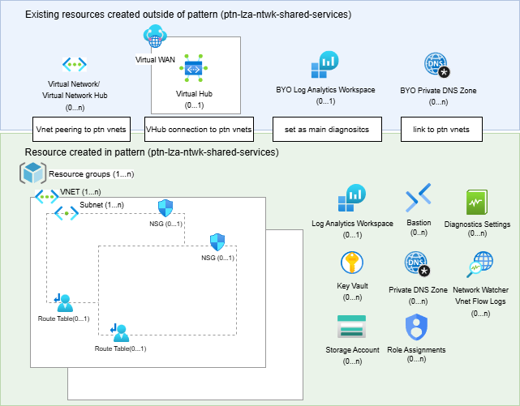

# ALZ Spoke Networking & Shared Services Pattern

This Terraform root module provisions Azure Application Landing Zone (ALZ) spoke networking and shared services infrastructure using [Azure Verified Modules (AVM)](https://azure.github.io/Azure-Verified-Modules/) exclusively.

## Features

- Spoke virtual networks with subnets, NSGs, route tables, and hub VNet peering
- Private DNS Zone VNet links for private endpoint resolution
- Key Vaults with managed identities and RBAC role assignments
- Virtual WAN hub connections (alternative to hub VNet peering)
- Azure Bastion for secure remote access (optional)
- Network Watcher VNet flow logs (optional)
- Log Analytics workspace (pattern-managed or externally provided)
- Resource locks, diagnostic settings, and common tagging on all resources
- Storage accounts with sub-resource diagnostic settings (blob, file, queue, table)

## Diagram



## Usage

All configuration is driven through `terraform.tfvars`. See the `examples/` directory for common deployment scenarios:

| Example | Description |
|---------|-------------|
| [examples/minimal](examples/minimal/) | Minimal spoke VNet with NSGs, Key Vault, and Bastion |
| [examples/vnet_hub](examples/vnet_hub/) | Hub VNet peering connectivity |
| [examples/vwan_hub](examples/vwan_hub/) | vWAN hub connectivity |
| [examples/full](examples/full/) | All features enabled |

## Quick Start

```bash
# 1. Copy an example tfvars as a starting point
cp examples/minimal/terraform.tfvars terraform.tfvars

# 2. Edit terraform.tfvars with your values
# 3. Initialize and deploy
terraform init
terraform plan
terraform apply
```

## Documentation

Input and output documentation is auto-generated by [terraform-docs](https://terraform-docs.io/).
